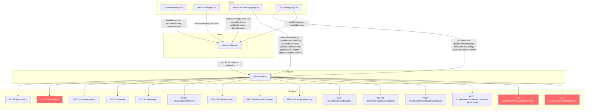

# Business Endpoint Audit — DokaniAI Frontend

> **Generated:** 2026-04-12  
> **Scope:** Audit of all 15 Business Postman endpoints against existing UI pages, components, store, and API layer.

---

## 1. Endpoint Coverage Table

| # | Method & Path | API Function in `businessApi.ts` | Caller(s) — Pages / Components / Store | Status | Notes |
|---|---|---|---|---|---|
| 1 | `POST /api/v1/businesses` | `createBusiness()` | `businessStore.createBusiness()` → `CreateBusinessModal.tsx` (line 108), `onboarding/page.tsx` (line 312) | ✅ Covered | Fully wired through store and called from both the modal and onboarding wizard step 3. |
| 2 | `GET /api/v1/businesses/{businessId}` | `getBusiness()` | **None** | ❌ Not Covered | API function exists but is never called from any page, component, or store action. |
| 3 | `GET /api/v1/businesses/{businessId}/stats` | `getBusinessStats()` | `businessStore.loadStats()` → `dashboard/page.tsx` (line 157), `dashboard/settings/page.tsx` (line 197) | ✅ Covered | Stats are loaded when `activeBusinessId` changes in both dashboard and settings pages. |
| 4 | `GET /api/v1/businesses` | `listBusinesses()` | `businessStore.loadBusinesses()` → `businesses/page.tsx` (line 196), `dashboard/page.tsx` (line 151), `onboarding/page.tsx` (line 228), `DashboardLayout.tsx` (line 121) | ✅ Covered | Heavily used — called from 4 different locations. |
| 5 | `PUT /api/v1/businesses/{businessId}` | `updateBusiness()` | `businessStore.updateBusiness()` → `dashboard/settings/page.tsx` (line 287) | ✅ Covered | Called from the General tab save handler in settings. |
| 6 | `POST /api/v1/businesses/{businessId}/archive` | `archiveBusiness()` | `businessStore.archiveBusiness()` → `businesses/page.tsx` (line 258), `dashboard/settings/page.tsx` (line 350) | ✅ Covered | Called from both the business list page and the settings danger zone. |
| 7 | `DELETE /api/v1/businesses/{businessId}` | `deleteBusiness()` | `businessStore.deleteBusiness()` → `businesses/page.tsx` (line 279), `dashboard/settings/page.tsx` (line 363) | ✅ Covered | Called from both the business list page and the settings danger zone. |
| 8 | `GET /api/v1/businesses/{businessId}/settings` | `getBusinessSettings()` | `dashboard/settings/page.tsx` (line 204) — direct import | ✅ Covered | Loaded lazily when the General tab is first visited. |
| 9 | `PUT /api/v1/businesses/{businessId}/settings` | `updateBusinessSettings()` | `dashboard/settings/page.tsx` (line 292) — direct import | ✅ Covered | Called in the General tab save handler alongside `updateBusiness`. |
| 10 | `GET /api/v1/businesses/{businessId}/onboarding` | `getOnboarding()` | `businessStore.loadOnboarding()` → `dashboard/settings/page.tsx` (line 196); direct import → `onboarding/page.tsx` (line 236) | ✅ Covered | Called both via store (settings page) and directly (onboarding resume flow). |
| 11 | `PATCH /api/v1/businesses/{businessId}/onboarding/step?step=N` | `updateOnboardingStep()` | `onboarding/page.tsx` (line 274) — direct import | ✅ Covered | Called in the `advanceStep` callback during onboarding wizard navigation. |
| 12 | `POST /api/v1/businesses/{businessId}/onboarding/complete` | `completeOnboarding()` | `onboarding/page.tsx` (line 374) — direct import | ✅ Covered | Called in the `handleComplete` callback at the end of the wizard. |
| 13 | `POST /api/v1/businesses/{businessId}/onboarding/sample-data-loaded` | `markSampleDataLoaded()` | `onboarding/page.tsx` (line 348) — direct import | ✅ Covered | Called in the `handleLoadSampleData` callback in step 4. |
| 14 | `GET /api/v1/businesses/onboarding/incomplete?maxStep=N` | `listIncompleteOnboarding()` | **None** | ❌ Not Covered | API function exists but is never called from any page or component. |
| 15 | `GET /api/v1/businesses/onboarding/stats` | `getOnboardingStats()` | **None** | ❌ Not Covered | API function exists but is never called from any page or component. |

---

## 2. Coverage Summary

| Status | Count | Endpoints |
|---|---|---|
| ✅ Covered | **12 / 15** | #1, #3, #4, #5, #6, #7, #8, #9, #10, #11, #12, #13 |
| ❌ Not Covered | **3 / 15** | #2, #14, #15 |

### Overall: **80% endpoint coverage** — 12 of 15 endpoints are actively called from the UI.

---

## 3. Missing Coverage Details

### 3.1 Endpoint #2 — `GET /api/v1/businesses/{businessId}` (Get Single Business)

- **API Function:** `getBusiness(businessId: string)` in [`businessApi.ts`](src/lib/businessApi.ts:52)
- **Current State:** The function is defined and fully typed but never invoked.
- **Why it matters:** The app currently relies on `listBusinesses()` to fetch all businesses and then finds the target business from the cached array in the store. This works for small business counts but is inefficient for fetching a single business after a page reload or deep link.
- **Impact:** No functional gap — the data is available via the list endpoint. However, there is no way to refresh a single business without re-fetching the entire list.

### 3.2 Endpoint #14 — `GET /api/v1/businesses/onboarding/incomplete?maxStep=N` (List Incomplete Onboardings)

- **API Function:** `listIncompleteOnboarding(maxStep?: number)` in [`businessApi.ts`](src/lib/businessApi.ts:194)
- **Current State:** The function is defined and fully typed but never invoked.
- **Why it matters:** This endpoint is designed to return businesses that have incomplete onboarding, optionally filtered by a maximum step number. It would be useful for:
  - Showing an admin/overview of which businesses need attention
  - The dashboard workspace view to highlight incomplete onboardings
  - A notification system prompting users to complete setup
- **Impact:** The dashboard page at [`dashboard/page.tsx`](src/app/dashboard/page.tsx:123) currently uses a **placeholder hash-based function** `getOnboardingProgress()` to fake onboarding percentages. This means the onboarding progress shown in the workspace card grid is not real data.

### 3.3 Endpoint #15 — `GET /api/v1/businesses/onboarding/stats` (Business Onboarding Stats)

- **API Function:** `getOnboardingStats()` in [`businessApi.ts`](src/lib/businessApi.ts:205)
- **Current State:** The function is defined and fully typed but never invoked.
- **Why it matters:** Returns aggregate counts (`completed`, `incomplete`) across all businesses. Useful for:
  - A super-admin dashboard or overview page
  - The workspace view header to show "X of Y businesses fully set up"
  - Prompting users to complete onboarding for all their businesses
- **Impact:** No current UI needs this data, but it would enhance the multi-business workspace experience.

---

## 4. Recommendations

### 4.1 For Endpoint #2 — `GET /businesses/{businessId}`

**Recommended integration point:** [`DashboardLayout.tsx`](src/components/layout/DashboardLayout.tsx:77)

- **What to add:** When `DashboardLayout` detects an `activeBusinessId` in the store but no matching `activeBusiness` object (e.g., after a page refresh where the persisted store has the ID but not the full object), call `getBusiness(activeBusinessId)` instead of re-fetching the entire list.
- **Alternative:** Add a `loadBusiness(businessId)` action to [`businessStore.ts`](src/store/businessStore.ts:1) that calls `getBusiness()` and updates both `activeBusiness` and the `businesses` cache.
- **UI changes needed:** None — this is purely an optimization to the data-fetching strategy.

### 4.2 For Endpoint #14 — `GET /businesses/onboarding/incomplete`

**Recommended integration point:** [`dashboard/page.tsx`](src/app/dashboard/page.tsx:132)

- **What to add:**
  1. Call `listIncompleteOnboarding()` on mount (alongside the existing `loadBusinesses()` call).
  2. Replace the placeholder `getOnboardingProgress()` function (line 123) with real onboarding data from the API response.
  3. Use the `setupStep` and `onboardingCompleted` fields from `BusinessOnboardingResponse` to calculate actual progress percentages for each business card in the workspace grid.
  4. The "AI Insight" banner (line 238) that checks `hasIncompleteOnboarding` should use real data instead of the hash-based placeholder.
- **Store enhancement:** Add `incompleteOnboardings: BusinessOnboardingResponse[]` to [`businessStore.ts`](src/store/businessStore.ts:1) with a `loadIncompleteOnboardings()` action.
- **UI changes needed:** Replace the `getOnboardingProgress()` hash function with real data binding in the business card grid.

### 4.3 For Endpoint #15 — `GET /businesses/onboarding/stats`

**Recommended integration point:** [`dashboard/page.tsx`](src/app/dashboard/page.tsx:132) — workspace header section

- **What to add:**
  1. Call `getOnboardingStats()` on mount alongside `loadBusinesses()`.
  2. Display an aggregate summary in the workspace header, e.g., "2 of 3 businesses fully set up" with a progress indicator.
  3. Use the `completed` and `incomplete` counts to conditionally show/hide the "Fix Now" CTA in the AI Insight banner.
- **Store enhancement:** Add `onboardingStats: OnboardingStatsResponse | null` to [`businessStore.ts`](src/store/businessStore.ts:1) with a `loadOnboardingStats()` action.
- **UI changes needed:** A small stats badge or summary line in the workspace header area.

---

## 5. Additional Observations

### 5.1 Placeholder Data in Dashboard Components

The following dashboard components use **hardcoded placeholder data** and make **no API calls**:

| Component | File | Data Source |
|---|---|---|
| `KpiCard` | [`KpiCard.tsx`](src/components/dashboard/KpiCard.tsx:1) | Receives data via props from dashboard page (real stats from endpoint #3) |
| `QuickActions` | [`QuickActions.tsx`](src/components/dashboard/QuickActions.tsx:1) | Static UI — no data fetching needed |
| `RecentTransactions` | [`RecentTransactions.tsx`](src/components/dashboard/RecentTransactions.tsx:1) | **Hardcoded placeholder data** (line 84) — needs a transactions API |
| `StockAlerts` | [`StockAlerts.tsx`](src/components/dashboard/StockAlerts.tsx:1) | **Hardcoded placeholder data** (line 53) — needs an inventory API |
| `DueLedgerWidget` | [`DueLedgerWidget.tsx`](src/components/dashboard/DueLedgerWidget.tsx:1) | **Hardcoded placeholder data** (line 59) — needs a due/ledger API |
| `AiCommandBar` | [`AiCommandBar.tsx`](src/components/dashboard/AiCommandBar.tsx:1) | Static UI — no data fetching needed |

### 5.2 Placeholder Data in Business List Page

- [`businesses/page.tsx`](src/app/businesses/page.tsx:152) uses `getPlaceholderStats()` (hash-based deterministic fake data) to show per-business sales/due amounts. This should eventually be replaced with real stats from endpoint #3 or a dedicated per-business summary endpoint.

### 5.3 `BusinessCard.tsx` Is Purely Presentational

- [`BusinessCard.tsx`](src/components/business/BusinessCard.tsx:1) receives all data and callbacks via props. It does not call any API directly. It is **not currently used** by any page — the business list page at [`businesses/page.tsx`](src/app/businesses/page.tsx:1) renders its own inline business rows instead.

### 5.4 Profile & Location Endpoints (Not in the 15 Postman Endpoints)

The API layer also includes 4 additional functions for profile and location management that are **not part of the 15 Postman endpoints** but are actively used:

| API Function | Endpoint | Caller |
|---|---|---|
| `getBusinessProfile()` | `GET /businesses/{businessId}/profile` | `settings/page.tsx` (line 218) |
| `updateBusinessProfile()` | `PUT /businesses/{businessId}/profile` | `settings/page.tsx` (line 306) |
| `getBusinessLocation()` | `GET /businesses/{businessId}/location` | `settings/page.tsx` (line 242) |
| `updateBusinessLocation()` | `PUT /businesses/{businessId}/location` | `settings/page.tsx` (line 330) |

These are fully covered in the UI despite not being in the Postman collection scope.

---

## 6. Architecture Flow Diagram

**Red nodes** = endpoints with API functions but no UI callers.

---

## 7. Priority Action Items

| Priority | Endpoint | Action | Effort |
|---|---|---|---|
| **High** | #14 — List Incomplete Onboardings | Replace placeholder `getOnboardingProgress()` in dashboard with real onboarding data | Medium — requires store + page changes |
| **Medium** | #15 — Onboarding Stats | Add aggregate onboarding stats to workspace header | Small — single API call + UI badge |
| **Low** | #2 — Get Single Business | Optimize `DashboardLayout` to fetch single business instead of full list | Small — store action + layout guard logic |
