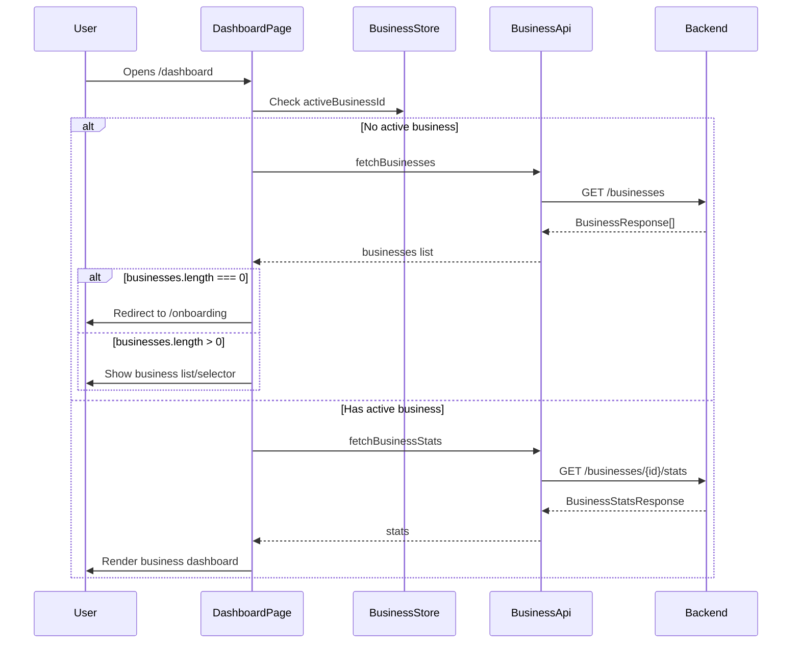
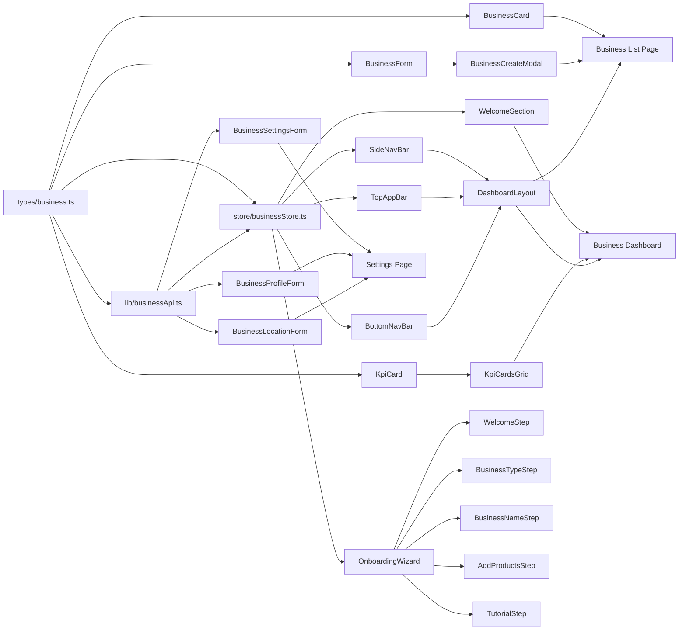

# Business Features Implementation Plan

> DokaniAI Frontend — Business Module  
> Generated: 2026-04-11  
> Status: Planning

---

## Table of Contents

1. [Design System Summary](#1-design-system-summary)
2. [Dashboard Layout Architecture](#2-dashboard-layout-architecture)
3. [API Endpoints Summary](#3-api-endpoints-summary)
4. [File Structure](#4-file-structure)
5. [Component Hierarchy](#5-component-hierarchy)
6. [State Management](#6-state-management)
7. [Page-by-Page Implementation Details](#7-page-by-page-implementation-details)
8. [i18n Keys](#8-i18n-keys)
9. [Implementation Order](#9-implementation-order)

---

## 1. Design System Summary

Source: [`bazaar_pro/DESIGN.md`](html%20design%20you%20should%20follow/bazaar_pro/DESIGN.md) and [`globals.css`](src/app/globals.css)

### 1.1 Color Tokens (Material Design 3)

All tokens are registered as CSS custom properties in [`globals.css`](src/app/globals.css:7) under `@theme inline` and mapped to Tailwind classes.

| Token | CSS Variable | Hex Value | Usage |
|-------|-------------|-----------|-------|
| `primary` | `--color-primary` | `#003727` | Deep green — trust, main CTAs, active states |
| `primary-container` | `--color-primary-container` | `#00503a` | Green container, gradient endpoint |
| `secondary` | `--color-secondary` | `#0061a4` | Blue — secondary actions, info |
| `tertiary` | `--color-tertiary` | `#531e1a` | Red/brown — negative values, alerts, baki |
| `surface` | `--color-surface` | `#f8faf6` | Base background |
| `surface-container-low` | `--color-surface-container-low` | `#f2f4f0` | Sectioning background |
| `surface-container-lowest` | `--color-surface-container-lowest` | `#ffffff` | Card/interactive surfaces |
| `surface-container` | `--color-surface-container` | `#ecefeb` | Container backgrounds |
| `surface-container-high` | `--color-surface-container-high` | `#e6e9e5` | Hover states, secondary buttons |
| `surface-container-highest` | `--color-surface-container-highest` | `#e1e3df` | Subtle backgrounds, badges |
| `on-surface` | `--color-on-surface` | `#191c1a` | Primary text — NEVER use #000000 |
| `on-surface-variant` | `--color-on-surface-variant` | `#404944` | Secondary text, labels |
| `outline-variant` | `--color-outline-variant` | `#bfc9c2` | Ghost borders at 15-20% opacity |
| `error` | `--color-error` | `#ba1a1a` | Error states |

### 1.2 Critical Design Rules

| Rule | Description |
|------|-------------|
| **No-Line Rule** | No `1px solid` borders for sectioning. Use background color shifts between surface layers. |
| **Tonal Layering** | Elevation through color, not shadows. Place `surface-container-lowest` cards on `surface-container-low` backgrounds. |
| **Ghost Border Fallback** | If a border is absolutely necessary, use `border-outline-variant/20` (15-20% opacity). |
| **Glassmorphism** | Navigation rails and AI components use `backdrop-blur-md` with `bg-surface-bright/80`. |
| **Touch Targets** | Minimum 48x48px for all interactive elements. |
| **No Pure Black** | Text must use `on-surface` (#191c1a), never #000000. |
| **Gradient AI** | AI-related components use gradient from `primary` to `primary-container`. |

### 1.3 Typography

| Scale | Font Family | Tailwind Class | Usage |
|-------|------------|----------------|-------|
| Display | Manrope / Hind Siliguri | `font-headline` | Financial totals, KPI numbers |
| Headline | Manrope / Hind Siliguri | `font-headline` | Page titles |
| Body | Manrope / Hind Siliguri | `font-body` | Body text, descriptions |
| Label | Manrope / Hind Siliguri | `font-label` | Micro-copy, timestamps |

Font sizes from dashboard HTML reference:
- KPI values: `text-4xl font-black`
- Section titles: `text-xl font-bold`
- Card labels: `text-on-surface-variant font-medium`
- Badge text: `text-xs font-bold`
- Welcome heading: `text-3xl font-bold`

### 1.4 Spacing Patterns

| Pattern | Value | Usage |
|---------|-------|-------|
| Page margins | `px-6` (1.5rem) | Outer page padding |
| Section gaps | `space-y-8` (2rem) | Between major sections |
| Card padding | `p-6` (1.5rem) | Inside cards/widgets |
| Inner card spacing | `space-y-3` or `space-y-4` | Between list items |
| Grid gaps | `gap-4` (1rem) | Card grids |

### 1.5 Border Radius

| Element | Radius | Tailwind |
|---------|--------|----------|
| Cards | 1.5rem | `rounded-2xl` or `rounded-3xl` |
| Buttons | 0.75rem | `rounded-xl` |
| Input fields | 0.25rem | `rounded` |
| FAB | 1.5rem | `rounded-2xl` |
| Bottom nav pill | 9999px | `rounded-full` |
| Avatar | 9999px | `rounded-full` |

---

## 2. Dashboard Layout Architecture

The dashboard layout follows the HTML template at [`code.html`](html%20design%20you%20should%20follow/1.%20Dashboard%20-%20dokaniai_primary_actions_dashboard/code.html). It consists of three navigation components and a main content area.

### 2.1 Layout Structure

```
┌──────────────────────────────────────────────────────┐
│  SideNavBar (md+)  │  TopAppBar                      │
│  w-64 fixed left   │  sticky top z-40                │
│  hidden on mobile  │  breadcrumb + actions           │
│                    │─────────────────────────────────│
│  - Logo            │                                  │
│  - Nav items       │  Main Content Area               │
│  - New Entry btn   │  px-6 py-8 max-w-7xl mx-auto    │
│                    │                                  │
│                    │  [Page content here]             │
│                    │                                  │
│                    │                                  │
└────────────────────┴─────────────────────────────────┘
                     BottomNavBar (mobile only)
                     fixed bottom-8, centered pill
```

### 2.2 Component Specifications

#### SideNavBar — Desktop Only

```
Classes: hidden md:flex flex-col h-screen w-64 fixed left-0 top-0 z-50
         bg-surface-container-lowest py-6 px-4
```

- Logo section: app name + tagline
- Navigation items with Material Symbols icons
- Active state: `bg-primary/10 text-primary font-bold rounded-lg px-4 py-3`
- Inactive state: `text-on-surface-variant px-4 py-3 hover:bg-surface-container-high`
- Footer: primary CTA button

#### TopAppBar — Always Visible

```
Classes: flex justify-between items-center w-full px-6 py-3
         bg-surface-container-low sticky top-0 z-40
```

- Mobile: app logo/name (left)
- Desktop: breadcrumb text (left)
- Right side: language, notifications, account icons

#### BottomNavBar — Mobile Only

```
Classes: md:hidden fixed bottom-8 left-1/2 -translate-x-1/2 z-50
         bg-surface-container-lowest rounded-full p-1 shadow-2xl
         backdrop-blur-md min-w-[300px]
```

- 5 icon buttons in a row
- Active item: gradient pill `bg-gradient-to-r from-primary to-primary-container text-on-primary rounded-full`
- Inactive: `text-primary px-6 py-3`

### 2.3 Layout Component API

```typescript
// src/components/layout/DashboardLayout.tsx
interface DashboardLayoutProps {
  children: React.ReactNode;
  activeNav: string; // e.g. 'dashboard', 'sales', 'expenses', etc.
  breadcrumb?: string; // e.g. 'Dashboard / Home'
}
```

---

## 3. API Endpoints Summary

Source: [`BusinessController.java`](C:/Users/alami/IdeaProjects/DokaniAI/src/main/java/com/dokaniai/controller/BusinessController.java) and [`API_Design.md`](API_Design.md:337)

### 3.1 Business CRUD Endpoints

| Method | Endpoint | Request DTO | Response DTO | Description |
|--------|----------|-------------|--------------|-------------|
| `GET` | `/businesses` | — | `{ businesses: BusinessResponse[], total: number }` | List user businesses |
| `POST` | `/businesses` | `BusinessCreateRequest` | `BusinessResponse` | Create business |
| `GET` | `/businesses/{id}` | — | `BusinessResponse` | Get business details |
| `PUT` | `/businesses/{id}` | `BusinessUpdateRequest` | `BusinessResponse` | Update business |
| `POST` | `/businesses/{id}/archive` | — | `void` | Archive business |
| `DELETE` | `/businesses/{id}` | — | `void` | Delete business permanently |

### 3.2 Business Sub-Resource Endpoints

| Method | Endpoint | Request DTO | Response DTO | Description |
|--------|----------|-------------|--------------|-------------|
| `GET` | `/businesses/{id}/settings` | — | `BusinessSettingsResponse` | Get settings |
| `PUT` | `/businesses/{id}/settings` | `BusinessSettingsRequest` | `void` | Update settings |
| `GET` | `/businesses/{id}/profile` | — | `BusinessProfileResponse` | Get profile |
| `PUT` | `/businesses/{id}/profile` | `BusinessProfileRequest` | `void` | Update profile |
| `GET` | `/businesses/{id}/location` | — | `BusinessLocationResponse` | Get location |
| `PUT` | `/businesses/{id}/location` | `BusinessLocationRequest` | `void` | Update location |
| `GET` | `/businesses/{id}/stats` | — | `BusinessStatsResponse` | Get statistics |

### 3.3 Business Onboarding Endpoints

| Method | Endpoint | Request | Response | Description |
|--------|----------|---------|----------|-------------|
| `GET` | `/businesses/{id}/onboarding` | — | `BusinessOnboardingResponse` | Get onboarding state |
| `PATCH` | `/businesses/{id}/onboarding/step?step=N` | — | `void` | Update step number |
| `POST` | `/businesses/{id}/onboarding/complete` | — | `void` | Mark complete |
| `POST` | `/businesses/{id}/onboarding/sample-data-loaded` | — | `void` | Mark sample data loaded |
| `GET` | `/businesses/onboarding/incomplete?maxStep=N` | — | `BusinessOnboardingResponse[]` | List incomplete |
| `GET` | `/businesses/onboarding/stats` | — | `{ completed: number, incomplete: number }` | Counts |

### 3.4 Exact DTO Field Definitions

#### Request DTOs

**`BusinessCreateRequest`** — from [`BusinessCreateRequest.java`](C:/Users/alami/IdeaProjects/DokaniAI/src/main/java/com/dokaniai/dto/request/BusinessCreateRequest.java)
```typescript
interface BusinessCreateRequest {
  name: string;         // required
  type: string;         // e.g. 'grocery', 'electronics'
  description: string;  // optional
  currency: string;     // e.g. 'BDT'
}
```

**`BusinessUpdateRequest`** — from [`BusinessUpdateRequest.java`](C:/Users/alami/IdeaProjects/DokaniAI/src/main/java/com/dokaniai/dto/request/BusinessUpdateRequest.java)
```typescript
interface BusinessUpdateRequest {
  name: string;
  type: string;
  description: string;
}
```

**`BusinessSettingsRequest`** — from [`BusinessSettingsRequest.java`](C:/Users/alami/IdeaProjects/DokaniAI/src/main/java/com/dokaniai/dto/request/BusinessSettingsRequest.java)
```typescript
interface BusinessSettingsRequest {
  currency: string;
  taxEnabled: boolean;
  taxRate: number;           // BigDecimal
  taxNumber: string;
  invoicePrefix: string;
  lowStockThreshold: number;
  lowStockAlertEnabled: boolean;
}
```

**`BusinessProfileRequest`** — from [`BusinessProfileRequest.java`](C:/Users/alami/IdeaProjects/DokaniAI/src/main/java/com/dokaniai/dto/request/BusinessProfileRequest.java)
```typescript
interface BusinessProfileRequest {
  description: string;
  logoUrl: string;
  coverImageUrl: string;
  contactPerson: string;
  phone: string;
  whatsappNumber: string;
  email: string;
  website: string;
  facebookPage: string;
}
```

**`BusinessLocationRequest`** — from [`BusinessLocationRequest.java`](C:/Users/alami/IdeaProjects/DokaniAI/src/main/java/com/dokaniai/dto/request/BusinessLocationRequest.java)
```typescript
interface BusinessLocationRequest {
  address: string;
  city: string;
  district: string;
  postalCode: string;
  country: string;
  latitude: number;    // BigDecimal
  longitude: number;   // BigDecimal
}
```

#### Response DTOs

**`BusinessResponse`** — from [`BusinessResponse.java`](C:/Users/alami/IdeaProjects/DokaniAI/src/main/java/com/dokaniai/dto/response/BusinessResponse.java)
```typescript
interface BusinessResponse {
  id: string;                    // UUID
  userId: string;                // UUID
  name: string;
  slug: string;
  type: string;
  status: 'ACTIVE' | 'ARCHIVED'; // BusinessStatus enum
  archivedAt: string | null;     // OffsetDateTime
  createdAt: string;             // OffsetDateTime
  updatedAt: string;             // OffsetDateTime
}
```

**`BusinessSettingsResponse`** — from [`BusinessSettingsResponse.java`](C:/Users/alami/IdeaProjects/DokaniAI/src/main/java/com/dokaniai/dto/response/BusinessSettingsResponse.java)
```typescript
interface BusinessSettingsResponse {
  businessId: string;
  currency: string;
  operatingHoursStart: string | null;  // LocalTime "HH:mm"
  operatingHoursEnd: string | null;    // LocalTime "HH:mm"
  is24Hours: boolean;
  breakStart: string | null;
  breakEnd: string | null;
  operatingDays: number[];             // Integer[] e.g. [1,2,3,4,5]
  taxEnabled: boolean;
  taxRate: number;                     // BigDecimal
  taxNumber: string;
  invoicePrefix: string;
  invoiceCounter: number;
  invoiceNotes: string;
  receiptFooter: string;
  lowStockThreshold: number;
  lowStockAlertEnabled: boolean;
  createdAt: string;
  updatedAt: string;
}
```

**`BusinessStatsResponse`** — from [`BusinessStatsResponse.java`](C:/Users/alami/IdeaProjects/DokaniAI/src/main/java/com/dokaniai/dto/response/BusinessStatsResponse.java)
```typescript
interface BusinessStatsResponse {
  totalProducts: number;
  totalSales: number;
  totalCustomers: number;
  totalRevenue: number;     // BigDecimal
  totalDue: number;         // BigDecimal
  activeCustomers: number;
  lowStockProducts: number;
}
```

**`BusinessProfileResponse`** — from [`BusinessProfileResponse.java`](C:/Users/alami/IdeaProjects/DokaniAI/src/main/java/com/dokaniai/dto/response/BusinessProfileResponse.java)
```typescript
interface BusinessProfileResponse {
  businessId: string;
  description: string;
  logoUrl: string;
  coverImageUrl: string;
  contactPerson: string;
  phone: string;
  whatsappNumber: string;
  email: string;
  website: string;
  facebookPage: string;
  createdAt: string;
  updatedAt: string;
}
```

**`BusinessLocationResponse`** — from [`BusinessLocationResponse.java`](C:/Users/alami/IdeaProjects/DokaniAI/src/main/java/com/dokaniai/dto/response/BusinessLocationResponse.java)
```typescript
interface BusinessLocationResponse {
  businessId: string;
  address: string;
  city: string;
  district: string;
  postalCode: string;
  country: string;
  latitude: number;     // BigDecimal
  longitude: number;    // BigDecimal
  timezone: string;
}
```

**`BusinessOnboardingResponse`** — from [`BusinessOnboardingResponse.java`](C:/Users/alami/IdeaProjects/DokaniAI/src/main/java/com/dokaniai/dto/response/BusinessOnboardingResponse.java)
```typescript
interface BusinessOnboardingResponse {
  businessId: string;
  onboardingCompleted: boolean;
  onboardingCompletedAt: string | null;
  setupStep: number;
  sampleDataLoaded: boolean;
  createdAt: string;
  updatedAt: string;
}
```

---

## 4. File Structure

### 4.1 New Files to Create

```
src/
├── app/
│   ├── dashboard/
│   │   ├── layout.tsx                          # Dashboard shell with nav components
│   │   ├── page.tsx                            # REPLACE existing demo — Business dashboard
│   │   └── businesses/
│   │       └── page.tsx                        # Business list/selector page
│   ├── businesses/
│   │   └── [businessId]/
│   │       ├── layout.tsx                      # Business-scoped layout with active biz context
│   │       ├── page.tsx                        # Business dashboard (stats, KPIs, quick actions)
│   │       ├── settings/
│   │       │   └── page.tsx                    # Business settings page
│   │       └── onboarding/
│   │           └── page.tsx                    # Multi-step onboarding wizard
│   └── onboarding/
│       └── page.tsx                            # Onboarding entry/router page
├── components/
│   ├── layout/
│   │   ├── DashboardLayout.tsx                 # Main dashboard shell (SideNav + TopBar + BottomNav)
│   │   ├── SideNavBar.tsx                      # Desktop sidebar navigation
│   │   ├── TopAppBar.tsx                       # Top bar with breadcrumb, actions
│   │   └── BottomNavBar.tsx                    # Mobile floating bottom navigation
│   ├── business/
│   │   ├── BusinessCard.tsx                    # Card for business list item
│   │   ├── BusinessCreateModal.tsx             # Modal dialog for creating business
│   │   ├── BusinessSwitcher.tsx                # Dropdown to switch active business
│   │   ├── BusinessForm.tsx                    # Reusable form for create/edit business
│   │   ├── BusinessSettingsForm.tsx            # Settings form (tax, invoice, stock)
│   │   ├── BusinessProfileForm.tsx             # Profile form (contact, social, logo)
│   │   ├── BusinessLocationForm.tsx            # Location form (address, city, district)
│   │   └── BusinessDeleteConfirm.tsx           # Confirmation dialog for archive/delete
│   ├── dashboard/
│   │   ├── WelcomeSection.tsx                  # Greeting + date display
│   │   ├── AICommandBar.tsx                    # AI search/voice input bar
│   │   ├── KpiCardsGrid.tsx                    # 4-column KPI bento grid
│   │   ├── KpiCard.tsx                         # Individual KPI card
│   │   ├── QuickActions.tsx                    # Primary + secondary action buttons
│   │   ├── RecentTransactions.tsx              # Recent transaction list
│   │   ├── LowStockWidget.tsx                  # Low stock alert sidebar widget
│   │   └── DueLedgerSummary.tsx               # Top 3 due customers widget
│   └── onboarding/
│       ├── OnboardingWizard.tsx                # Wizard container with step management
│       ├── steps/
│       │   ├── WelcomeStep.tsx                 # Step 1: Welcome + language select
│       │   ├── BusinessTypeStep.tsx            # Step 3: Business category selection
│       │   ├── BusinessNameStep.tsx             # Step 4: Name entry + create business
│       │   ├── AddProductsStep.tsx             # Step 5: Add initial products
│       │   ├── DueSetupStep.tsx                # Step 5.5: Credit sale setup
│       │   └── TutorialStep.tsx                # Step 6: Tutorial/success
│       └── OnboardingProgress.tsx              # Step indicator/progress bar
├── store/
│   └── businessStore.ts                        # Zustand store for business state
├── lib/
│   └── businessApi.ts                          # API functions for business endpoints
└── types/
    └── business.ts                             # TypeScript interfaces for all DTOs
```

### 4.2 Files to Modify

| File | Change |
|------|--------|
| [`src/app/dashboard/page.tsx`](src/app/dashboard/page.tsx) | Replace demo content with redirect to business list or active business dashboard |
| [`messages/en.json`](messages/en.json) | Add `business`, `dashboard`, `onboarding` translation sections |
| [`messages/bn.json`](messages/bn.json) | Add Bengali translations for all new keys |

---

## 5. Component Hierarchy

```mermaid
graph TD
    A[RootLayout] --> B[DashboardLayout]
    
    B --> C[SideNavBar - desktop only]
    B --> D[TopAppBar]
    B --> E[BottomNavBar - mobile only]
    B --> F[Main Content Area]
    
    C --> C1[Logo + Tagline]
    C --> C2[Nav Items List]
    C --> C3[New Entry CTA Button]
    
    D --> D1[Mobile: App Name]
    D --> D2[Desktop: Breadcrumb]
    D --> D3[Action Icons: Language, Notifications, Account]
    
    E --> E1[Dashboard Icon]
    E --> E2[Due Ledger Icon]
    E --> E3[AI Assistant Pill - gradient active]
    E --> E4[Inventory Icon]
    E --> E5[Profile Icon]
    
    F --> G[Business List Page]
    F --> H[Business Dashboard Page]
    F --> I[Business Settings Page]
    F --> J[Onboarding Wizard Page]
    
    G --> G1[BusinessCard list]
    G --> G2[BusinessCreateModal]
    G2 --> G2a[BusinessForm]
    
    H --> H1[WelcomeSection]
    H --> H2[AICommandBar]
    H --> H3[KpiCardsGrid]
    H3 --> H3a[KpiCard x4]
    H --> H4[QuickActions]
    H --> H5[Two Column Grid]
    H5 --> H5a[RecentTransactions]
    H5 --> H5b[Right Column]
    H5b --> H5c[LowStockWidget]
    H5b --> H5d[DueLedgerSummary]
    
    I --> I1[BusinessSettingsForm]
    I --> I2[BusinessProfileForm]
    I --> I3[BusinessLocationForm]
    I --> I4[BusinessDeleteConfirm]
    
    J --> J1[OnboardingWizard]
    J1 --> J2[OnboardingProgress]
    J1 --> J3[WelcomeStep]
    J1 --> J4[BusinessTypeStep]
    J1 --> J5[BusinessNameStep]
    J1 --> J6[AddProductsStep]
    J1 --> J7[DueSetupStep]
    J1 --> J8[TutorialStep]
```



---

## 6. State Management

### 6.1 businessStore — Zustand with Persist

Following the same pattern as [`authStore.ts`](src/store/authStore.ts):

```typescript
// src/store/businessStore.ts
import { create } from 'zustand';
import { persist, createJSONStorage } from 'zustand/middleware';

interface BusinessState {
  // Active business context
  activeBusinessId: string | null;
  activeBusiness: BusinessResponse | null;
  
  // Business list cache
  businesses: BusinessResponse[];
  totalBusinessCount: number;
  
  // Stats cache
  businessStats: BusinessStatsResponse | null;
  
  // Loading states
  isLoadingBusinesses: boolean;
  isCreating: boolean;
  
  // Onboarding state
  onboardingStep: number | null;
  
  // Actions
  setActiveBusiness: (business: BusinessResponse) => void;
  clearActiveBusiness: () => void;
  setBusinesses: (businesses: BusinessResponse[], total: number) => void;
  setBusinessStats: (stats: BusinessStatsResponse) => void;
  setLoadingBusinesses: (loading: boolean) => void;
  setCreating: (creating: boolean) => void;
  setOnboardingStep: (step: number | null) => void;
  addBusiness: (business: BusinessResponse) => void;
  updateBusiness: (id: string, business: BusinessResponse) => void;
  removeBusiness: (id: string) => void;
  reset: () => void;
}
```

### 6.2 Persistence Strategy

- `activeBusinessId` — persisted to `localStorage` via Zustand persist middleware
- `businesses` list — NOT persisted; fetched fresh on app load
- `businessStats` — NOT persisted; fetched when entering business dashboard
- Store key: `dokaniai-business-storage`

### 6.3 Business Context Flow



---

## 7. Page-by-Page Implementation Details

### 7.1 Business List Page — `/dashboard/businesses`

**Purpose:** Display all user businesses, allow creating new ones, switching active business.

**Layout:** Uses `DashboardLayout` with `activeNav="dashboard"`

**Components:**
- Header with title + business count badge
- Grid of `BusinessCard` components
- FAB or button to trigger `BusinessCreateModal`
- Empty state when no businesses exist

**BusinessCard props:**
```typescript
interface BusinessCardProps {
  business: BusinessResponse;
  isActive: boolean;
  onSelect: (id: string) => void;
  onArchive: (id: string) => void;
}
```

**BusinessCard styling:**
```
Container: bg-surface-container-lowest p-6 rounded-2xl
Active indicator: border-b-4 border-primary
Inactive: border-b-4 border-outline-variant/20
Business name: text-xl font-bold text-on-surface
Type badge: text-xs font-bold bg-primary-fixed text-on-primary-fixed px-2 py-1 rounded
Stats row: text-sm text-on-surface-variant
Hover: hover:bg-surface-container-high transition-colors
```

**BusinessCreateModal:**
- Triggered by "Add Business" button
- Uses `BusinessForm` component
- Fields: `name` (required), `type` (select from predefined list), `description` (optional), `currency` (default "BDT")
- On success: adds to store, sets as active, redirects to onboarding if new

**Business types for selector:**
```typescript
const BUSINESS_TYPES = [
  { value: 'grocery', labelBn: 'মুদি দোকান', labelEn: 'Grocery' },
  { value: 'electronics', labelBn: 'ইলেকট্রনিক্স', labelEn: 'Electronics' },
  { value: 'clothing', labelBn: 'কাপড়ের দোকান', labelEn: 'Clothing' },
  { value: 'pharmacy', labelBn: 'ফার্মেসি', labelEn: 'Pharmacy' },
  { value: 'restaurant', labelBn: 'রেস্টুরেন্ট', labelEn: 'Restaurant' },
  { value: 'stationery', labelBn: 'স্টেশনারি', labelEn: 'Stationery' },
  { value: 'hardware', labelBn: 'হার্ডওয়্যার', labelEn: 'Hardware' },
  { value: 'other', labelBn: 'অন্যান্য', labelEn: 'Other' },
];
```

### 7.2 Business Dashboard — `/businesses/[businessId]`

**Purpose:** Main workspace dashboard with KPIs, quick actions, recent activity.

**Layout:** Uses `DashboardLayout` with `activeNav="dashboard"` and `BusinessSwitcher` in TopAppBar.

**Data fetching:**
1. `GET /businesses/{businessId}` — verify business exists
2. `GET /businesses/{businessId}/stats` — load KPI data
3. Poll stats every 60 seconds or on window focus

**Component details from HTML template:**

#### WelcomeSection
```
Container: flex flex-col md:flex-row md:items-end justify-between gap-4
Greeting: text-3xl font-bold text-on-surface
Subtitle: text-on-surface-variant text-lg
Date badge: bg-surface-container-low px-4 py-2 rounded-full text-primary font-semibold
           border border-outline-variant/20
```

#### AICommandBar
```
Outer glow: absolute -inset-1 bg-gradient-to-r from-primary to-secondary rounded-2xl blur opacity-15
Container: relative flex items-center bg-surface-container-lowest rounded-2xl p-2
Input: w-full bg-transparent border-none text-lg py-3 text-on-surface
       placeholder:text-on-surface-variant/60
Mic button: bg-gradient-to-br from-primary to-primary-container text-on-primary
            p-4 rounded-xl shadow-lg
Icon: material-symbols-outlined mic, FILL=1
```

#### KpiCardsGrid
```
Grid: grid grid-cols-1 sm:grid-cols-2 lg:grid-cols-4 gap-4
```

#### KpiCard (individual)
```
Container: bg-surface-container-lowest p-6 rounded-2xl border-b-4 border-{color}
           shadow-sm hover:shadow-md transition-shadow
Label: text-on-surface-variant font-medium mb-2
Value: text-4xl font-black text-{color}
Badge: text-xs font-bold text-{color} bg-{color}-fixed px-2 py-1 rounded w-fit

Colors per card:
  - Today Sales: primary (#003727)
  - Today Profit: secondary (#0061a4)
  - Total Due: tertiary (#531e1a)
  - Today Expense: on-surface-variant (#404944)
```

**KPI card data mapping from `BusinessStatsResponse`:**

| Card | Field | Color Token |
|------|-------|-------------|
| Total Products | `totalProducts` | `primary` |
| Total Revenue | `totalRevenue` | `secondary` |
| Total Due | `totalDue` | `tertiary` |
| Low Stock Products | `lowStockProducts` | `on-surface-variant` |

#### QuickActions
```
Primary row: grid grid-cols-1 sm:grid-cols-3 gap-4
  - New Sale: bg-primary text-on-primary p-6 rounded-2xl
  - Add Product: bg-secondary text-on-secondary p-6 rounded-2xl
  - Add Due: bg-tertiary text-on-tertiary p-6 rounded-2xl

Secondary row: grid grid-cols-2 gap-4
  - Record Expense: bg-surface-container-high text-on-surface-variant py-4 rounded-xl
  - Record Return: bg-surface-container-high text-on-surface-variant py-4 rounded-xl
```

#### RecentTransactions
```
Container: bg-surface-container-low rounded-3xl p-6
Header: flex justify-between items-center mb-6
  Title: text-xl font-bold
  Link: text-primary font-bold text-sm

Transaction item: bg-surface-container-lowest p-4 rounded-xl flex items-center justify-between
  Left: icon circle + name + timestamp
  Right: amount + status badge
  Hover: hover:bg-surface-container transition-colors
```

#### LowStockWidget
```
Container: bg-surface-container-lowest rounded-3xl p-6 border border-tertiary/10
Header: text-tertiary with warning icon
Items: flex items-center justify-between p-3 rounded-xl bg-tertiary-fixed/20 border-l-4 border-tertiary
Footer: w-full border border-dashed border-tertiary text-tertiary rounded-xl font-bold
```

#### DueLedgerSummary
```
Container: bg-surface-container-lowest rounded-3xl p-6
Header: text-secondary with menu_book icon
Customer items: flex items-center justify-between
  Avatar: w-10 h-10 rounded-full
  Name + last due date
  Amount: text-tertiary font-bold
  WhatsApp button: w-8 h-8 bg-green-100 text-green-700 rounded-full
Footer: bg-secondary text-on-secondary py-3 rounded-xl font-bold
```

### 7.3 Business Settings Page — `/businesses/[businessId]/settings`

**Purpose:** Manage all business configuration in one place.

**Layout:** Tabbed interface with 3 tabs: General, Profile, Location.

**Tab 1 — General Settings (`BusinessSettingsForm`)**
- Currency selector (default BDT)
- Tax toggle + tax rate + tax number
- Invoice prefix + notes + receipt footer
- Low stock threshold + alert toggle
- Save button: `bg-primary text-on-primary py-3 rounded-xl font-bold`

**Tab 2 — Business Profile (`BusinessProfileForm`)**
- Description (textarea)
- Logo URL + Cover Image URL
- Contact person name
- Phone + WhatsApp number
- Email + Website + Facebook page

**Tab 3 — Location (`BusinessLocationForm`)**
- Address field
- City + District + Postal Code
- Country (default: Bangladesh)
- Save button

**Danger Zone (bottom of page):**
- Archive business button: `border border-tertiary text-tertiary`
- Delete business button: `bg-error text-on-error`
- Both trigger `BusinessDeleteConfirm` dialog

**Form styling (from DESIGN.md):**
```
Input fields: bg-surface-container-highest rounded px-4 py-3
              border-none focus:ring-2 focus:ring-primary/30
Labels: text-sm font-medium text-on-surface-variant mb-1
Toggle: custom switch component using primary color
```

### 7.4 Business Onboarding Wizard — `/businesses/[businessId]/onboarding`

**Purpose:** Guide new users through initial business setup. Per SRS Section 6.6.

**Layout:** Full-screen overlay or dedicated page with step progress indicator.

**Step Management:**
- Current step stored in `businessStore.onboardingStep`
- Synced with backend via `PATCH /businesses/{id}/onboarding/step?step=N`
- On completion: `POST /businesses/{id}/onboarding/complete`

**OnboardingProgress component:**
```
Horizontal step indicator at top
Active step: bg-primary text-on-primary rounded-full
Completed: bg-primary-fixed text-primary
Upcoming: bg-surface-container-highest text-on-surface-variant
Connector lines between steps
```

**Step Details:**

| Step | Component | User Action | API Call |
|------|-----------|-------------|----------|
| 1 | `WelcomeStep` | Click Start | `PATCH .../onboarding/step?step=1` |
| 2 | (Language select — handled by existing `LanguageSwitcher`) | Select language | `PATCH .../onboarding/step?step=2` |
| 3 | `BusinessTypeStep` | Select category | `PATCH .../onboarding/step?step=3` |
| 4 | `BusinessNameStep` | Enter name + create | `POST /businesses` then `PATCH .../step?step=4` |
| 5 | `AddProductsStep` | Add 3-5 products or skip | `PATCH .../onboarding/step?step=5` |
| 5.5 | `DueSetupStep` | Optional credit setup | `PATCH .../onboarding/step?step=5` |
| 6 | `TutorialStep` | Watch/acknowledge | `POST .../onboarding/complete` |

**Step 4 — BusinessNameStep:**
- Business name input field
- Business type selector (pre-filled from step 3)
- Currency selector (default BDT)
- On submit: calls `POST /businesses` with `BusinessCreateRequest`
- On success: stores created business, advances step

**Skip functionality:**
- Each step after step 2 has a "Skip for now" link
- Skipping step 4 (no business created) redirects to business list
- Wizard can be resumed from Help menu

---

## 8. i18n Keys

### 8.1 New Translation Sections

Add these to both [`messages/en.json`](messages/en.json) and [`messages/bn.json`](messages/bn.json):

```json
{
  "business": {
    "list": {
      "heading": "My Businesses",
      "subheading": "Manage your business workspaces",
      "countBadge": "{count} of {limit}",
      "createButton": "Create New Business",
      "emptyTitle": "No Businesses Yet",
      "emptyDescription": "Create your first business to get started",
      "active": "Active",
      "archived": "Archived",
      "archivedLabel": "Archived",
      "totalProducts": "{count} products",
      "totalSales": "{count} sales",
      "totalDue": "৳{amount} due",
      "selectBusiness": "Select",
      "archiveConfirm": "Archive this business?",
      "archiveDescription": "You can restore archived businesses later.",
      "deleteConfirm": "Delete this business permanently?",
      "deleteDescription": "This action cannot be undone. All data will be permanently deleted.",
      "errorFetch": "Failed to load businesses",
      "errorCreate": "Failed to create business",
      "errorArchive": "Failed to archive business",
      "errorDelete": "Failed to delete business",
      "limitReached": "Business limit reached. Upgrade your plan to add more."
    },
    "form": {
      "nameLabel": "Business Name",
      "namePlaceholder": "e.g. Rahim Grocery",
      "typeLabel": "Business Type",
      "typePlaceholder": "Select a category",
      "descriptionLabel": "Description",
      "descriptionPlaceholder": "Brief description of your business",
      "currencyLabel": "Currency",
      "createButton": "Create Business",
      "updateButton": "Update Business",
      "errorNameRequired": "Business name is required",
      "errorTypeRequired": "Please select a business type"
    },
    "types": {
      "grocery": "Grocery",
      "electronics": "Electronics",
      "clothing": "Clothing",
      "pharmacy": "Pharmacy",
      "restaurant": "Restaurant",
      "stationery": "Stationery",
      "hardware": "Hardware",
      "other": "Other"
    },
    "settings": {
      "heading": "Business Settings",
      "tabGeneral": "General",
      "tabProfile": "Profile",
      "tabLocation": "Location",
      "currencyLabel": "Currency",
      "taxEnabledLabel": "Enable Tax",
      "taxRateLabel": "Tax Rate (%)",
      "taxNumberLabel": "Tax Number",
      "invoicePrefixLabel": "Invoice Prefix",
      "invoiceNotesLabel": "Invoice Notes",
      "receiptFooterLabel": "Receipt Footer",
      "lowStockThresholdLabel": "Low Stock Threshold",
      "lowStockAlertLabel": "Low Stock Alerts",
      "saveButton": "Save Settings",
      "errorSave": "Failed to save settings",
      "successSave": "Settings saved successfully"
    },
    "profile": {
      "descriptionLabel": "Description",
      "logoUrlLabel": "Logo URL",
      "coverImageUrlLabel": "Cover Image URL",
      "contactPersonLabel": "Contact Person",
      "phoneLabel": "Phone Number",
      "whatsappLabel": "WhatsApp Number",
      "emailLabel": "Email",
      "websiteLabel": "Website",
      "facebookLabel": "Facebook Page",
      "saveButton": "Save Profile",
      "errorSave": "Failed to save profile",
      "successSave": "Profile saved successfully"
    },
    "location": {
      "addressLabel": "Address",
      "addressPlaceholder": "Street address",
      "cityLabel": "City",
      "cityPlaceholder": "e.g. Dhaka",
      "districtLabel": "District",
      "districtPlaceholder": "e.g. Dhaka",
      "postalCodeLabel": "Postal Code",
      "countryLabel": "Country",
      "saveButton": "Save Location",
      "errorSave": "Failed to save location",
      "successSave": "Location saved successfully"
    },
    "danger": {
      "heading": "Danger Zone",
      "archiveButton": "Archive Business",
      "deleteButton": "Delete Business",
      "archiveConfirm": "Yes, Archive",
      "deleteConfirm": "Yes, Delete Permanently",
      "cancel": "Cancel"
    }
  },
  "dashboard": {
    "welcome": {
      "greeting": "Good morning, {name}!",
      "greetingAfternoon": "Good afternoon, {name}!",
      "greetingEvening": "Good evening, {name}!",
      "subtitle": "Here is your shop summary for today.",
      "dateLabel": "{date}"
    },
    "ai": {
      "placeholder": "Speak or type here...",
      "micTooltip": "Voice Input"
    },
    "kpi": {
      "todaySales": "Today Sales",
      "todayProfit": "Today Profit",
      "totalDue": "Total Due",
      "todayExpense": "Today Expense",
      "totalProducts": "Total Products",
      "totalRevenue": "Total Revenue",
      "activeCustomers": "Active Customers",
      "lowStock": "Low Stock Items",
      "trendUp": "{percent}% increase",
      "trendDown": "{percent}% decrease",
      "count": "{count} items"
    },
    "quickActions": {
      "title": "Quick Actions",
      "newSale": "New Sale",
      "addProduct": "Add Product",
      "addDue": "Add Due",
      "recordExpense": "Record Expense",
      "recordReturn": "Record Return"
    },
    "transactions": {
      "title": "Recent Transactions",
      "viewAll": "View All",
      "success": "Success",
      "return": "Return",
      "expense": "Expense",
      "noTransactions": "No transactions yet"
    },
    "lowStock": {
      "title": "Low Stock Alert",
      "remaining": "Only {quantity} {unit} left",
      "viewInventory": "View Inventory"
    },
    "dueLedger": {
      "title": "Due Ledger - Top 3",
      "lastDue": "Last due: {days} days ago",
      "viewAll": "View Full Ledger"
    }
  },
  "onboarding": {
    "progress": "Step {current} of {total}",
    "skip": "Skip for now",
    "next": "Continue",
    "back": "Back",
    "finish": "Get Started",
    "welcome": {
      "title": "Welcome to DokaniAI!",
      "subtitle": "Your digital business ledger is ready. Let's set it up.",
      "startButton": "Let's Start"
    },
    "businessType": {
      "title": "What type of business do you run?",
      "subtitle": "Select the category that best describes your shop"
    },
    "businessName": {
      "title": "Name Your Business",
      "subtitle": "Enter your shop name to create your first workspace",
      "successMessage": "Business created successfully!"
    },
    "addProducts": {
      "title": "Add Your Products",
      "subtitle": "Add a few products to get started, or skip for now",
      "skipButton": "Skip - I will add later",
      "addMore": "Add Another",
      "done": "Done Adding"
    },
    "dueSetup": {
      "title": "Do You Sell on Credit?",
      "subtitle": "Set up due tracking for your customers",
      "yesButton": "Yes, Set Up Due Tracking",
      "noButton": "No, Maybe Later"
    },
    "tutorial": {
      "title": "You are All Set!",
      "subtitle": "Watch a quick tour or jump right in",
      "watchTour": "Watch Quick Tour",
      "goToDashboard": "Go to Dashboard"
    }
  },
  "nav": {
    "dashboard": "Dashboard",
    "sales": "Sales",
    "expenses": "Expenses",
    "dueLedger": "Due Ledger",
    "products": "Products",
    "reports": "Reports",
    "aiAssistant": "AI Assistant",
    "settings": "Settings",
    "newEntry": "New Entry"
  }
}
```

---

## 9. Implementation Order

The implementation follows a dependency-first approach. Each phase builds on the previous one.

### Phase 1: Foundation (Types, Store, API)

| Order | File | Purpose | Dependencies |
|-------|------|---------|-------------|
| 1.1 | `src/types/business.ts` | TypeScript interfaces for all DTOs | None |
| 1.2 | `src/lib/businessApi.ts` | API functions wrapping all business endpoints | types/business.ts, lib/api.ts |
| 1.3 | `src/store/businessStore.ts` | Zustand store with persist | types/business.ts |
| 1.4 | `messages/en.json` + `messages/bn.json` | Add all i18n keys from Section 8 | None |

### Phase 2: Layout Shell (Navigation Components)

| Order | File | Purpose | Dependencies |
|-------|------|---------|-------------|
| 2.1 | `src/components/layout/SideNavBar.tsx` | Desktop sidebar | store/businessStore, i18n |
| 2.2 | `src/components/layout/TopAppBar.tsx` | Top bar with breadcrumb | store/businessStore |
| 2.3 | `src/components/layout/BottomNavBar.tsx` | Mobile bottom nav | store/businessStore, i18n |
| 2.4 | `src/components/layout/DashboardLayout.tsx` | Combines all nav components | SideNavBar, TopAppBar, BottomNavBar |
| 2.5 | `src/components/business/BusinessSwitcher.tsx` | Active business dropdown | store/businessStore |

### Phase 3: Business List + Create

| Order | File | Purpose | Dependencies |
|-------|------|---------|-------------|
| 3.1 | `src/components/business/BusinessCard.tsx` | Business list item card | types/business.ts |
| 3.2 | `src/components/business/BusinessForm.tsx` | Create/edit form | types/business.ts, lib/businessApi.ts |
| 3.3 | `src/components/business/BusinessCreateModal.tsx` | Modal wrapper for form | BusinessForm |
| 3.4 | `src/components/business/BusinessDeleteConfirm.tsx` | Archive/delete confirmation | lib/businessApi.ts |
| 3.5 | `src/app/dashboard/businesses/page.tsx` | Business list page | BusinessCard, BusinessCreateModal |
| 3.6 | `src/app/dashboard/layout.tsx` | Dashboard layout route | DashboardLayout |
| 3.7 | `src/app/dashboard/page.tsx` | Update to redirect or show business list | store/businessStore |

### Phase 4: Business Dashboard

| Order | File | Purpose | Dependencies |
|-------|------|---------|-------------|
| 4.1 | `src/components/dashboard/KpiCard.tsx` | Individual KPI card | None |
| 4.2 | `src/components/dashboard/KpiCardsGrid.tsx` | 4-column KPI grid | KpiCard |
| 4.3 | `src/components/dashboard/WelcomeSection.tsx` | Greeting + date | store/businessStore |
| 4.4 | `src/components/dashboard/AICommandBar.tsx` | AI search/voice bar | None |
| 4.5 | `src/components/dashboard/QuickActions.tsx` | Action buttons grid | None |
| 4.6 | `src/components/dashboard/RecentTransactions.tsx` | Transaction list placeholder | None |
| 4.7 | `src/components/dashboard/LowStockWidget.tsx` | Low stock alert widget | None |
| 4.8 | `src/components/dashboard/DueLedgerSummary.tsx` | Top due customers | None |
| 4.9 | `src/app/businesses/[businessId]/layout.tsx` | Business-scoped layout | DashboardLayout, BusinessSwitcher |
| 4.10 | `src/app/businesses/[businessId]/page.tsx` | Full dashboard page | All dashboard components |

### Phase 5: Business Settings

| Order | File | Purpose | Dependencies |
|-------|------|---------|-------------|
| 5.1 | `src/components/business/BusinessSettingsForm.tsx` | Tax, invoice, stock settings | lib/businessApi.ts |
| 5.2 | `src/components/business/BusinessProfileForm.tsx` | Contact, social, logo | lib/businessApi.ts |
| 5.3 | `src/components/business/BusinessLocationForm.tsx` | Address fields | lib/businessApi.ts |
| 5.4 | `src/app/businesses/[businessId]/settings/page.tsx` | Settings page with tabs | All 3 form components |

### Phase 6: Onboarding Wizard

| Order | File | Purpose | Dependencies |
|-------|------|---------|-------------|
| 6.1 | `src/components/onboarding/OnboardingProgress.tsx` | Step indicator | None |
| 6.2 | `src/components/onboarding/steps/WelcomeStep.tsx` | Step 1 | None |
| 6.3 | `src/components/onboarding/steps/BusinessTypeStep.tsx` | Step 3 | lib/businessApi.ts |
| 6.4 | `src/components/onboarding/steps/BusinessNameStep.tsx` | Step 4 | BusinessForm, lib/businessApi.ts |
| 6.5 | `src/components/onboarding/steps/AddProductsStep.tsx` | Step 5 | Placeholder for product API |
| 6.6 | `src/components/onboarding/steps/DueSetupStep.tsx` | Step 5.5 | Placeholder for due API |
| 6.7 | `src/components/onboarding/steps/TutorialStep.tsx` | Step 6 | None |
| 6.8 | `src/components/onboarding/OnboardingWizard.tsx` | Wizard container | All steps, OnboardingProgress |
| 6.9 | `src/app/businesses/[businessId]/onboarding/page.tsx` | Onboarding page | OnboardingWizard |
| 6.10 | `src/app/onboarding/page.tsx` | Onboarding entry/router | store/businessStore |

### Dependency Graph



---

## Appendix A: Business API Service Functions

Reference for [`src/lib/businessApi.ts`](src/lib/businessApi.ts):

```typescript
// All functions use apiClient from src/lib/api.ts

export const businessApi = {
  // CRUD
  list: () => apiClient.get('/businesses'),
  create: (data: BusinessCreateRequest) => apiClient.post('/businesses', data),
  get: (id: string) => apiClient.get(`/businesses/${id}`),
  update: (id: string, data: BusinessUpdateRequest) => apiClient.put(`/businesses/${id}`, data),
  archive: (id: string) => apiClient.post(`/businesses/${id}/archive`),
  delete: (id: string) => apiClient.delete(`/businesses/${id}`),
  
  // Sub-resources
  getSettings: (id: string) => apiClient.get(`/businesses/${id}/settings`),
  updateSettings: (id: string, data: BusinessSettingsRequest) => apiClient.put(`/businesses/${id}/settings`, data),
  getProfile: (id: string) => apiClient.get(`/businesses/${id}/profile`),
  updateProfile: (id: string, data: BusinessProfileRequest) => apiClient.put(`/businesses/${id}/profile`, data),
  getLocation: (id: string) => apiClient.get(`/businesses/${id}/location`),
  updateLocation: (id: string, data: BusinessLocationRequest) => apiClient.put(`/businesses/${id}/location`, data),
  getStats: (id: string) => apiClient.get(`/businesses/${id}/stats`),
  
  // Onboarding
  getOnboarding: (id: string) => apiClient.get(`/businesses/${id}/onboarding`),
  updateOnboardingStep: (id: string, step: number) => apiClient.patch(`/businesses/${id}/onboarding/step?step=${step}`),
  completeOnboarding: (id: string) => apiClient.post(`/businesses/${id}/onboarding/complete`),
  markSampleDataLoaded: (id: string) => apiClient.post(`/businesses/${id}/onboarding/sample-data-loaded`),
  getIncompleteOnboardings: (maxStep?: number) => apiClient.get('/businesses/onboarding/incomplete', { params: { maxStep } }),
  getOnboardingStats: () => apiClient.get('/businesses/onboarding/stats'),
};
```

## Appendix B: Routing Strategy

```
/                           → Landing page (existing)
/login                      → Login page (existing)
/register                   → Register page (existing)
/dashboard                  → Redirects based on state:
                                - No active business → /dashboard/businesses
                                - Has active business → /businesses/{id}
/dashboard/businesses       → Business list + create
/businesses/[businessId]    → Business dashboard (stats, KPIs)
/businesses/[businessId]/settings    → Business settings
/businesses/[businessId]/onboarding  → Onboarding wizard
/onboarding                 → Onboarding entry (detects incomplete onboardings)
```

## Appendix C: Error Handling for Business Endpoints

| Error Code | HTTP | Meaning | Frontend Action |
|-----------|------|---------|----------------|
| `BUS_001` | 404 | Business not found | Show 404, redirect to business list |
| `BUS_002` | 403 | Business limit reached | Show upgrade prompt |
| `VAL_001` | 400 | Validation failed | Show inline field errors |
| `SUB_001` | 403 | Subscription required | Show subscription page |
| `SUB_002` | 403 | Feature not in plan | Show upgrade prompt |
| — | 401 | Unauthorized | Redirect to login (handled by api.ts interceptor) |
