# List of Activity Diagrams

## User Registration & Login Flow

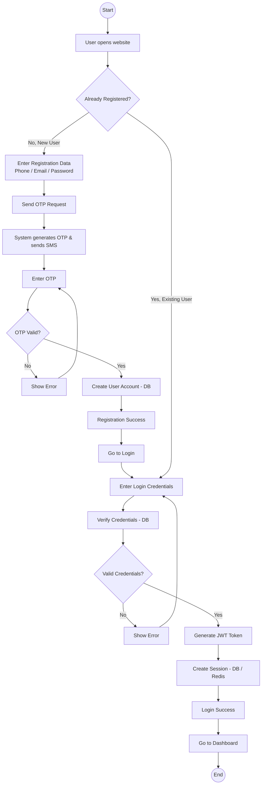

## Business Module Flow

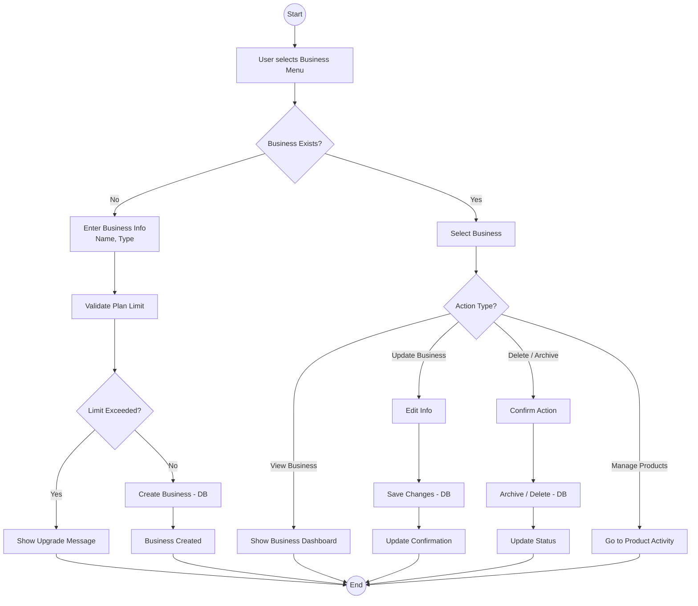

## Product Module Flow

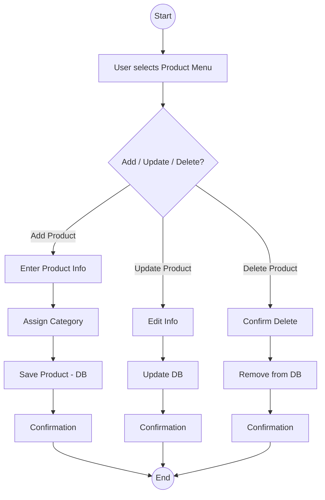

## Sales Module Flow

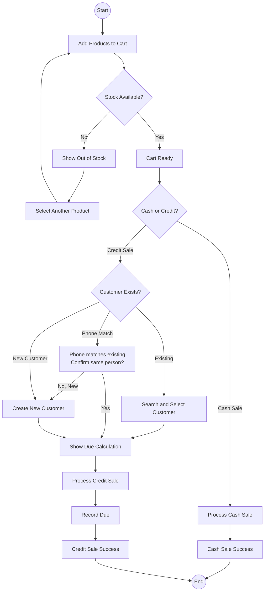

## Due & Customer Module Flow

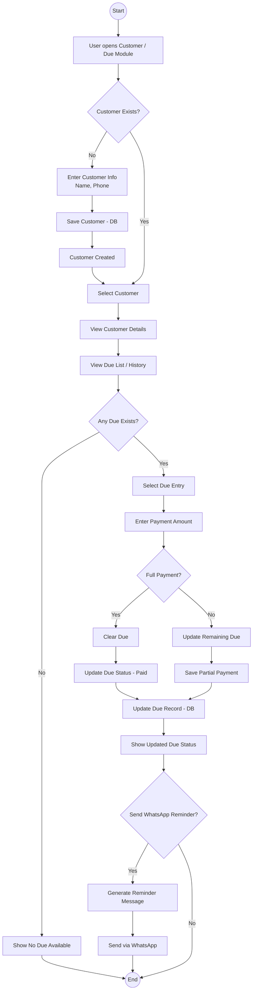

## Subscription, Payment & Coupon Module Flow

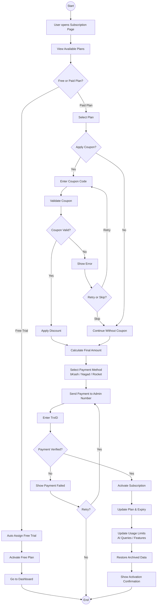

## Support Module Flow

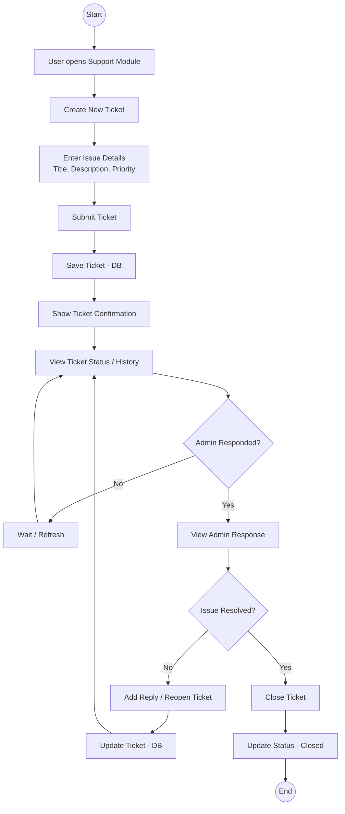

## Report Module Flow

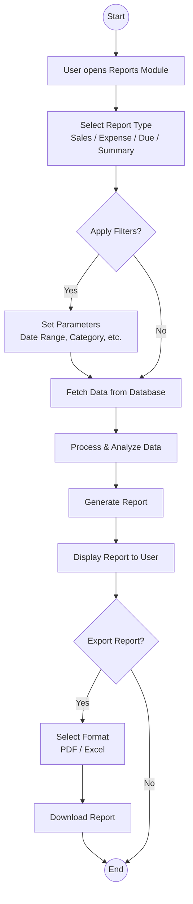

## Expense Module Flow

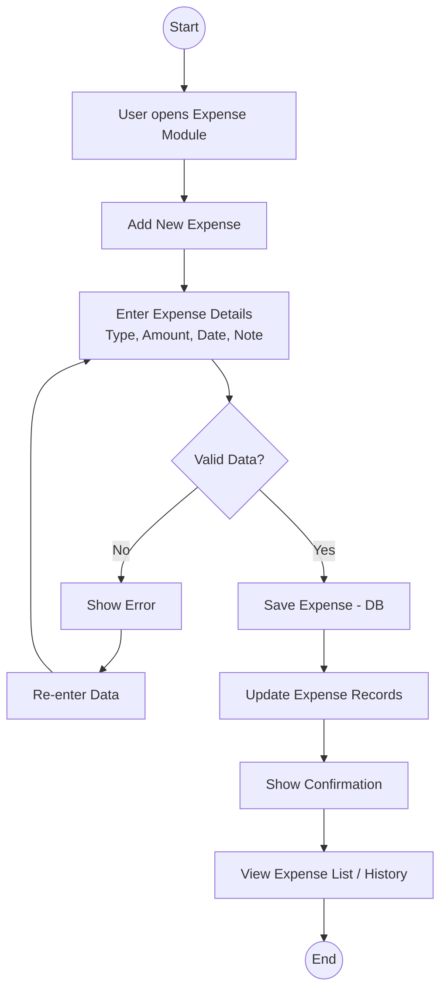

## AI Assistant Module Flow

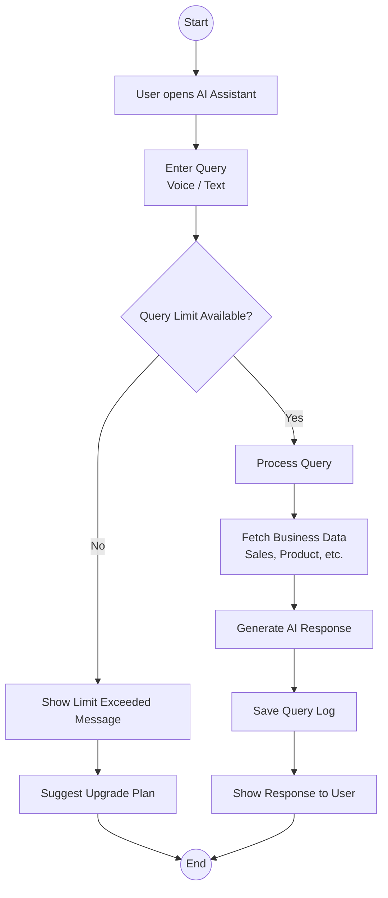

## Admin Category Request Moderation Flow

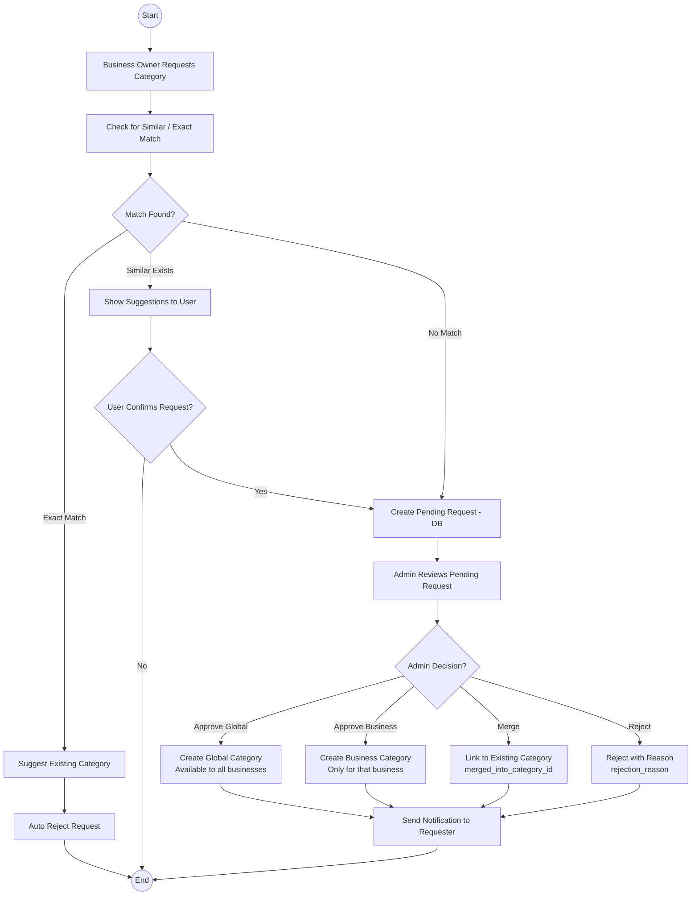

## Admin Coupon Management Flow

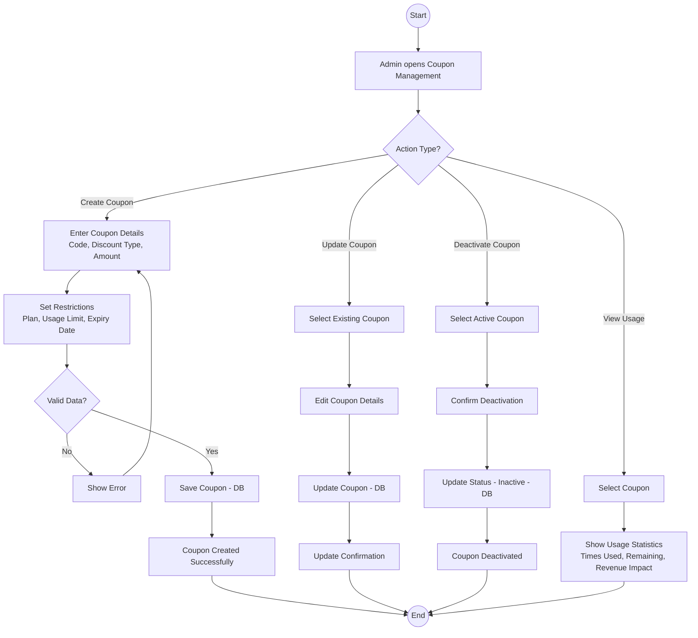
