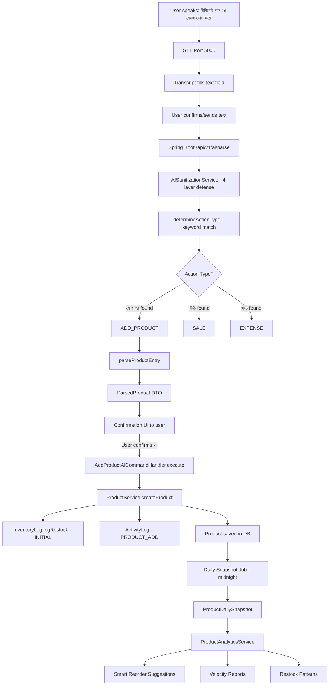
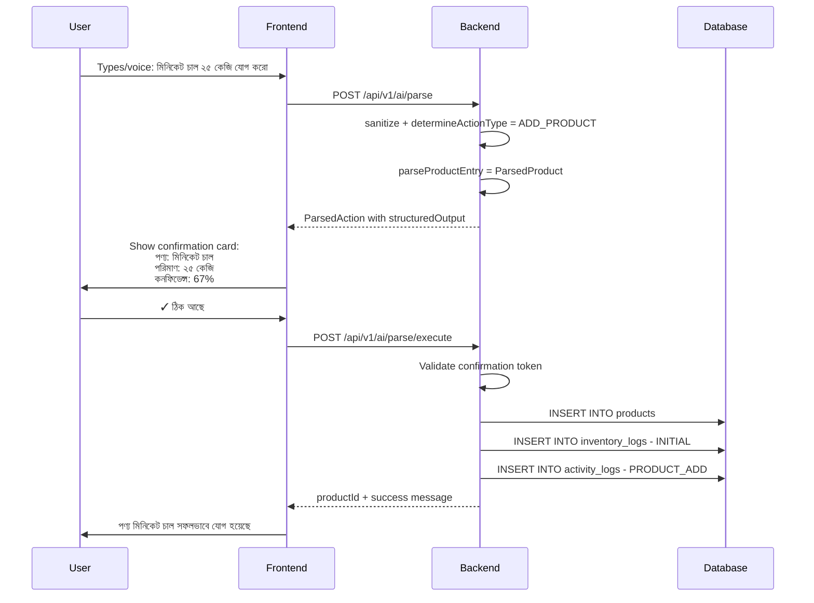
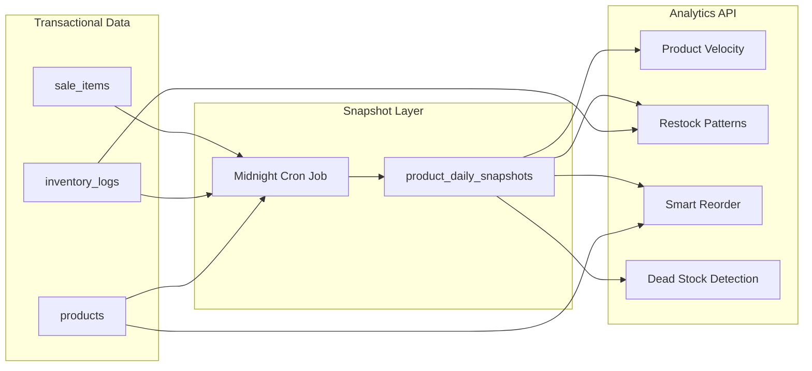

# ADD_PRODUCT AI Action + Product Analytics Implementation Plan

## Executive Summary

This plan covers two interconnected goals:

1. **ADD_PRODUCT AI Action**: Enable shopkeepers to add products via voice/text commands like "মিনিকেট চাল ২৫ কেজি যোগ করো 1650 taka"
2. **Product Analytics Foundation**: Build the data layer needed to provide real business insights that differentiate DokaniAI from competitors like Tally

## Follow this structure

## 📦 Add Product - AI Flow Architecture

### Sale vs Add Product এর পার্থক্য:

| Feature                      | Sale (বিক্রি)                                       | Add Product (পণ্য যোগ)                               |
| ---------------------------- | --------------------------------------------------------- | ----------------------------------------------------------- |
| **Input**              | "চাল ২০ কেজি বিক্রি ১২০০ টাকায়" | "চাল যোগ করো ৫০ কেজি ৬০ টাকা কেজি" |
| **AI Action**          | `SALE`                                                  | `PRODUCT_ADD`                                             |
| **Database**           | Sale + SaleItem + Stock কমবে                          | Product তৈরি + Stock যোগ                             |
| **Subscription Check** | -                                                         | `withUsageLimit('PRODUCT_ADD')`                           |

---

### Add Product Voice Flow:

```
┌─────────────────────────────────────────────────────────────────────────────┐
│                    ADD PRODUCT - VOICE TO ACTION                             │
├─────────────────────────────────────────────────────────────────────────────┤
│                                                                             │
│  ┌─────────────┐                                                            │
│  │   User      │                                                            │
│  │  Speaks     │                                                            │
│  └──────┬──────┘                                                            │
│         │                                                                   │
│         │  "চাল যোগ করো ৫০ কেজি কেনা ৫৫ টাকা বিক্রি ৬০ টাকা"              │
│         │                                                                   │
│         ▼                                                                   │
│  ┌─────────────────────────────────────────────────────────────────────┐   │
│  │  STEP 1: STT (FREE - No AI Query)                                    │   │
│  │  ─────────────────────────────────────────────────────────────────   │   │
│  │  BanglaSpeech2Text → "চাল যোগ করো ৫০ কেজি কেনা ৫৫ টাকা বিক্রি ৬০ টাকা" │   │
│  └─────────────────────────────────────────────────────────────────────┘   │
│         │                                                                   │
│         ▼                                                                   │
│  ┌─────────────────────────────────────────────────────────────────────┐   │
│  │  STEP 2: CHECK PRODUCT LIMIT (Subscription)                          │   │
│  │  ─────────────────────────────────────────────────────────────────   │   │
│  │  if (currentProducts >= plan.maxProducts) {                          │   │
│  │      showError("পণ্য সীমা শেষ। আপগ্রেড করুন।");                        │   │
│  │      return;                                                         │   │
│  │  }                                                                   │   │
│  └─────────────────────────────────────────────────────────────────────┘   │
│         │                                                                   │
│         ▼                                                                   │
│  ┌─────────────────────────────────────────────────────────────────────┐   │
│  │  STEP 3: NLP PARSING (AI Query - Counts)                             │   │
│  │  ─────────────────────────────────────────────────────────────────   │   │
│  │  Z.ai GLM-4 → Structured JSON                                        │   │
│  │                                                                      │   │
│  │  Input: "চাল যোগ করো ৫০ কেজি কেনা ৫৫ টাকা বিক্রি ৬০ টাকা"             │   │
│  │                                                                      │   │
│  │  Output:                                                             │   │
│  │  {                                                                   │   │
│  │    "action": "PRODUCT_ADD",                                          │   │
│  │    "confidence": 0.95,                                               │   │
│  │    "parsed": {                                                       │   │
│  │      "product": {                                                    │   │
│  │        "name": "চাল",                                                │   │
│  │        "existingProductId": "prod_123",  // if exists               │   │
│  │        "isNew": false                                                │   │
│  │      },                                                              │   │
│  │      "quantity": 50,                                                 │   │
│  │      "unit": "kg",                                                   │   │
│  │      "costPrice": 55,      // কেনা দর                                │   │
│  │      "sellPrice": 60,      // বিক্রি দর                              │   │
│  │      "category": {                                                   │   │
│  │        "suggested": "চাল-ডাল-মসলা",                                  │   │
│  │        "categoryId": "cat_001"                                       │   │
│  │      }                                                               │   │
│  │    },                                                                │   │
│  │    "needsConfirmation": true                                         │   │
│  │  }                                                                   │   │
│  └─────────────────────────────────────────────────────────────────────┘   │
│         │                                                                   │
│         ▼                                                                   │
│  ┌─────────────────────────────────────────────────────────────────────┐   │
│  │  STEP 4: CONFIRMATION UI                                             │   │
│  │  ─────────────────────────────────────────────────────────────────   │   │
│  │  ┌─────────────────────────────────────────────────────────────┐    │   │
│  │  │ পণ্য যোগ করুন - নিশ্চিত করুন                                   │    │   │
│  │  ├─────────────────────────────────────────────────────────────┤    │   │
│  │  │ পণ্যের নাম:  চাল                                              │    │   │
│  │  │ পরিমাণ:     ৫০ কেজি                                          │    │   │
│  │  │ কেনা দর:    ৳৫৫/কেজি                                          │    │   │
│  │  │ বিক্রি দর:   ৳৬০/কেজি                                          │    │   │
│  │  │ ক্যাটাগরি:  চাল-ডাল-মসলা ▼                                    │    │   │
│  │  │                                                              │    │   │
│  │  │ ⚠️ এই পণ্যটি আগে থেকেই আছে (স্টক আপডেট হবে)                      │    │   │
│  │  │                                                              │    │   │
│  │  │ [✓ ঠিক আছে]  [✗ ভুল হয়েছে]                                  │    │   │
│  │  └─────────────────────────────────────────────────────────────┘    │   │
│  └─────────────────────────────────────────────────────────────────────┘   │
│         │                                                                   │
│         │ User confirms                                                     │
│         ▼                                                                   │
│  ┌─────────────────────────────────────────────────────────────────────┐   │
│  │  STEP 5: DATABASE OPERATIONS                                         │   │
│  │  ─────────────────────────────────────────────────────────────────   │   │
│  │                                                                      │   │
│  │  if (product.isNew) {                                                │   │
│  │      // Create new product                                           │   │
│  │      await db.product.create({                                       │   │
│  │          name: "চাল",                                                │   │
│  │          unit: "kg",                                                 │   │
│  │          costPrice: 55,                                              │   │
│  │          sellPrice: 60,                                              │   │
│  │          stockQty: 50,                                               │   │
│  │          categoryId: "cat_001"                                       │   │
│  │      });                                                             │   │
│  │  } else {                                                            │   │
│  │      // Update existing product stock                                │   │
│  │      await db.product.update({                                       │   │
│  │          where: { id: existingProductId },                           │   │
│  │          data: {                                                     │   │
│  │              stockQty: { increment: 50 },                            │   │
│  │              costPrice: 55,  // Update prices                        │   │
│  │              sellPrice: 60                                           │   │
│  │          }                                                           │   │
│  │      });                                                             │   │
│  │  }                                                                   │   │
│  │                                                                      │   │
│  │  // Log inventory change                                             │   │
│  │  await db.inventoryLog.create({                                      │   │
│  │      changeType: "PURCHASE",                                         │   │
│  │      changeQty: 50                                                   │   │
│  │  });                                                                 │   │
│  │                                                                      │   │
│  └─────────────────────────────────────────────────────────────────────┘   │
│                                                                             │
└─────────────────────────────────────────────────────────────────────────────┘
```

---

### Various Add Product Input Examples:

```
┌─────────────────────────────────────────────────────────────────────────────┐
│                    ADD PRODUCT - INPUT EXAMPLES                              │
├─────────────────────────────────────────────────────────────────────────────┤
│                                                                             │
│  Example 1: Simple Product Add                                              │
│  ─────────────────────────────────────                                      │
│  Input:  "সাবান যোগ করো"                                                    │
│  Output: {                                                                  │
│    "action": "PRODUCT_ADD",                                                 │
│    "parsed": {                                                              │
│      "product": { "name": "সাবান", "isNew": true },                        │
│      "needsMoreInfo": ["quantity", "price"]                                 │
│    }                                                                        │
│  }                                                                          │
│  → UI asks for missing info                                                 │
│                                                                             │
│  Example 2: Product with Cost & Sell Price                                  │
│  ───────────────────────────────────────────                                │
│  Input:  "ডাল ২০ কেজি কেনা ১২০ বিক্রি ১৩০"                                 │
│  Output: {                                                                  │
│    "action": "PRODUCT_ADD",                                                 │
│    "parsed": {                                                              │
│      "product": { "name": "ডাল" },                                         │
│      "quantity": 20,                                                        │
│      "unit": "kg",                                                          │
│      "costPrice": 120,                                                      │
│      "sellPrice": 130                                                       │
│    }                                                                        │
│  }                                                                          │
│                                                                             │
│  Example 3: Product with Category                                           │
│  ─────────────────────────────────────                                      │
│  Input:  "পেয়ার ৫০ কেজি ৪০ টাকা কেজি শাকসবজি ক্যাটাগরিতে"                  │
│  Output: {                                                                  │
│    "action": "PRODUCT_ADD",                                                 │
│    "parsed": {                                                              │
│      "product": { "name": "পেয়ার" },                                      │
│      "quantity": 50,                                                        │
│      "unit": "kg",                                                          │
│      "sellPrice": 40,                                                       │
│      "category": { "name": "শাকসবজি" }                                     │
│    }                                                                        │
│  }                                                                          │
│                                                                             │
│  Example 4: Multiple Products at Once                                       │
│  ─────────────────────────────────────                                      │
│  Input:  "চাল ২০ কেজি ৬০ টাকা, ডাল ১০ কেজি ১৩০ টাকা"                        │
│  Output: {                                                                  │
│    "action": "PRODUCT_ADD_BATCH",                                           │
│    "parsed": {                                                              │
│      "products": [                                                          │
│        { "name": "চাল", "quantity": 20, "unit": "kg", "sellPrice": 60 },   │
│        { "name": "ডাল", "quantity": 10, "unit": "kg", "sellPrice": 130 }   │
│      ]                                                                      │
│    }                                                                        │
│  }                                                                          │
│  → Note: Batch counts as 1 AI Query but multiple product creates            │
│                                                                             │
│  Example 5: Stock Update (Existing Product)                                 │
│  ─────────────────────────────────────────                                  │
│  Input:  "চাল আর ৩০ কেজি এসেছে ৫৫ টাকা কেজি"                               │
│  Output: {                                                                  │
│    "action": "PRODUCT_ADD",                                                 │
│    "parsed": {                                                              │
│      "product": {                                                           │
│        "name": "চাল",                                                       │
│        "existingProductId": "prod_123",                                     │
│        "isNew": false                                                       │
│      },                                                                     │
│      "quantity": 30,                                                        │
│      "unit": "kg",                                                          │
│      "costPrice": 55,                                                       │
│      "isStockUpdate": true                                                  │
│    }                                                                        │
│  }                                                                          │
│                                                                             │
└─────────────────────────────────────────────────────────────────────────────┘
```

---

### NLP Prompt for Add Product:

```typescript
// /lib/ai/prompts/product-add.ts

export const PRODUCT_ADD_SYSTEM_PROMPT = `
তুমি একজন বাংলাদেশি দোকানের সহায়ক। তুমি পণ্য যোগ করার তথ্য বের করবে।

নিয়ম:
1. পণ্যের নাম, পরিমাণ, একক, কেনা দর, বিক্রি দর বের করবে
2. ক্যাটাগরি উল্লেখ থাকলে সেটাও বের করবে
3. পণ্য যদি আগে থেকে থাকে তাহলে existingProductId দেবে
4. JSON format এ আউটপুট দেবে

একক চিহ্ন:
- কেজি = kg
- পিস = pcs
- লিটার = liter
- বোতল = bottle
- প্যাকেট = packet

Output Format:
{
  "action": "PRODUCT_ADD",
  "confidence": 0.0-1.0,
  "parsed": {
    "product": {
      "name": "পণ্যের নাম",
      "existingProductId": "id_যদি_থাকে",
      "isNew": true/false
    },
    "quantity": number,
    "unit": "kg|pcs|liter|bottle|packet",
    "costPrice": number,
    "sellPrice": number,
    "category": {
      "name": "ক্যাটাগরি নাম",
      "categoryId": "id_যদি_থাকে"
    }
  },
  "needsConfirmation": true
}
`;
```

---

### API Endpoint:

```typescript
// /app/api/products/parse/route.ts

import { NextRequest, NextResponse } from 'next/server';
import { withSubscription, withUsageLimit } from '@/lib/subscription/guard';
import { askGLM4 } from '@/lib/ai/glm4';
import { PRODUCT_ADD_SYSTEM_PROMPT } from '@/lib/ai/prompts/product-add';

export const POST = withSubscription(
  withUsageLimit('PRODUCT_ADD')(async (req: NextRequest) => {
    const { businessId, input } = await req.json();
  
    // 1. Get existing products for matching
    const existingProducts = await db.product.findMany({
      where: { businessId, status: 'ACTIVE' },
      select: { id: true, name: true }
    });
  
    // 2. Build context for AI
    const context = `
বর্তমান পণ্যগুলো:
${existingProducts.map(p => `- ${p.name} (ID: ${p.id})`).join('\n')}
    `;
  
    // 3. Call AI
    const response = await askGLM4(
      PRODUCT_ADD_SYSTEM_PROMPT,
      `${context}\n\nইনপুট: ${input}`
    );
  
    const parsed = JSON.parse(response);
  
    // 4. If existing product found, add ID
    if (parsed.parsed?.product?.name) {
      const existing = existingProducts.find(
        p => p.name.toLowerCase() === parsed.parsed.product.name.toLowerCase()
      );
      if (existing) {
        parsed.parsed.product.existingProductId = existing.id;
        parsed.parsed.product.isNew = false;
      }
    }
  
    return NextResponse.json({ success: true, data: parsed });
  })
);
```

---

### Subscription Check for Products:

```typescript
// Product limit check before adding

const PLAN_PRODUCT_LIMITS = {
  FT1: 10,
  FT2: 20,
  BASIC: 100,
  PRO: 200,
  PLUS: -1,  // Unlimited
  ENTERPRISE: -1
};

// In API:
const currentCount = await db.product.count({
  where: { businessId, status: 'ACTIVE' }
});

const limit = PLAN_PRODUCT_LIMITS[user.plan];

if (limit !== -1 && currentCount >= limit) {
  return NextResponse.json({
    error: 'PRODUCT_LIMIT_EXCEEDED',
    message: `আপনার প্ল্যানে সর্বোচ্চ ${limit}টি পণ্য রাখা যায়`,
    current: currentCount,
    limit,
    upgradeRequired: true
  }, { status: 403 });
}
```

---

এটা হলো **Add Product** এর AI Flow architecture। এখন কি আরো কিছু যোগ করবেন? 🚀
একদম ঠিক বলেছেন! এটাই আমাদের **Core Value Proposition**। Tally বা অন্যান্য free app এ এই AI insights নেই - এটাই আমাদের competitive advantage।

চলুন architecture দেখাই:

---

## 🧠 AI Business Insights Architecture

### কেন এটা দরকার?

```
┌─────────────────────────────────────────────────────────────────────────────┐
│                    COMPETITIVE ADVANTAGE                                     │
├─────────────────────────────────────────────────────────────────────────────┤
│                                                                             │
│  Tally / Other Apps           vs           DokaniAI                         │
│  ─────────────────────                      ─────────────────               │
│  ✓ হিসাব রাখে                                ✓ হিসাব রাখে                   │
│  ✓ রিপোর্ট দেয়                               ✓ রিপোর্ট দেয়                  │
│  ✗ AI ইনসাইট নেই                             ✓ AI ইনসাইট আছে                 │
│  ✗ ভবিষ্যৎ বলে না                             ✓ ভবিষ্যৎ বলে (Prediction)      │
│  ✗ সুপারিশ দেয় না                            ✓ সুপারিশ দেয় (Actionable)     │
│                                                                             │
│  Example:                                                                   │
│  ─────────────────────────────────────────────────────────────────────────  │
│  Tally:     "আপনার চাল বিক্রি হয়েছে ৫০০ কেজি"                              │
│  DokaniAI:  "চাল সাধারণত ৫ দিনে শেষ হয়। আজ ৪র্থ দিন, কাল অর্ডার দিন।        │
│             গত মাসের তুলনায় বিক্রি ২০% বেশি, স্টক বাড়ালে লাভ বেশি হবে।"     │
│                                                                             │
└─────────────────────────────────────────────────────────────────────────────┘
```

---

### Data Collection Layer (What We Log)

```typescript
// ============================================
// ANALYTICS LOGGING ENTITIES
// ============================================

// 1. Product Performance Tracking (Daily Aggregated)
model ProductAnalytics {
  id              String   @id @default(cuid())
  businessId      String
  productId       String
  date            DateTime  // Daily snapshot
  
  // Sales Metrics
  qtySold         Float    @default(0)      // Total quantity sold
  revenue         Float    @default(0)      // Total revenue
  profit          Float    @default(0)      // Total profit
  saleCount       Int      @default(0)      // Number of sales
  
  // Stock Metrics
  openingStock    Float    @default(0)      // Day start stock
  closingStock    Float    @default(0)      // Day end stock
  stockAdded      Float    @default(0)      // Restock quantity
  stockoutMinutes Int      @default(0)      // Minutes out of stock
  isStockout      Boolean  @default(false)  // Was stockout today?
  
  // Velocity & Patterns
  daysToStockout  Float?   // Estimated days until empty
  velocityScore   Float    @default(0)      // How fast it sells (0-100)
  
  // Profitability
  profitMargin    Float    @default(0)      // profit/revenue %
  profitPerUnit   Float    @default(0)      // Average profit per unit
  
  createdAt       DateTime @default(now())
  
  @@unique([businessId, productId, date])
  @@index([businessId, date])
  @@index([productId, date])
}

// 2. Daily Business Snapshot
model BusinessAnalytics {
  id              String   @id @default(cuid())
  businessId      String
  date            DateTime
  
  // Revenue
  totalRevenue    Float    @default(0)
  totalProfit     Float    @default(0)
  totalExpenses   Float    @default(0)
  
  // Sales
  totalSales      Int      @default(0)      // Number of transactions
  avgBasketSize   Float    @default(0)      // Average per sale
  uniqueCustomers Int      @default(0)
  
  // Products
  productsSold    Int      @default(0)      // Unique products sold
  topProduct      String?                   // Best seller ID
  worstProduct    String?                   // Lowest seller ID
  
  // Stock Health
  stockoutProducts Int     @default(0)      // Products out of stock
  lowStockProducts Int     @default(0)      // Products near reorder
  overstockedValue Float   @default(0)      // Value of excess stock
  
  // Due/Credit
  dueCollected    Float    @default(0)
  dueCreated      Float    @default(0)
  totalDueBalance Float    @default(0)
  
  createdAt       DateTime @default(now())
  
  @@unique([businessId, date])
  @@index([businessId, date])
}

// 3. AI Insight Log (Generated Insights)
model AIInsight {
  id              String   @id @default(cuid())
  businessId      String
  
  // Insight Type
  type            String   // STOCKOUT_WARNING, PROFIT_OPPORTUNITY, 
                          // TREND_DETECTED, ANOMALY, RECOMMENDATION
  
  // Content
  title           String                    // "চাল শেষ হয়ে যাচ্ছে"
  message         String                    // Full insight message
  severity        String   @default("INFO") // INFO, WARNING, CRITICAL
  
  // Related Data
  entityType      String?  // PRODUCT, BUSINESS, CUSTOMER
  entityId        String?  // Related ID
  
  // AI Generated
  confidence      Float    @default(0.8)
  actionSuggested String?  // "restock", "reduce_price", etc.
  
  // User Interaction
  isRead          Boolean  @default(false)
  isActedUpon     Boolean  @default(false)
  userFeedback    String?  // "helpful", "not_relevant"
  
  validUntil      DateTime? // When insight expires
  createdAt       DateTime @default(now())
  
  @@index([businessId, type, createdAt])
  @@index([businessId, isRead])
}

// 4. User Activity Log (For Pattern Detection)
model ActivityLog {
  id              String   @id @default(cuid())
  businessId      String
  userId          String
  
  // Activity Details
  action          String   // SALE_CREATE, PRODUCT_ADD, DUE_COLLECT, etc.
  entityType      String   // PRODUCT, SALE, CUSTOMER, EXPENSE
  entityId        String?
  
  // Context
  metadata        Json?    // Additional context
  value           Float?   // Monetary value if applicable
  
  // Device/Session
  deviceType      String?  // mobile, tablet, desktop
  sessionId       String?
  
  createdAt       DateTime @default(now())
  
  @@index([businessId, action, createdAt])
  @@index([userId, createdAt])
}

// 5. Product Restock Pattern
model RestockPattern {
  id              String   @id @default(cuid())
  businessId      String
  productId       String
  
  // Pattern Detection
  avgDaysBetweenRestocks Float  @default(0)
  avgRestockQty          Float  @default(0)
  lastRestockDate        DateTime?
  nextPredictedRestock   DateTime?
  
  // Supplier Info
  preferredSupplier      String?
  supplierLeadTime       Int?   // Days
  
  // AI Prediction Accuracy
  predictionAccuracy     Float  @default(0)
  
  updatedAt      DateTime @updatedAt
  
  @@unique([businessId, productId])
}
```

---

### Insight Generation Examples

```
┌─────────────────────────────────────────────────────────────────────────────┐
│                    AI INSIGHTS EXAMPLES                                      │
├─────────────────────────────────────────────────────────────────────────────┤
│                                                                             │
│  ১. STOCKOUT PREDICTION (স্টক শেষ হবার ভবিষ্যৎবাণী)                           │
│  ─────────────────────────────────────────────────────────────────────────  │
│  Trigger: Product.velocityScore > 70 AND closingStock < avgDailySale * 3   │
│                                                                             │
│  ┌─────────────────────────────────────────────────────────────────────┐   │
│  │ ⚠️ চাল ২ দিনের মধ্যে শেষ হয়ে যাবে                                     │   │
│  │                                                                      │   │
│  │ বর্তমান স্টক: ৫০ কেজি                                                │   │
│  │ দৈনিক বিক্রি: গড় ২৫ কেজি                                            │   │
│  │ শেষ বার অর্ডার দিতে ২ দিন লেগেছিল                                     │   │
│  │                                                                      │   │
│  │ 💡 সুপারিশ: আজই অর্ডার দিন, কমপক্ষে ১০০ কেজি                          │   │
│  │                                                                      │   │
│  │ [অর্ডার তালিকায় যোগ করুন] [পরে দেখব]                                │   │
│  └─────────────────────────────────────────────────────────────────────┘   │
│                                                                             │
│  ২. PROFIT OPPORTUNITY (লাভের সুযোগ)                                        │
│  ─────────────────────────────────────────────────────────────────────────  │
│  Trigger: Product.profitMargin < avgCategoryMargin - 10%                   │
│                                                                             │
│  ┌─────────────────────────────────────────────────────────────────────┐   │
│  │ 💰 ডালে লাভ বাড়ানোর সুযোগ আছে                                        │   │
│  │                                                                      │   │
│  │ বর্তমান মার্জিন: ৮%                                                  │   │
│  │ ক্যাটাগরি গড়: ১৫%                                                   │   │
│  │ বিক্রি ভালো: মাসে ২০০ কেজি                                           │   │
│  │                                                                      │   │
│  │ 💡 সুপারিশ: দাম ৳১০ বাড়ালে লাভ বাড়বে ৳২০০০/মাস                      │   │
│  │                                                                      │   │
│  │ [দাম আপডেট করুন] [এড়িয়ে যান]                                       │   │
│  └─────────────────────────────────────────────────────────────────────┘   │
│                                                                             │
│  ৩. TREND DETECTION (ট্রেন্ড সনাক্তকরণ)                                     │
│  ─────────────────────────────────────────────────────────────────────────  │
│  Trigger: This week sales > last week * 1.3                                │
│                                                                             │
│  ┌─────────────────────────────────────────────────────────────────────┐   │
│  │ 📈 সাবানের বিক্রি বেড়েছে!                                            │   │
│  │                                                                      │   │
│  │ গত সপ্তাহ: ৫০ পিস                                                   │   │
│  │ এই সপ্তাহ: ৮০ পিস (৬০% বেশি)                                         │   │
│  │                                                                      │   │
│  │ 💡 সুপারিশ: স্টক বাড়ান, এটি মৌসুমের শুরু হতে পারে                     │   │
│  └─────────────────────────────────────────────────────────────────────┘   │
│                                                                             │
│  ৪. SLOW MOVING STOCK (অচল পণ্য সতর্কতা)                                    │
│  ─────────────────────────────────────────────────────────────────────────  │
│  Trigger: No sales in 14 days AND stockQty > 0                             │
│                                                                             │
│  ┌─────────────────────────────────────────────────────────────────────┐   │
│  │ 🐢 মশলা ১৪ দিন ধরে বিক্রি হয়নি                                        │   │
│  │                                                                      │   │
│  │ স্টকে আছে: ৫ কেজি (মূল্য ৳২,৫০০)                                     │   │
│  │ শেষ বিক্রি: ১৫ দিন আগে                                                │   │
│  │                                                                      │   │
│  │ 💡 সুপারিশ: ডিসকাউন্ট অফার দিন বা বিক্রি করুন                          │   │
│  │                                                                      │   │
│  │ [১০% ডিসকাউন্ট সেট করুন] [এড়িয়ে যান]                               │   │
│  └─────────────────────────────────────────────────────────────────────┘   │
│                                                                             │
│  ৫. PEAK TIME DETECTION (পিক টাইম)                                          │
│  ─────────────────────────────────────────────────────────────────────────  │
│  Trigger: Analyze sale timestamps                                          │
│                                                                             │
│  ┌─────────────────────────────────────────────────────────────────────┐   │
│  │ ⏰ আপনার দোকানে সবচেয়ে বেশি বিক্রি হয় বিকাল ৫-৭টায়                   │   │
│  │                                                                      │   │
│  │ সেই সময়ে ৪০% বিক্রি হয়                                              │   │
│  │                                                                      │   │
│  │ 💡 সুপারিশ: বিকাল ৪টায় স্টক চেক করুন, ক্যাশিয়ার রাখুন                 │   │
│  └─────────────────────────────────────────────────────────────────────┘   │
│                                                                             │
│  ৬. DUE COLLECTION INSIGHT (বাকী আদায়)                                     │
│  ─────────────────────────────────────────────────────────────────────────  │
│  Trigger: Customer due > 30 days AND payment pattern exists                │
│                                                                             │
│  ┌─────────────────────────────────────────────────────────────────────┐   │
│  │ 👤 রফিকুল ভাই সাধারণত ৫ তারিখে বকেয়া পরিশোধ করেন                       │   │
│  │                                                                      │   │
│  │ বর্তমান বকেয়া: ৳৩,৫০০                                                │   │
│  │ আজ ৪ তারিখ - কাল রিমাইন্ডার পাঠান ভালো হবে                             │   │
│  │                                                                      │   │
│  │ [WhatsApp এ রিমাইন্ডার পাঠান]                                         │   │
│  └─────────────────────────────────────────────────────────────────────┘   │
│                                                                             │
└─────────────────────────────────────────────────────────────────────────────┘
```

---

### Insight Generation Service

```typescript
// /lib/insights/generator.ts

export async function generateDailyInsights(businessId: string) {
  
  // 1. Stockout Prediction
  await generateStockoutInsights(businessId);
  
  // 2. Profit Opportunities
  await generateProfitInsights(businessId);
  
  // 3. Trend Detection
  await generateTrendInsights(businessId);
  
  // 4. Slow Moving Stock
  await generateSlowStockInsights(businessId);
  
  // 5. Due Collection Timing
  await generateDueInsights(businessId);
  
  // 6. Peak Time Analysis
  await generatePeakTimeInsights(businessId);
}

// Example: Stockout Prediction
async function generateStockoutInsights(businessId: string) {
  const products = await db.product.findMany({
    where: { businessId, status: 'ACTIVE' },
    include: {
      analytics: {
        orderBy: { date: 'desc' },
        take: 7  // Last 7 days
      }
    }
  });
  
  for (const product of products) {
    if (product.analytics.length < 3) continue;
  
    // Calculate average daily sale
    const totalSold = product.analytics.reduce((sum, a) => sum + a.qtySold, 0);
    const avgDailySale = totalSold / product.analytics.length;
  
    // Calculate days to stockout
    const daysToStockout = avgDailySale > 0 
      ? product.stockQty / avgDailySale 
      : 999;
  
    // Generate insight if critical
    if (daysToStockout <= 3 && avgDailySale > 0) {
      await db.aIInsight.create({
        data: {
          businessId,
          type: 'STOCKOUT_WARNING',
          title: `${product.name} ${Math.ceil(daysToStockout)} দিনের মধ্যে শেষ হয়ে যাবে`,
          message: `বর্তমান স্টক: ${product.stockQty} ${product.unit}। দৈনিক গড় বিক্রি: ${avgDailySale.toFixed(1)} ${product.unit}`,
          severity: daysToStockout <= 1 ? 'CRITICAL' : 'WARNING',
          entityType: 'PRODUCT',
          entityId: product.id,
          actionSuggested: 'restock',
          confidence: 0.85,
          validUntil: new Date(Date.now() + 24 * 60 * 60 * 1000) // 24 hours
        }
      });
    }
  
    // Update velocity score
    await db.productAnalytics.updateMany({
      where: { productId: product.id, date: new Date() },
      data: { 
        daysToStockout,
        velocityScore: Math.min(100, avgDailySale * 10) // Higher = faster
      }
    });
  }
}
```

---

### Dashboard Stats API

```typescript
// /app/api/insights/dashboard/route.ts

export async function GET(request: NextRequest) {
  const businessId = request.nextUrl.searchParams.get('businessId');
  
  // Get today's snapshot
  const today = await db.businessAnalytics.findUnique({
    where: { businessId_date: { businessId, date: new Date() } }
  });
  
  // Get insights count
  const insights = await db.aIInsight.count({
    where: { businessId, isRead: false }
  });
  
  // Get top products
  const topProducts = await db.productAnalytics.groupBy({
    by: ['productId'],
    where: { 
      businessId, 
      date: { gte: last30Days } 
    },
    _sum: { revenue: true, qtySold: true },
    orderBy: { _sum: { revenue: 'desc' } },
    take: 5
  });
  
  // Get stock health
  const stockHealth = {
    critical: await db.product.count({
      where: { businessId, stockQty: { lte: 0 } }
    }),
    low: await db.product.count({
      where: { 
        businessId, 
        stockQty: { gt: 0, lte: prisma.raw`reorder_point` } 
      }
    }),
    healthy: await db.product.count({
      where: { businessId, stockQty: { gt: prisma.raw`reorder_point` } }
    })
  };
  
  return NextResponse.json({
    today,
    unreadInsights: insights,
    topProducts,
    stockHealth
  });
}
```

---

### এটাই আমাদের Real Value:

| Feature                                              | Other Apps | DokaniAI       |
| ---------------------------------------------------- | ---------- | -------------- |
| হিসাব রাখা                                  | ✓         | ✓             |
| রিপোর্ট                                       | ✓         | ✓             |
| **স্টক শেষ হবার আগে জানান** | ✗         | ✓**AI** |
| **কোন পণ্য বেশি লাভদায়ক**  | ✗         | ✓**AI** |
| **কখন অর্ডার দেবেন**             | ✗         | ✓**AI** |
| **অচল পণ্য চিহ্নিত**             | ✗         | ✓**AI** |
| **পিক আওয়ার সাজেশন**           | ✗         | ✓**AI** |
| **বাকী আদায়ের সেরা সময়**  | ✗         | ✓**AI** |

---

**এটাই হলো আমাদের differentiation!** Shopkeeper কে শুধু data দেখালে হবে না - তাকে actionable insight দিতে হবে যা তার ব্যবসা বাড়াবে। 🚀

so plan file ta merge and update koro.
--------------------------------------

## Part 1: Gap Analysis — What Exists vs What's Missing

### ✅ What Already Exists

| Component                            | Status  | File                                       |
| ------------------------------------ | ------- | ------------------------------------------ |
| Product entity with profit methods   | ✅ Done | `Product.java`                           |
| InventoryLog with RESTOCK tracking   | ✅ Done | `InventoryLog.java`                      |
| Sale + SaleItem with profit per item | ✅ Done | `Sale.java`, `SaleItem.java`           |
| AI Command Handler pattern           | ✅ Done | `AbstractAICommandHandler.java`          |
| AI Command Registry auto-discovery   | ✅ Done | `AICommandRegistry.java`                 |
| 7 existing command handlers          | ✅ Done | `impl/command/*.java`                    |
| AI Sanitization 4-layer defense      | ✅ Done | `AISanitizationServiceImpl.java`         |
| Confirmation token flow              | ✅ Done | `AIConfirmationTokenService`             |
| Validation chain                     | ✅ Done | `AICommandValidationChain`               |
| ProductCreateRequest DTO             | ✅ Done | `ProductCreateRequest.java`              |
| ProductService.createProduct()       | ✅ Done | `ProductService.java`                    |
| InventoryLogService.logRestock()     | ✅ Done | `InventoryLogService.java`               |
| ProductStatsResponse                 | ✅ Done | `ProductStatsResponse.java`              |
| TopProductResponse                   | ✅ Done | `TopProductResponse.java`                |
| ProductProfitReport                  | ✅ Done | `ProductProfitReport.java`               |
| StockAlertReport                     | ✅ Done | `StockAlertReport.java`                  |
| BanglaDigitBigDecimalDeserializer    | ✅ Done | `BanglaDigitBigDecimalDeserializer.java` |

### ❌ What's Missing

| Gap                                                                  | Impact                                              | Priority     |
| -------------------------------------------------------------------- | --------------------------------------------------- | ------------ |
| `ADD_PRODUCT` not in `AIActionType` enum                         | Voice/text "যোগ করো" returns UNKNOWN          | **P0** |
| No ADD_PRODUCT keywords in `determineActionType()`                 | Can't detect product add intent                     | **P0** |
| No `AddProductAICommandHandler`                                    | No execution path for ADD_PRODUCT                   | **P0** |
| No `ParsedProduct` DTO                                             | No structured output for product parsing            | **P0** |
| Bengali digit regex bug in `extractAmount()`/`extractQuantity()` | ০-৯ digits not parsed                             | **P0** |
| `extractProductName()` too simplistic                              | Multi-word product names lost                       | **P1** |
| No `ProductDailySnapshot` entity                                   | Can't track stock trends over time                  | **P1** |
| No product velocity calculation                                      | Can't answer "which product finishes fastest?"      | **P1** |
| No restock pattern analysis                                          | Can't answer "how often do you restock?"            | **P1** |
| No smart reorder suggestions                                         | Can't suggest "order 50kg rice, runs out in 5 days" | **P1** |
| No dead-stock detection                                              | Can't identify products that never sell             | **P2** |

---

## Part 2: Implementation Plan

### Phase 1 — ADD_PRODUCT AI Action (Backend)

#### Step 1.1: Add `ADD_PRODUCT` to `AIActionType` enum

**File**: `com.dokaniai.enums.AIActionType`

```java
// Add between DISCOUNT and RETURN:
ADD_PRODUCT("Add Product", "পণ্য যোগ"),
```

Update enum methods:

- `requiresConfirmation()` → returns `true` for ADD_PRODUCT
- `affectsInventory()` → returns `true` for ADD_PRODUCT
- `isFinancialTransaction()` → returns `false` for ADD_PRODUCT (no money movement, just inventory)

#### Step 1.2: Add Bengali keywords to `determineActionType()`

**File**: `com.dokaniai.service.impl.AIParsingServiceImpl`

Add BEFORE the SALE check (product add should be detected early):

```java
// Product add indicators — check BEFORE sale to avoid "বিক্রি" false match
if (containsAny(lowerText, "যোগ কর", "যোগকর", "add product", "নতুন পণ্য", "new product",
                "পণ্য যোগ", "স্টক যোগ", "add stock", "add item")) {
    return AIActionType.ADD_PRODUCT;
}
```

**Important**: Must be placed BEFORE the SALE indicator because "যোগ" could appear in other contexts. The compound patterns "যোগ কর" and "পণ্য যোগ" are specific enough.

#### Step 1.3: Fix Bengali digit regex

**File**: `com.dokaniai.service.impl.AIParsingServiceImpl`

Current bug: `extractAmount()` uses `\\d` which only matches ASCII 0-9, not Bengali ০-৯.

Fix `extractAmount()`:

```java
private BigDecimal extractAmount(String text) {
    // Convert Bengali digits to ASCII first
    String normalized = normalizeBengaliDigits(text);
  
    Pattern pattern = Pattern.compile("(\\d+(?:\\.\\d+)?)\\s*(?:টাকা|taka|tk|৳)?");
    Matcher matcher = pattern.matcher(normalized);
  
    if (matcher.find()) {
        return new BigDecimal(matcher.group(1));
    }
  
    // Check for Bengali number words
    for (Map.Entry<String, Integer> entry : BENGALI_NUMBERS.entrySet()) {
        if (text.contains(entry.getKey())) {
            return new BigDecimal(entry.getValue());
        }
    }
  
    return BigDecimal.ZERO;
}
```

Add helper method:

```java
private String normalizeBengaliDigits(String text) {
    StringBuilder sb = new StringBuilder();
    for (char c : text.toCharArray()) {
        if (c >= '\u09E6' && c <= '\u09EF') { // Bengali digits ০-৯
            sb.append((char) ('0' + (c - '\u09E6')));
        } else {
            sb.append(c);
        }
    }
    return sb.toString();
}
```

Apply same fix to `extractQuantity()` and `extractPercentage()`.

#### Step 1.4: Improve `extractProductName()`

Current implementation returns first word >2 chars without digits. This fails for "মিনিকেট চাল" (returns only "মিনিকেট").

**New approach**:

```java
private String extractProductName(String text) {
    // Remove known action keywords, quantities, amounts, units
    String cleaned = text
        .replaceAll("(?i)(বিক্রি|বিক্রয়|sell|sold|sale|খরচ|expense|যোগ\\s*কর|add|বাকি|বকেয়া|জমা|ফেরত|ছাড়|discount)", "")
        .replaceAll("\\d+(?:\\.\\d+)?", "")  // Remove numbers
        .replaceAll("(টাকা|taka|tk|৳|কেজি|লিটার|পিস|টি|টা|kg|liter|piece)", "") // Remove units
        .replaceAll("\\s+", " ")
        .trim();
  
    if (!cleaned.isEmpty() && cleaned.length() > 1) {
        return cleaned;
    }
  
    // Fallback: first non-numeric word
    String[] words = text.split("\\s+");
    for (String word : words) {
        if (!word.matches(".*\\d.*") && word.length() > 2) {
            return word;
        }
    }
    return null;
}
```

#### Step 1.5: Create `ParsedProduct` record

**New file**: `com.dokaniai.dto.response.ParsedProduct`

```java
package com.dokaniai.dto.response;

import java.math.BigDecimal;

public record ParsedProduct(
    String name,
    String unit,
    BigDecimal costPrice,
    BigDecimal sellPrice,
    BigDecimal stockQty,
    BigDecimal reorderPoint,
    String categoryName,   // Will try to match existing category
    BigDecimal confidenceScore
) {}
```

#### Step 1.6: Add `parseProductEntry()` to AIParsingService

**File**: `com.dokaniai.service.AIParsingService`

```java
/**
 * Parse product add entry from text
 */
ParsedProduct parseProductEntry(UUID businessId, String text);
```

#### Step 1.7: Implement `parseProductEntry()` in AIParsingServiceImpl

```java
@Override
public ParsedProduct parseProductEntry(UUID businessId, String text) {
    log.info("Parsing product entry for business: {}", businessId);
  
    String productName = extractProductName(text);
    BigDecimal quantity = extractQuantity(text);
    String unit = extractUnit(text);
    BigDecimal amount = extractAmount(text);
  
    // For ADD_PRODUCT, amount is typically cost price
    BigDecimal costPrice = amount;
    BigDecimal sellPrice = BigDecimal.ZERO; // User must set manually or via follow-up
  
    // Default reorder point = 20% of initial stock
    BigDecimal reorderPoint = quantity != null 
        ? quantity.multiply(new BigDecimal("0.2")).setScale(0, RoundingMode.UP) 
        : BigDecimal.ZERO;
  
    BigDecimal confidence = calculateConfidence(amount, quantity, productName);
  
    return new ParsedProduct(
        productName, unit, costPrice, sellPrice,
        quantity, reorderPoint, null, confidence
    );
}
```

#### Step 1.8: Update `parseText()` to handle ADD_PRODUCT

**File**: `com.dokaniai.service.impl.AIParsingServiceImpl`

In the `parseText()` method, add a case for `ADD_PRODUCT`:

```java
case ADD_PRODUCT -> {
    ParsedProduct product = parseProductEntry(businessId, sanitizedText);
    structuredOutput = objectMapper.writeValueAsString(product);
    confidenceScore = product.confidenceScore();
}
```

#### Step 1.9: Create `AddProductAICommandHandler`

**New file**: `com.dokaniai.service.impl.command.AddProductAICommandHandler`

```java
@Component
@RequiredArgsConstructor
public class AddProductAICommandHandler extends AbstractAICommandHandler implements AICommandHandler {

    private final AIParsingService aiParsingService;
    private final ProductService productService;
    private final CategoryService categoryService;
    private final MessageHelper messageHelper;

    @Override
    public AIActionType supportedAction() {
        return AIActionType.ADD_PRODUCT;
    }

    @Override
    public Map<String, Object> execute(AIParsedCommand command) {
        ParsedProduct parsedProduct = aiParsingService.parseProductEntry(
            command.businessId(), command.originalText()
        );

        // Try to match category by name if provided
        UUID categoryId = null;
        if (parsedProduct.categoryName() != null) {
            categoryId = categoryService.findByName(
                command.businessId(), parsedProduct.categoryName()
            ).map(Category::getId).orElse(null);
        }

        ProductCreateRequest request = new ProductCreateRequest(
            parsedProduct.name(),
            null,   // sku — auto-generate
            null,   // barcode
            categoryId,
            null,   // subCategoryId
            parsedProduct.unit(),
            parsedProduct.costPrice(),
            parsedProduct.sellPrice(),
            parsedProduct.stockQty(),
            parsedProduct.reorderPoint(),
            "Added via AI voice command"
        );

        Product product = productService.createProduct(
            command.businessId(), request, command.userId()
        );

        Map<String, Object> result = baseResult(command);
        result.put("executed", true);
        result.put("productId", product.getId());
        result.put("productName", product.getName());
        result.put("stockQty", product.getStockQty());
        result.put("message", messageHelper.get(
            "ai.command.product.created", product.getName()
        ));
        return result;
    }
}
```

#### Step 1.10: Add i18n message

**File**: `src/main/resources/messages/messages_bn.properties`

```
ai.command.product.created=পণ্য "{0}" সফলভাবে যোগ করা হয়েছে
```

**File**: `src/main/resources/messages/messages_en.properties`

```
ai.command.product.created=Product "{0}" has been added successfully
```

---

### Phase 2 — Product Analytics Foundation (Backend)

#### Step 2.1: Create `ProductDailySnapshot` entity

**New file**: `com.dokaniai.entity.ProductDailySnapshot`

```java
@Entity
@Table(name = "product_daily_snapshots", indexes = {
    @Index(name = "idx_pds_product_date", columnList = "product_id, snapshot_date"),
    @Index(name = "idx_pds_business_date", columnList = "business_id, snapshot_date")
})
public class ProductDailySnapshot {
    @Id @UuidGenerator
    private UUID id;
  
    private UUID productId;
    private UUID businessId;
    private OffsetDateTime snapshotDate;
  
    private BigDecimal stockQty;           // End-of-day stock
    private BigDecimal totalSoldQty;       // Units sold today
    private BigDecimal totalRevenue;       // Revenue today
    private BigDecimal totalCost;          // Cost today
    private BigDecimal totalProfit;        // Profit today
    private Long saleCount;                // Number of sales today
    private BigDecimal restockQty;         // Units restocked today
  
    @PrePersist
    protected void onCreate() {
        if (snapshotDate == null) snapshotDate = OffsetDateTime.now();
    }
}
```

#### Step 2.2: Flyway migration V18

**New file**: `V18__Create_Product_Daily_Snapshots.sql`

```sql
CREATE TABLE product_daily_snapshots (
    id UUID PRIMARY KEY,
    product_id UUID NOT NULL REFERENCES products(id),
    business_id UUID NOT NULL REFERENCES businesses(id),
    snapshot_date TIMESTAMPTZ NOT NULL,
    stock_qty DECIMAL(12,3) NOT NULL DEFAULT 0,
    total_sold_qty DECIMAL(12,3) NOT NULL DEFAULT 0,
    total_revenue DECIMAL(12,2) NOT NULL DEFAULT 0,
    total_cost DECIMAL(12,2) NOT NULL DEFAULT 0,
    total_profit DECIMAL(12,2) NOT NULL DEFAULT 0,
    sale_count BIGINT NOT NULL DEFAULT 0,
    restock_qty DECIMAL(12,3) NOT NULL DEFAULT 0,
    created_at TIMESTAMPTZ NOT NULL DEFAULT NOW(),
    UNIQUE(product_id, snapshot_date)
);

CREATE INDEX idx_pds_product_date ON product_daily_snapshots(product_id, snapshot_date);
CREATE INDEX idx_pds_business_date ON product_daily_snapshots(business_id, snapshot_date);
```

#### Step 2.3: Create analytics response DTOs

**New files**:

`ProductVelocityReport.java`:

```java
public record ProductVelocityReport(
    UUID productId,
    String productName,
    BigDecimal dailyVelocity,      // Units sold per day
    BigDecimal weeklyVelocity,     // Units sold per week
    Integer daysUntilOutOfStock,   // Estimated days until stock runs out
    String urgencyLevel            // CRITICAL, HIGH, MEDIUM, LOW
) {}
```

`RestockPatternReport.java`:

```java
public record RestockPatternReport(
    UUID productId,
    String productName,
    Integer avgDaysBetweenRestocks,
    BigDecimal avgRestockQuantity,
    OffsetDateTime lastRestockDate,
    Integer daysSinceLastRestock,
    Boolean isOverdueForRestock
) {}
```

`SmartReorderSuggestion.java`:

```java
public record SmartReorderSuggestion(
    UUID productId,
    String productName,
    BigDecimal currentStock,
    BigDecimal dailyVelocity,
    Integer daysUntilOutOfStock,
    BigDecimal suggestedOrderQty,
    BigDecimal estimatedCost,
    String reason
) {}
```

`ProductPerformanceReport.java`:

```java
public record ProductPerformanceReport(
    OffsetDateTime startDate,
    OffsetDateTime endDate,
    List<ProductPerformanceItem> products,
    List<ProductVelocityReport> fastestMoving,
    List<ProductVelocityReport> slowestMoving,
    List<SmartReorderSuggestion> reorderSuggestions
) {}

public record ProductPerformanceItem(
    UUID productId,
    String productName,
    BigDecimal totalSold,
    BigDecimal totalRevenue,
    BigDecimal totalProfit,
    BigDecimal profitMargin,
    BigDecimal avgDailySales
) {}
```

#### Step 2.4: Create `ProductAnalyticsService`

**New file**: `com.dokaniai.service.ProductAnalyticsService`

```java
public interface ProductAnalyticsService {
  
    /** Get sales velocity for a specific product */
    ProductVelocityReport getProductVelocity(UUID businessId, UUID productId, int lookbackDays);
  
    /** Get products that sell fastest — sorted by velocity */
    List<ProductVelocityReport> getFastestMovingProducts(UUID businessId, int limit);
  
    /** Get products that rarely/never sell — dead stock */
    List<ProductPerformanceItem> getSlowestMovingProducts(UUID businessId, int limit);
  
    /** Get restock patterns for a product */
    RestockPatternReport getRestockPattern(UUID businessId, UUID productId);
  
    /** Get AI-calculated reorder suggestions */
    List<SmartReorderSuggestion> getSmartReorderSuggestions(UUID businessId);
  
    /** Get comprehensive product performance report */
    ProductPerformanceReport getProductPerformanceReport(UUID businessId, int days);
  
    /** Take daily snapshot — called by scheduled job */
    void takeDailySnapshot(UUID businessId);
  
    /** Take daily snapshots for all businesses */
    void takeAllBusinessSnapshots();
}
```

#### Step 2.5: Implement `ProductAnalyticsServiceImpl`

Key implementation approach:

- **Velocity**: Query `sale_items` grouped by `product_id` over last N days, divide by days
- **Days until out**: `currentStock / dailyVelocity`
- **Restock pattern**: Query `inventory_logs` where `changeType = RESTOCK`, calculate avg interval
- **Smart reorder**: Combine velocity + current stock + restock frequency → suggest quantity
- **Daily snapshot**: Aggregate today's `sale_items` + current `product.stockQty` → insert/upsert snapshot

#### Step 2.6: Create scheduled job for daily snapshots

**New file**: `com.dokaniai.service.impl.ProductDailySnapshotJob`

```java
@Component
@RequiredArgsConstructor
public class ProductDailySnapshotJob {
    private final ProductAnalyticsService analyticsService;
  
    @Scheduled(cron = "0 5 0 * * *") // 12:05 AM every day (Bangladesh time)
    public void takeDailySnapshots() {
        analyticsService.takeAllBusinessSnapshots();
    }
}
```

#### Step 2.7: Add analytics endpoints

**File**: `com.dokaniai.controller.ReportController` (or new `ProductAnalyticsController`)

```
GET /api/v1/products/analytics/velocity?days=30
GET /api/v1/products/analytics/fastest-moving?limit=10
GET /api/v1/products/analytics/reorder-suggestions
GET /api/v1/products/analytics/performance?days=30
GET /api/v1/products/{productId}/analytics/velocity?days=30
GET /api/v1/products/{productId}/analytics/restock-pattern
```

---

### Phase 3 — Frontend Updates

#### Step 3.1: Update frontend `AIActionType`

**File**: `src/types/ai.ts`

Add `ADD_PRODUCT` to the union type.

#### Step 3.2: Update VoiceCommandBar confirmation UI

**File**: `src/components/products/VoiceCommandBar.tsx`

Add ADD_PRODUCT-specific confirmation display:

- Show: product name, quantity, unit, cost price
- Bengali label: "পণ্য যোগ নিশ্চিত করুন"

#### Step 3.3: Create/enhance ProductInsightPanel

**File**: `src/components/products/ProductInsightPanel.tsx`

Show on the products page:

- Top fastest-moving products
- Smart reorder suggestions
- Products running out soon

#### Step 3.4: Add analytics API functions

**File**: `src/lib/productAnalyticsApi.ts` (new)

```typescript
export async function getFastestMovingProducts(businessId: string, limit: number)
export async function getReorderSuggestions(businessId: string)
export async function getProductPerformance(businessId: string, days: number)
```

---

### Phase 4 — SRS Update

#### Step 4.1: Update SRSv2.md

Add to Section 9.5.2 Supported Text Parsing Actions:

- ADD_PRODUCT action with Bengali examples

Add new Section 9.9: Product Analytics & Business Intelligence:

- Daily snapshot mechanism
- Velocity calculation
- Smart reorder algorithm
- Dead-stock detection

---

## Architecture Flow Diagram



## ADD_PRODUCT Confirmation Flow



## Product Analytics Data Flow



---

## Files to Create/Modify Summary

### Backend — New Files (8)

| # | File                                                     | Purpose                  |
| - | -------------------------------------------------------- | ------------------------ |
| 1 | `dto/response/ParsedProduct.java`                      | Parsed product DTO       |
| 2 | `service/impl/command/AddProductAICommandHandler.java` | ADD_PRODUCT handler      |
| 3 | `entity/ProductDailySnapshot.java`                     | Daily snapshot entity    |
| 4 | `repository/ProductDailySnapshotRepository.java`       | JPA repository           |
| 5 | `service/ProductAnalyticsService.java`                 | Analytics interface      |
| 6 | `service/impl/ProductAnalyticsServiceImpl.java`        | Analytics implementation |
| 7 | `service/impl/ProductDailySnapshotJob.java`            | Scheduled job            |
| 8 | `db/migration/V18__Create_Product_Daily_Snapshots.sql` | Flyway migration         |

### Backend — Modified Files (6)

| # | File                                       | Change                                              |
| - | ------------------------------------------ | --------------------------------------------------- |
| 1 | `enums/AIActionType.java`                | Add ADD_PRODUCT enum value                          |
| 2 | `service/impl/AIParsingServiceImpl.java` | Add keywords, parseProductEntry, fix Bengali digits |
| 3 | `service/AIParsingService.java`          | Add parseProductEntry method                        |
| 4 | `controller/AIController.java`           | No change needed — registry auto-discovers         |
| 5 | `messages/messages_bn.properties`        | Add ai.command.product.created                      |
| 6 | `messages/messages_en.properties`        | Add ai.command.product.created                      |

### Frontend — Modified Files (3)

| # | File                                                | Change                          |
| - | --------------------------------------------------- | ------------------------------- |
| 1 | `src/types/ai.ts`                                 | Add ADD_PRODUCT to AIActionType |
| 2 | `src/components/products/VoiceCommandBar.tsx`     | ADD_PRODUCT confirmation UI     |
| 3 | `src/components/products/ProductInsightPanel.tsx` | Show analytics insights         |

### Frontend — New Files (1)

| # | File                               | Purpose                 |
| - | ---------------------------------- | ----------------------- |
| 1 | `src/lib/productAnalyticsApi.ts` | Analytics API functions |

### Documentation — Modified Files (1)

| # | File         | Change                                       |
| - | ------------ | -------------------------------------------- |
| 1 | `SRSv2.md` | Add ADD_PRODUCT + Product Analytics sections |

---

## Risk Considerations

1. **Category matching**: When user says "চাল" we need to match it to an existing category. If no match, product is created without category — user can set later. => AI will match that from exisiting category, if not related category AI will suggest to create related category [as user can't create category, user will request for category, then admin will manage that].
2. **Duplicate product detection**: Should check if product with similar name exists before creating. Use `ProductService.existsByName()`.
3. **Bengali digit normalization**: The fix must handle mixed Bengali/English digits in the same text.
4. **Snapshot job performance**: For businesses with many products, the midnight job should batch-insert. Consider 1000-product batch size.
5. **Analytics accuracy**: Velocity calculations need at least 7 days of data to be meaningful. Show "insufficient data" for newer products.
6. **Subscription gating**: Smart reorder suggestions should be a Pro/Plus feature per the feature matrix. Free users see basic stock alerts only.
