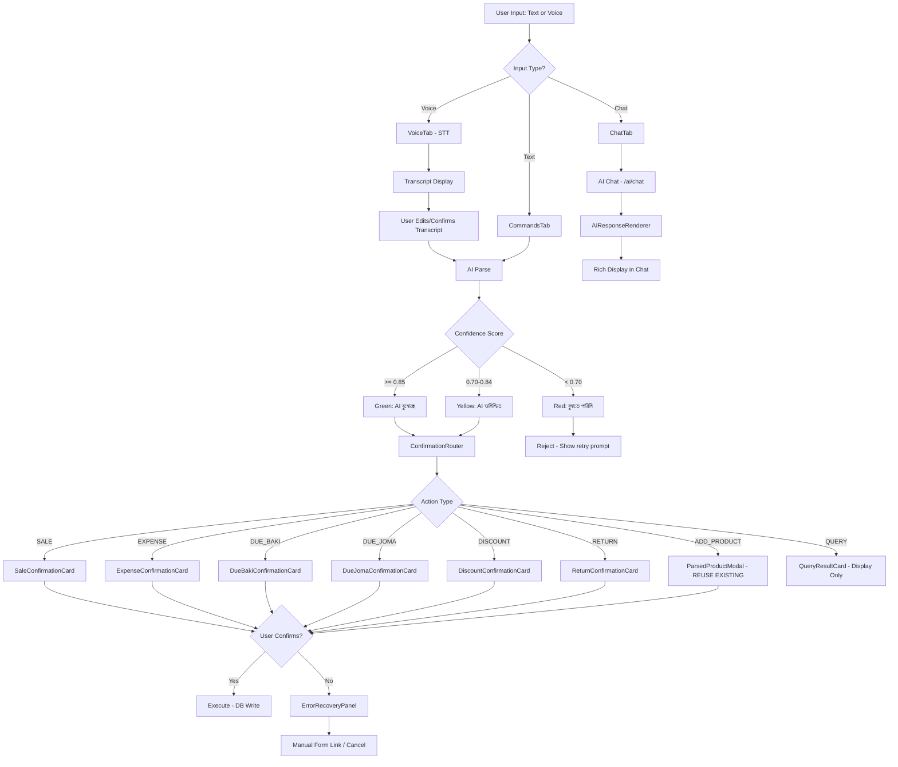
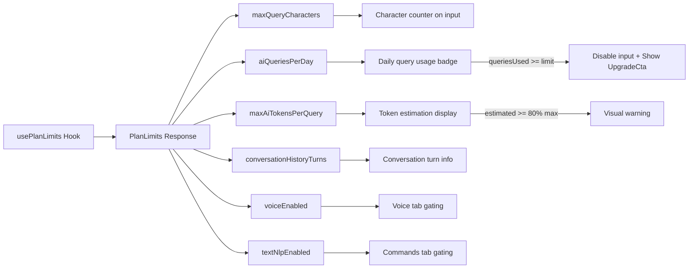

# AI Page Complete Plan (Revised v2)

**Page:** `/shop/{businessId}/ai`
**Route file:** `src/app/shop/[businessId]/ai/page.tsx`
**Main component:** `src/components/ai/AIWorkspace.tsx`
**SRS Reference:** Section 9 — AI Assistant Specification
**AGENTS.md:** Followed — read `node_modules/next/dist/docs/` before writing code

---

## Current State Summary

The AI page has a functional three-tab layout:

| Tab      | Component       | Status                                                             |
| -------- | --------------- | ------------------------------------------------------------------ |
| Chat     | `ChatTab`     | Functional — conversation history, quick queries, message display |
| Voice    | `VoiceTab`    | Functional — recording, STT, session state machine, parse preview |
| Commands | `CommandsTab` | Functional — text NLP input, parse & execute flow                 |

**Supporting infrastructure already in place:**

- [`aiApi.ts`](src/lib/aiApi.ts) — Full API client (chat, voice sessions, parse/execute, usage stats)
- [`ai.ts`](src/types/ai.ts) — Comprehensive TypeScript types
- [`usePlanLimits`](src/hooks/usePlanLimits.ts) — Fetches `PlanLimits` from backend
- [`usePlanFeatures`](src/hooks/usePlanFeatures.ts) — Feature gating (voice, text_nlp, ai_insights)
- [`localeNumber.ts`](src/lib/localeNumber.ts) — Already has `formatCurrencyBDT()` and `formatLocalizedNumber()` for Bengali numerals
- Bengali i18n in [`bn.json`](messages/bn.json:2144) — `shop.ai` section with all translations

**Already-built features to REUSE (not rebuild):**

- [`ParsedProductModal.tsx`](src/components/products/ParsedProductModal.tsx) — Product confirmation modal with confidence bar, editable fields, confirm/cancel. Reuse for ADD_PRODUCT actions in AI page.
- [`VoiceCommandBar.tsx`](src/components/products/VoiceCommandBar.tsx) — Voice recording + STT + NLP parse flow on Products page. Pattern reference for VoiceTab.
- [`formatCurrencyBDT()`](src/lib/localeNumber.ts:88) — Already formats `৳১,২০০`. No new utility needed.

**Subscription infrastructure already in place:**

- [`PlanLimits`](src/types/subscription.ts:56) type has: `aiQueriesPerDay`, `maxAiTokensPerQuery`, `conversationHistoryTurns`, `maxQueryCharacters`, `voiceEnabled`, `textNlpEnabled`
- [`Plan`](src/types/subscription.ts:20) type has all plan tier fields
- [`usePlanLimits`](src/hooks/usePlanLimits.ts) hook fetches limits — currently only uses `maxQueryCharacters`

---

## Gap Analysis: SRS vs Current Implementation (Revised)

### GAP-1: Structured Confirmation UI (SRS 9.6.2) — CRITICAL ✅ CONFIRMED

**SRS Requirement:** All AI-parsed transactions MUST show a proper Bengali confirmation dialog before database insertion (FR-AI-CONFIRM-01).

**Current State:** The [`CommandPreview`](src/components/ai/AIWorkspace.tsx:823) component shows `structuredOutput` as raw JSON in a `<pre>` tag. This is developer-facing, not user-facing.

**Required UI per SRS 9.6.2:**

```
┌─────────────────────────────────────────────────────────────────┐
│  AI বুঝেছে - নিশ্চিত করুন                                        │
├─────────────────────────────────────────────────────────────────┤
│  আপনার কথা: "চাল ২০ কেজি বিক্রি ১২০০ টাকায়"                     │
│                                                                 │
│  AI বুঝেছে:                                                     │
│  ┌─────────────────────────────────────────────────────────┐   │
│  │ পণ্য: চাল                                               │   │
│  │ পরিমাণ: ২০ কেজি                                        │   │
│  │ দর: ৬০ টাকা/কেজি                                       │   │
│  │ মোট: ১,২০০ টাকা                                        │   │
│  │ পেমেন্ট: নগদ                                            │   │
│  └─────────────────────────────────────────────────────────┘   │
│                                                                 │
│  [✓ ঠিক আছে, সেভ করুন]  [✗ ভুল হয়েছে, আবার বলুন]              │
└─────────────────────────────────────────────────────────────────┘
```

**Reuse:** Follow the pattern from [`ParsedProductModal.tsx`](src/components/products/ParsedProductModal.tsx) — confidence bar, editable form fields, confirm/cancel footer. Use [`formatCurrencyBDT()`](src/lib/localeNumber.ts:88) for monetary values.

### GAP-2: Confidence-Based UX Tiers (SRS 9.6.3) — HIGH ✅ CONFIRMED

**SRS Requirement:** Three distinct UX behaviors based on confidence score.

| Confidence | Current                  | Required                                                                                                  |
| ---------- | ------------------------ | --------------------------------------------------------------------------------------------------------- |
| ≥ 0.85    | Shows confidence % badge | Green confirmation dialog: "AI বুঝেছে - নিশ্চিত করুন"                                    |
| 0.70–0.84 | Shows confidence % badge | Yellow warning with highlighted uncertain fields: "AI অনিশ্চিত - দয়া করে চেক করুন" |
| < 0.70     | No special handling      | Red rejection: "বুঝতে পারিনি, আবার বলুন" — no confirmation shown                      |

**Reuse:** The [`confidenceColor()`](src/components/products/ParsedProductModal.tsx:14) function in ParsedProductModal already has tier logic (≥80 green, ≥50 amber, <50 red). Adapt thresholds to SRS values (≥85, ≥70, <70).

### GAP-3: Error Recovery (SRS 9.6.4) — HIGH ✅ CONFIRMED (TRIMMED)

**SRS Requirement FR-AI-RECOVER-01:** If user rejects parsed output:

1. ✅ Store original text in audit log for improvement (backend — already done)
2. ✅ Offer manual form entry as alternative
3. ❌ ~~Allow voice re-recording if voice input~~ — REMOVED per user feedback
4. ❌ ~~Prompt user to rephrase if repeated failures~~ — REMOVED per user feedback

**Scope:** Only implement audit log acknowledgment + manual form fallback link.

### GAP-4: Feature Gating for Commands Tab — MEDIUM

**SRS Reference:** Text NLP entry requires Basic+ plan (Feature Matrix, Section 4.2).

**Current State:** Voice tab is gated behind `plan.voice`, but the Commands tab (text NLP) is NOT gated behind `plan.textNlp`.

### ~~GAP-5: ADD_PRODUCT Action Confirmation~~ — REMOVED (Already Built)

**User feedback:** "we have built this in Products pages, you can check that"

The [`VoiceCommandBar.tsx`](src/components/products/VoiceCommandBar.tsx) + [`ParsedProductModal.tsx`](src/components/products/ParsedProductModal.tsx) already handle ADD_PRODUCT voice/text commands with full confirmation UI. The AI page should **reuse** `ParsedProductModal` when the parsed action type is `ADD_PRODUCT`, not create a new component.

### GAP-6: AI Response Rich Rendering — MEDIUM

**Current State:** AI responses are rendered as plain `whitespace-pre-wrap` text.

**Needed:** Parse AI responses for bold text, bullet lists, numbered lists, Bengali numeral conversion for monetary values.

### GAP-7: Mobile Responsiveness — MEDIUM

**Current State:** Chat sidebar uses `hidden lg:block` on mobile with a toggle.

**Needed:** Bottom sheet/drawer for conversation history, larger touch targets, responsive confirmation cards.

### GAP-8: Typing Indicator — LOW

**Current State:** Shows static `progress_activity` icon while waiting.

**Needed:** Animated typing dots indicator.

### GAP-9: Subscription-Based Query Limit Enforcement (SRS 9.3) — HIGH (NEW)

**SRS 9.3 AI Query Limits by Plan:**

| Plan         | Queries/Day | Max Tokens/Query | Conversation History |
| ------------ | ----------- | ---------------- | -------------------- |
| Free Trial   | 5           | 1,000            | Last 3 turns         |
| Basic        | 20          | 2,000            | Last 10 turns        |
| Pro          | 100         | 4,000            | Last 20 turns        |
| Plus         | Unlimited   | 8,000            | Last 50 turns        |
| Enterprise   | Unlimited   | 16,000           | Full history         |

**Current State:** The [`usePlanLimits`](src/hooks/usePlanLimits.ts) hook fetches `PlanLimits` which includes `aiQueriesPerDay`, `maxAiTokensPerQuery`, `conversationHistoryTurns` — but `AIWorkspace.tsx` only uses `maxQueryCharacters`. The usage badge shows `queriesUsed/queriesLimit` but doesn't disable input when exhausted.

**Required:**
- Display daily query usage prominently (e.g., "আজ ৩/৫ কুয়েরি ব্যবহৃত")
- Disable chat input + show upgrade CTA when daily limit reached
- Show conversation turn limit info (e.g., "সর্বোচ্চ ৩ টার্ন কনভার্সেশন")
- Display estimated token usage per query (informational)

### GAP-10: Cost Optimization Frontend Concerns (SRS 7.4, 9.4.3) — MEDIUM (NEW)

**SRS 7.4:** Cache identical AI query results for 24h in Redis (backend concern).
**SRS 9.4.3:** Token calculation method — Bengali ~1.5-2 tokens/char, English ~0.25 tokens/char.

**Frontend cost optimization strategies:**
- Client-side cache for Quick Query results (QQ-01 through QQ-08) — same query within session returns cached result
- Debounce input before sending (300ms) to avoid accidental duplicate API calls
- Show character count + estimated token count as user types
- Disable submit button while a request is in-flight (already partially done)

**Backend concerns (noted for awareness, NOT in frontend scope):**
- Redis 24h cache for identical queries
- Token limit enforcement per query by plan
- Connection pooling for LLM API calls
- SSE for streaming responses (future — current `useSSE` hook is for notifications only)

---

## Implementation Plan (Revised)

### Phase 1: Structured Confirmation UI (GAP-1 + GAP-2)

This is the most impactful change — replacing raw JSON with proper Bengali confirmation cards with confidence tiers.

#### Step 1.1: Create ConfirmationCard Router Component

Create [`ConfirmationRouter.tsx`](src/components/ai/confirmations/ConfirmationRouter.tsx):

- Parses `structuredOutput` JSON from `ParsedAction`
- Routes to the correct action-specific card based on `actionType`
- Wraps in confidence-tier styling:
  - **≥ 0.85**: Green border + header "AI বুঝেছে - নিশ্চিত করুন"
  - **0.70–0.84**: Yellow/amber border + header "AI অনিশ্চিত - দয়া করে চেক করুন" + highlight uncertain fields
  - **< 0.70**: Red border + "বুঝতে পারিনি, আবার বলুন" — no confirm button, only retry/cancel
- Action buttons: "✓ ঠিক আছে, সেভ করুন" and "✗ ভুল হয়েছে, আবার বলুন"
- For ADD_PRODUCT: render existing [`ParsedProductModal`](src/components/products/ParsedProductModal.tsx) instead of a new card

#### Step 1.2: Create Action-Specific Confirmation Cards

Create in `src/components/ai/confirmations/`:

- [`SaleConfirmationCard.tsx`](src/components/ai/confirmations/SaleConfirmationCard.tsx) — Shows: পণ্য, পরিমাণ, দর/কেজি, মোট, পেমেন্ট মাধ্যম, ডিসকাউন্ট
- [`ExpenseConfirmationCard.tsx`](src/components/ai/confirmations/ExpenseConfirmationCard.tsx) — Shows: খরচের ধরন, পরিমাণ, তারিখ, বিবরণ
- [`DueBakiConfirmationCard.tsx`](src/components/ai/confirmations/DueBakiConfirmationCard.tsx) — Shows: ক্রেতা, পরিমাণ, পণ্যসমূহ
- [`DueJomaConfirmationCard.tsx`](src/components/ai/confirmations/DueJomaConfirmationCard.tsx) — Shows: ক্রেতা, জমার পরিমাণ, মাধ্যম
- [`DiscountConfirmationCard.tsx`](src/components/ai/confirmations/DiscountConfirmationCard.tsx) — Shows: ডিসকাউন্ট ধরন, মাধ্যম, মান, হিসাব
- [`ReturnConfirmationCard.tsx`](src/components/ai/confirmations/ReturnConfirmationCard.tsx) — Shows: পণ্য, পরিমাণ, ফেরত টাকা, বিক্রি রেফারেন্স
- [`QueryResultCard.tsx`](src/components/ai/confirmations/QueryResultCard.tsx) — Simple display for QUERY results (no confirmation needed, just display)

**NOT creating AddProductConfirmationCard** — reusing [`ParsedProductModal`](src/components/products/ParsedProductModal.tsx) instead.

All cards use:
- [`formatCurrencyBDT()`](src/lib/localeNumber.ts:88) for monetary values
- [`formatLocalizedNumber()`](src/lib/localeNumber.ts:65) for quantities
- Bengali labels from i18n

#### Step 1.3: Replace CommandPreview with ConfirmationRouter

In [`AIWorkspace.tsx`](src/components/ai/AIWorkspace.tsx):

- Replace the `CommandPreview` component usage in both `VoiceTab` (line 658) and `CommandsTab` (line 808)
- Pass `onConfirm` and `onReject` callbacks
- Wire up confirmation flow to existing execute/reject logic
- For ADD_PRODUCT: render `ParsedProductModal` with the parsed product data

### Phase 2: Subscription Limit Enforcement (GAP-9)

#### Step 2.1: Expand usePlanLimits Usage in AIWorkspace

In [`AIWorkspace.tsx`](src/components/ai/AIWorkspace.tsx):

- Extract `aiQueriesPerDay`, `maxAiTokensPerQuery`, `conversationHistoryTurns` from `usePlanLimits`
- Enhance usage badge to show: "আজ ৩/৫ কুয়েরি ব্যবহৃত" with progress bar
- When `queriesUsed >= aiQueriesPerDay`: disable all input fields, show upgrade CTA
- Display conversation turn limit: "সর্বোচ্চ {n} টার্ন কনভার্সেশন হিস্টোরি"

#### Step 2.2: Add Token Estimation Display

- Show estimated token count as user types in chat/commands input
- Formula: Bengali chars × 1.75 + English chars × 0.25 + 50 (system prompt) + 200 (context)
- Display as "{estimated} / {maxTokens} টোকেন" below input
- Visual warning when approaching limit (≥80% of max)

#### Step 2.3: Client-Side Quick Query Cache

- Cache Quick Query (QQ-01 through QQ-08) results in component state
- If same quick query clicked again within session, show cached result
- Show "ক্যাশ থেকে দেখানো হচ্ছে" badge for cached results
- This reduces duplicate LLM API calls for common queries

### Phase 3: Error Recovery Flow (GAP-3, Trimmed)

#### Step 3.1: Add Error Recovery Panel

When user rejects parsed output (clicks "ভুল হয়েছে"):

- Show acknowledgment: "ঠিক আছে, এই ডেটা সেভ হয়নি"
- Offer manual form entry link:
  - SALE → link to `/shop/{businessId}/sales`
  - EXPENSE → link to `/shop/{businessId}/expenses`
  - DUE_BAKI → link to `/shop/{businessId}/due-ledger`
  - DUE_JOMA → link to `/shop/{businessId}/due-ledger`
  - DISCOUNT → link to `/shop/{businessId}/discounts`
  - RETURN → link to `/shop/{businessId}/sales` (returns tab)
  - ADD_PRODUCT → link to `/shop/{businessId}/products`
- "বাতিল" button to dismiss and start over

### Phase 4: Feature Gating (GAP-4)

#### Step 4.1: Gate Commands Tab Behind text_nlp Feature

In [`AIWorkspace.tsx`](src/components/ai/AIWorkspace.tsx):

- Check `plan.textNlp` before rendering Commands tab content
- Show [`UpgradeCta`](src/components/reports/UpgradeCta.tsx) component if feature not available (same pattern as Voice tab)
- Add lock icon to tab button when feature is unavailable

### Phase 5: AI Response Rich Rendering (GAP-6)

#### Step 5.1: Create AI Response Renderer Component

Create [`AIResponseRenderer.tsx`](src/components/ai/AIResponseRenderer.tsx):

- Parse AI response text for markdown-like formatting
- Render bold text (`**text**`), bullet lists (`- item`), numbered lists (`1. item`)
- Convert monetary values to Bengali numeral + ৳ symbol using `formatCurrencyBDT()`
- Render product names as inline chips

#### Step 5.2: Integrate into Chat Messages

In [`ChatTab`](src/components/ai/AIWorkspace.tsx:140):

- Replace `<p className="text-sm whitespace-pre-wrap">` with `<AIResponseRenderer>`
- Keep fallback to plain text if parsing fails

### Phase 6: Mobile Responsiveness (GAP-7)

#### Step 6.1: Mobile Conversation Drawer

- Add a slide-up drawer / bottom sheet for conversation history on mobile
- Replace `hidden lg:block` sidebar with a toggleable drawer
- Add hamburger/history icon button in chat header for mobile

#### Step 6.2: Responsive Confirmation Cards

- Stack confirmation card fields vertically on mobile
- Full-width action buttons on mobile
- Larger touch targets for voice recording button

### Phase 7: Typing Indicator (GAP-8)

#### Step 7.1: Add Animated Typing Dots

- Replace static `progress_activity` icon with animated dots
- Show "AI লিখছে..." text below dots
- Use CSS animation for smooth pulsing effect

---

## Architecture: Confirmation Flow



## Architecture: Subscription Enforcement



---

## File Change Summary

| File                                                               | Action           | Description                                                          |
| ------------------------------------------------------------------ | ---------------- | -------------------------------------------------------------------- |
| `src/components/ai/AIWorkspace.tsx`                              | **Modify** | Replace CommandPreview, add subscription enforcement, feature gating |
| `src/components/ai/confirmations/ConfirmationRouter.tsx`         | **Create** | Routes to action-specific cards with confidence tiers                |
| `src/components/ai/confirmations/SaleConfirmationCard.tsx`       | **Create** | SALE action confirmation UI                                          |
| `src/components/ai/confirmations/ExpenseConfirmationCard.tsx`    | **Create** | EXPENSE action confirmation UI                                       |
| `src/components/ai/confirmations/DueBakiConfirmationCard.tsx`    | **Create** | DUE_BAKI action confirmation UI                                      |
| `src/components/ai/confirmations/DueJomaConfirmationCard.tsx`    | **Create** | DUE_JOMA action confirmation UI                                      |
| `src/components/ai/confirmations/DiscountConfirmationCard.tsx`   | **Create** | DISCOUNT action confirmation UI                                      |
| `src/components/ai/confirmations/ReturnConfirmationCard.tsx`     | **Create** | RETURN action confirmation UI                                        |
| `src/components/ai/confirmations/QueryResultCard.tsx`            | **Create** | QUERY action result display - no confirmation needed                 |
| `src/components/ai/AIResponseRenderer.tsx`                       | **Create** | Rich text renderer for AI chat responses                             |
| `src/components/ai/ErrorRecoveryPanel.tsx`                       | **Create** | Error recovery with manual form links                                |
| `messages/bn.json`                                               | **Modify** | Add confirmation UI, subscription limit, error recovery translations |
| `messages/en.json`                                               | **Modify** | Add confirmation UI, subscription limit, error recovery translations |

**NOT creating (reusing existing):**
- ~~`AddProductConfirmationCard.tsx`~~ → Reusing [`ParsedProductModal.tsx`](src/components/products/ParsedProductModal.tsx)
- ~~`ConversationDrawer.tsx`~~ → Will be simple inline mobile drawer in AIWorkspace
- ~~Bengali numeral utility~~ → Reusing [`localeNumber.ts`](src/lib/localeNumber.ts)

---

## SRS Traceability Matrix

| SRS Requirement                                                     | Plan Item                                          | Priority |
| ------------------------------------------------------------------- | -------------------------------------------------- | -------- |
| FR-AI-CONFIRM-01 (9.6.2) — User confirmation before DB insert      | Phase 1: ConfirmationRouter + Action Cards         | CRITICAL |
| SRS 9.6.3 — Confidence ≥ 0.85 green, 0.70-0.84 yellow, < 0.70 red | Phase 1 Step 1.1: Confidence tier styling          | HIGH     |
| SRS 9.3 — AI query limits by plan                                  | Phase 2: Subscription limit enforcement            | HIGH     |
| SRS 9.4.2 — Character limits by plan                               | Already implemented ✅                             | —       |
| SRS 9.4.3 — Token calculation method                               | Phase 2 Step 2.2: Token estimation display         | MEDIUM   |
| FR-AI-RECOVER-01 (9.6.4) — Error recovery with manual fallback     | Phase 3: ErrorRecoveryPanel (trimmed scope)        | HIGH     |
| SRS 4.2 Feature Matrix — Text NLP requires Basic+                  | Phase 4: Gate Commands tab                         | MEDIUM   |
| FR-PRD-05, FR-STOCK-01 — ADD_PRODUCT via AI                        | Phase 1: Reuse ParsedProductModal ✅               | MEDIUM   |
| NFR-UI-01 — Bengali numerals + ৳ symbol                           | Reusing localeNumber.ts ✅                         | —       |
| SRS 7.4 — AI cache 24h                                             | Backend concern. Phase 2 Step 2.3: Client cache ✅ | —       |
| SRS 9.4.1 — Predefined Quick Queries                               | Already implemented ✅                             | —       |
| SRS 9.1.4 — Voice Command Bar                                      | Already implemented ✅                             | —       |
| SRS 9.7 — Prompt injection prevention                              | Backend concern ✅                                 | —       |
| SRS 9.8 — Streaming responses                                      | Future concern. Current SSE is notifications only  | LOW      |

---

## AI Provider Reality Check

### Runtime Configuration (ACTUAL — from `.env`)

The SRS §9.2 states Zhipu as primary, but the **actual `.env` overrides** this:

```yaml
# application.yml defaults (overridden by .env)
ai.providers.primary: ${AI_PRIMARY_PROVIDER:zhipu}    # YAML default
ai.providers.fallback: ${AI_FALLBACK_PROVIDER:gemini}  # YAML default

# .env (ACTUAL runtime values)
AI_PRIMARY_PROVIDER=gemini        ← Gemini is PRIMARY
AI_FALLBACK_PROVIDER=zhipu        ← Zhipu is FALLBACK
```

**Runtime chain:** Gemini 2.5 Flash-Lite (primary) → Zhipu GLM-4.7-FlashX (fallback)

### SRS Update Required
- §9.2 LLM Provider Chain: Swap primary/fallback to match reality
- §9.2.2 AI Configuration YAML: Update to reflect `.env` values
- Document the override mechanism clearly

---

## AI Cost Analysis — Comprehensive Multi-Scale

### Provider Pricing (Actual)

| Provider | Role | Model | Input/1M tokens | Output/1M tokens |
|----------|------|-------|-----------------|-------------------|
| **Gemini** | Primary | 2.5 Flash-Lite | FREE tier ($0.10 paid) | FREE tier ($0.40 paid) |
| **Zhipu** | Fallback | GLM-4.7-FlashX | $0.07 | $0.40 |

### Per-Query Token Estimation (Bengali)

```
User query:        ~100-400 tokens  (Bengali ≈ 1.5-2 tok/char)
System prompt:     ~50 tokens       (fixed)
RAG context:       ~200 tokens      (business data)
Conv history:      ~100-500 tokens  (varies by plan)
─────────────────────────────────────────────────
Total INPUT:       ~400-1,150 tokens per query
AI OUTPUT:         ~200-600 tokens per query
```

### ALL AI Token Consumers (Not Just Chat!)

| Token Consumer | Per Event | Frequency | Who Controls |
|---|---|---|---|
| **Chat Queries** | 400-1,500 | Per user query | Token/query limit |
| **Text/Voice Parse** | 100-300 | Per parse request | System — always short |
| **Smart Notifications** (§11.3) | 200-400 | Per trigger event | **System-generated** |
| **Weekly AI Insights** | 500-1,000 | Per business/week | **System-generated** |
| **AI Expense Intelligence** | 100-200 | Per expense entry | **System-generated** |

**Key insight:** System-generated AI calls are NOT limited by query/token limits. They run on cron jobs.

### Token Limit Analysis: Same vs Different per Plan

**Question:** সবার জন্য same token limit রাখলে কি কমবে?

**Answer: NO — ~2-3% savings only.** কারণ:

```
Real AI Cost = Queries/Day × Actual Tokens Used Per Query

Token/Query limit is a MAX CAP — not what's actually consumed.
99% queries stay under 2,000 tokens anyway.
Average Bengali query response: 200-500 tokens (FAR under any limit)
```

#### Scenario A: CURRENT SRS (Varying Token Limits: 1K-16K)

| Scale | Users | AI Chat/mo | Parse/mo | Notifications/mo | Insights/mo | Total Tokens/mo | Cost/mo |
|---|---|---|---|---|---|---|---|
| 100 | 60 paid, 40 FT | 45K | 6K | 3K | 400 | ~40M | **$16** |
| 500 | 350 paid, 150 FT | 225K | 30K | 15K | 2K | ~200M | **$80** |
| 1,000 | 750 paid, 250 FT | 450K | 60K | 30K | 4K | ~400M | **$160** |
| 10,000 | 8K paid, 2K FT | 3.6M | 600K | 300K | 40K | ~3.2B | **$1,280** |

#### Scenario B: UNIFORM 2K Token Limit (Your Proposal)

| Scale | Same metrics | Total Tokens/mo | Cost/mo | Savings |
|---|---|---|---|---|
| 100 | same | ~39M | **$15.60** | 2.5% |
| 500 | same | ~196M | **$78.40** | 2% |
| 1,000 | same | ~392M | **$156.80** | 2% |
| 10,000 | same | ~3.1B | **$1,248** | 2.5% |

**Savings: ~2-3% only.** Because average queries are already well under 2K tokens.

### Decision: KEEP CURRENT VARYING TOKEN LIMITS

Varying limits (1K→16K) provide better plan differentiation for marketing without significant cost difference.

### Revenue vs Cost Analysis by Scale

| Scale | Revenue/mo | AI Cost/mo | Margin | Plus Users | Plus Cost | Plus Margin |
|---|---|---|---|---|---|---|
| 100 | ~৳20K ($167) | $16 | **90%** | 10 | $4.80 | **93%** |
| 500 | ~৳100K ($833) | $80 | **90%** | 50 | $24 | **93%** |
| 1,000 | ~৳200K ($1,667) | $160 | **90%** | 100 | $48 | **93%** |
| 10,000 | ~৳2M ($16,667) | $1,280 | **92%** | 1,000 | $480 | **93%** |

### Plus Plan Pricing Decision

| Metric | Current (৳799) | If ৳899 | If ৳999 |
|---|---|---|---|
| Plus revenue/user | ৳799 ($6.66) | ৳899 ($7.49) | ৳999 ($8.33) |
| Plus AI cost/user | $0.48 | $0.48 | $0.48 |
| Plus margin | **93%** | 94% | 94% |
| Competitive risk | Low | Medium | High (৳200 jump) |

**Decision: Keep ৳799.** Already 93% margin. Plus is NOT losing money. No price increase needed.

### ⚠️ Free Tier Rate Limit Risk

| Limit | Free Tier | Impact |
|-------|-----------|--------|
| RPM (Requests/Min) | 15 | 200 users → **WILL hit limit** |
| RPD (Requests/Day) | ~1,500 | Plus plan alone = 9,000 → **EXCEEDS** |

**Mitigation:**
1. **v1.0 beta (5-10 users):** Free tier sufficient
2. **Post-beta:** Switch to paid Gemini API
3. **Redis cache (24h):** Identical queries → $0
4. **Quick Query cache:** QQ-01–08 cached client-side

### What ACTUALLY Reduces Cost

| Strategy | Impact | Status |
|----------|--------|--------|
| Redis cache hit rate 30% → 50% | Saves 20% on chat costs | Backend optimization |
| Quick Query pre-caching | QQ-01–08 never hit LLM after first call | Frontend Phase 2 |
| Smart notification cap (3/day) | Prevents notification cost explosion | SRS §11.3.4 ✅ |
| Weekly insight batch processing | Per-business, not per-user | Already designed |
| STT parse → skip LLM for simple cases | Direct regex/JSON parse | Future optimization |
| Conversation truncation by plan | FT=3 vs Plus=50 turns | DB enforced ✅ |

---

## Cost Optimization Strategy

### Frontend (In Scope)

| Strategy                           | Implementation                                    | Impact                                  |
| ---------------------------------- | ------------------------------------------------- | --------------------------------------- |
| Client-side Quick Query cache      | Cache QQ-01–08 results in component state         | Avoids duplicate LLM calls              |
| Input debounce                     | 300ms debounce on text input before submit        | Prevents accidental duplicate requests  |
| Token estimation display           | Show estimated tokens as user types               | User awareness reduces long queries     |
| Daily query limit enforcement      | Disable input when limit reached                  | Prevents overage                         |
| Character limit enforcement        | Already implemented via `maxQueryCharacters`      | Prevents oversized queries              |
| In-flight request blocking         | Disable submit while request pending              | Already partially done                  |

### Backend (Noted for Awareness — NOT Frontend Scope)

| Strategy                           | Owner     | Status     |
| ---------------------------------- | --------- | ---------- |
| Redis 24h cache for identical queries | Backend | SRS 7.4    |
| Token limit per query by plan      | Backend   | SRS 9.3    |
| LLM provider failover chain        | Backend   | SRS 9.2    |
| Connection pooling for LLM APIs    | Backend   | Ops        |
| SSE for AI streaming responses     | Backend   | Future     |

---

## Implementation Order

1. **Phase 1** — Structured Confirmation UI (highest impact, SRS compliance, user-facing)
2. **Phase 2** — Subscription Limit Enforcement (cost control, plan compliance)
3. **Phase 4** — Feature Gating (quick win, prevents unauthorized access)
4. **Phase 3** — Error Recovery (completes the confirmation flow)
5. **Phase 5** — Rich Response Rendering (improves chat UX)
6. **Phase 7** — Typing Indicator (small polish)
7. **Phase 6** — Mobile Responsiveness (final polish)

