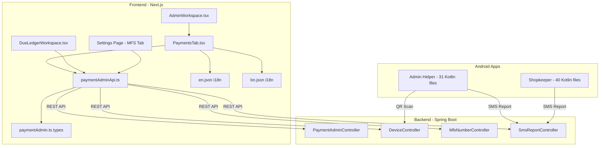

# DOKANIAI PAYMENT SYSTEM — DETAILED IMPLEMENTATION PLAN

## GAP ANALYSIS SUMMARY

After thorough review of all source files against the 6 HTML design files, here is the **current state**:

### ✅ Already Fully Implemented (No Changes Needed)

| Component | File | Lines | Status |
|-----------|------|-------|--------|
| Types | `src/types/paymentAdmin.ts` | 111 | Complete — all interfaces |
| API Layer | `src/lib/paymentAdminApi.ts` | 210 | Complete — 15 endpoints |
| AdminWorkspace | `src/components/admin/AdminWorkspace.tsx` | — | Payments tab integrated |
| Android Admin | `DokaniAI-PaymentHelper-Android/` | 31 files | Full MVVM Kotlin app |
| Android Shopkeeper | `DokaniAI-PaymentShopkeeper-Android/` | 40 files | Full Jetpack Compose app |

### 🔶 Exists But Needs HTML Design Alignment (4 files)

| Component | File | Lines | Gap Level |
|-----------|------|-------|-----------|
| PaymentsTab | `src/components/admin/PaymentsTab.tsx` | 1027 | **Minor** — structural match is ~90%, needs fine-tuning |
| DueLedgerWorkspace | `src/components/due/DueLedgerWorkspace.tsx` | 1090 | **Minimal** — AUTO_MFS already implemented |
| Settings Page | `src/app/dashboard/settings/page.tsx` | 1606 | **Minimal** — MFS Registration already implemented |
| i18n Bengali | `messages/bn.json` | — | **Moderate** — missing many admin.payments keys |

---

## DETAILED GAP ANALYSIS BY HTML DESIGN

### 1. `payment_management_manual/code.html` → PaymentsTab Review Tab

**Current match: ~92%**

| HTML Element | Current State | Gap |
|-------------|---------------|-----|
| KPI Row (3 cards) | ✅ Implemented at lines 313-337 | None |
| Review Queue items | ✅ Implemented at lines 378-413 | None |
| Avatar initials | ✅ `AvatarInitials` component | None |
| Flagged items (red border) | ✅ `bg-error-container/30` + red left border | None |
| Filter pills (All/High Risk) | ✅ Implemented at lines 373-374 | None |
| Companion Devices sidebar | ✅ Implemented at lines 424-453 | Minor — missing battery icon |
| AI Insight glass card | ✅ Implemented at lines 457-466 | Minor — missing action buttons |
| Search bar in header | ✅ Implemented at lines 301-304 | None |

**Changes needed:**
- Add battery icon (`battery_charging_80`) to device cards in sidebar
- Add "Apply Threshold" and "Dismiss" buttons to AI Insight card
- Add `font-bengali` class import if not already present

### 2. `manual_review_detail/code.html` → PaymentsTab Verify Modal

**Current match: ~85%**

| HTML Element | Current State | Gap |
|-------------|---------------|-----|
| Left column (span-5) | ✅ Implemented at lines 791-831 | Partial |
| Payment details card | ✅ TrxID, amount, payer, MFS method | None |
| Gradient text on amount | ❌ Not implemented | Add `text-gradient` class |
| Payer Profile card | ❌ Missing — no trust score, total orders | Add new section |
| Resolution Decision panel | ✅ Implemented at lines 818-830 | Partial |
| Reject Submission button | ❌ Not in resolution panel | Add button |
| Right column (span-7) | ✅ Implemented at lines 834-897 | None |
| SMS Pool Alignment header | ✅ With AI suggestion chip | None |
| Search bar | ✅ Implemented | None |
| SMS list (AI recommended) | ✅ Primary-fixed bg, selected state | None |
| SMS list (other matches) | ✅ White bg, clickable | None |
| Copy TrxID button | ❌ Not in payment details | Add button |

**Changes needed:**
- Add "Payer Profile" card with avatar, name, UID, trust score, total orders
- Add gradient text effect on amount (`text-gradient` CSS class)
- Add "Reject Submission" button in resolution panel alongside "Verify & Link Selected"
- Add copy button for TrxID

### 3. `device_bootstrap_qr/code.html` → PaymentsTab Devices Tab

**Current match: ~88%**

| HTML Element | Current State | Gap |
|-------------|---------------|-----|
| QR Display with corner accents | ✅ Implemented at lines 483-491 | None |
| Expiry timer | ✅ Implemented in bootstrap modal | None |
| Session Details panel | ✅ Implemented at lines 504-519 | Partial |
| Node ID field | ❌ Shows activeDevices count instead | Replace with Node ID |
| Environment badge | ✅ Implemented | None |
| Bootstrap Token field | ❌ Shows deep link instead | Add token field |
| How to Link steps | ✅ Implemented at lines 525-541 | None |
| Active Fleet stats card | ✅ Implemented at lines 546-555 | None |
| Recent Devices list | ✅ Implemented at lines 557-580 | None |
| Generate QR button position | ✅ In sidebar at line 582 | None |

**Changes needed:**
- In session details, replace "Active Fleet" count with "Node ID" field (use device data or generate)
- Add "Bootstrap Token" truncated display field
- Ensure QR code displays in the main tab view (not just modal)

### 4. `mfs_approval_management/code.html` → PaymentsTab MFS Numbers Tab

**Current match: ~90%**

| HTML Element | Current State | Gap |
|-------------|---------------|-----|
| Pending list with shop cards | ✅ Implemented at lines 662-704 | None |
| Storefront icon | ✅ Implemented | None |
| MFS details with provider icon | ✅ `MfsIconCircle` component | None |
| SIM slot info | ✅ Implemented | None |
| Approve/Reject buttons | ✅ Implemented at lines 693-700 | None |
| Policy sidebar (glassmorphism) | ✅ Implemented at lines 709-729 | None |
| Region badge | ❌ Not shown | Add region/area info |
| Mismatch warning | ❌ Not shown | Add mismatch detection |
| v1.1 subtitle | ❌ Not shown | Add subtitle text |
| Search bar in header | ❌ Not in MFS tab | Add search |

**Changes needed:**
- Add region/area badge to shop cards (if data available from backend)
- Add mismatch warning when phone number doesn't match MFS number
- Add "v1.1 Auto-Collection Integrity" subtitle to header
- Add search input for filtering by shop name or number

### 5. `mfs_registration_settings/code.html` → Settings Page MFS Tab

**Current match: ~93%**

| HTML Element | Current State | Gap |
|-------------|---------------|-----|
| Provider chip selector | ✅ Implemented at lines 1462-1479 | None |
| Phone input with +88 | ✅ Implemented at lines 1484-1489 | None |
| Account Type dropdown | ✅ Implemented at lines 1491-1497 | None |
| SIM Slot selector | ✅ Implemented at lines 1499-1504 | None |
| Register button | ✅ Implemented at lines 1508-1513 | None |
| Registered Accounts list | ✅ Implemented at lines 1518-1560 | None |
| Approved/Pending badges | ✅ Implemented | None |
| Auto-Sync status | ✅ Implemented | None |
| AI Verification hint | ✅ Implemented at lines 1445-1449 | None |
| Info card "Why register?" | ❌ Not shown | Add info card |
| Configure button | ❌ Not shown | Add on approved items |
| Resend button | ❌ Not shown | Add on pending items |
| "2 Active" count badge | ❌ Not shown | Add count badge |

**Changes needed:**
- Add "Why register MFS numbers?" info card after registered accounts list
- Add "Configure" button on approved MFS number items
- Add "Resend" button on pending MFS number items
- Add count badge next to "Registered Accounts" title

### 6. `due_ledger_workspace/code.html` → DueLedgerWorkspace

**Current match: ~95%**

| HTML Element | Current State | Gap |
|-------------|---------------|-----|
| Auto-credited transaction styling | ✅ `bg-primary-fixed/20 border-l-4 border-primary` | None |
| Glassmorphism gradient | ✅ `from-primary-fixed/40 to-transparent` | None |
| `account_balance_wallet` icon (filled) | ✅ With `FILL: 1` variation | None |
| Regular BAKI transaction | ✅ `bg-surface-container-lowest` | None |
| `shopping_bag` icon | ✅ Implemented | None |
| Amount coloring (JOMA/BAKI) | ✅ `text-primary` / `text-tertiary` | None |
| `font-bengali` class | ✅ Applied on auto-MFS description | None |
| Bengali numerals | ❌ HTML uses ৳ ৪,৫০০ format | Minor — locale-dependent |
| Customer list with due amounts | ✅ Implemented | None |
| WhatsApp reminder button | ✅ Implemented | None |

**Changes needed:**
- Verify Bengali numeral rendering works with locale (likely already works via Intl.NumberFormat)
- Ensure `font-bengali` (Hind Siliguri) is loaded in the app's font configuration

---

## i18n GAP: bn.json Missing Keys

The Bengali translation file (`messages/bn.json`) is missing many keys that exist in `messages/en.json` under `admin.payments`:

### Missing in bn.json admin.payments:
- `summary.pendingVolume`
- `summary.acrossTransactions`
- `summary.highRiskFlags`
- `summary.immediateReview`
- `review.title`, `review.flagged`, `review.loadMore`, `review.devices`, `review.manageDevices`, `review.aiInsight`, `review.aiInsightDesc`
- `devices.scanHint`, `devices.activeFleet`, `devices.connectedNodes`, `devices.sessionDetails`, `devices.environment`, `devices.howToLink`, `devices.step1Title`, `devices.step1Desc`, `devices.step2Title`, `devices.step2Desc`, `devices.step3Title`, `devices.step3Desc`, `devices.recentDevices`, `devices.refresh`, `devices.bootstrapTitle`, `devices.scanWithApp`
- `smsPool.searchPlaceholder`, `smsPool.allMfs`
- `modal.smsPoolAlignment`, `modal.findReceipt`, `modal.probMatch`, `modal.aiRecommended`, `modal.searchSms`, `modal.smsPreview`, `modal.resolution`, `modal.payer`
- `mfsNumbers.pendingTitle`, `mfsNumbers.reviewingCount`, `mfsNumbers.submittedNumber`, `mfsNumbers.policyTitle`, `mfsNumbers.policy1Title`, `mfsNumbers.policy1Desc`, `mfsNumbers.policy2Title`, `mfsNumbers.policy2Desc`
- `settings.title`, `settings.subtitle`, `settings.receiverNumber`, `settings.save`, `settings.saving`, `settings.saved`, `settings.saveFailed`

---

## IMPLEMENTATION TASKS

### Task 1: Align PaymentsTab.tsx Review Tab
**File**: `src/components/admin/PaymentsTab.tsx`
**HTML Source**: `stitch_modern_admin_control_panel/payment_management_manual/code.html`

Changes:
1. In Companion Devices sidebar (lines 430-449), add battery icon per device:
   - Add `battery_charging_80` icon for online devices
   - Add `battery_alert` icon for offline devices
   - Show version from device data or keep "v1.0"
2. In AI Insight card (lines 457-466), add action buttons:
   - "Apply Threshold" button (secondary colored)
   - "Dismiss" button (surface colored)

### Task 2: Align PaymentsTab.tsx Verify Modal
**File**: `src/components/admin/PaymentsTab.tsx`
**HTML Source**: `stitch_modern_admin_control_panel/manual_review_detail/code.html`

Changes:
1. Add Payer Profile card between payment details and resolution panel (after line 815):
   - Avatar with initials
   - User name and UID
   - Trust score (use `failedAttempts` as proxy or add to type)
   - Total orders (use subscription data or placeholder)
2. Add gradient text effect on amount (line 802):
   - Add CSS class `bg-gradient-to-r from-primary to-primary-container bg-clip-text text-transparent`
3. Add "Reject Submission" button in resolution panel (after line 825):
   - Red error-container styled button
4. Add copy button next to TrxID (line 798)

### Task 3: Align PaymentsTab.tsx Devices Tab
**File**: `src/components/admin/PaymentsTab.tsx`
**HTML Source**: `stitch_modern_admin_control_panel/device_bootstrap_qr/code.html`

Changes:
1. In session details panel (lines 504-519), restructure grid:
   - Replace "Active Fleet" count with "Node ID" field (generate from device data or use placeholder)
   - Add "Bootstrap Token" field showing truncated JWT token
2. Ensure QR code placeholder shows in main tab view when no bootstrap is active

### Task 4: Align PaymentsTab.tsx MFS Numbers Tab
**File**: `src/components/admin/PaymentsTab.tsx`
**HTML Source**: `stitch_modern_admin_control_panel/mfs_approval_management/code.html`

Changes:
1. Add header subtitle "v1.1 Auto-Collection Integrity" (around line 654)
2. Add search input for filtering by shop name or number
3. Add region/area badge to each shop card (if data available)
4. Add mismatch warning when `userPhone !== mfsNumber` on MFS detail cards

### Task 5: Align Settings Page MFS Section
**File**: `src/app/dashboard/settings/page.tsx`
**HTML Source**: `stitch_modern_admin_control_panel/mfs_registration_settings/code.html`

Changes:
1. Add count badge next to "Registered Accounts" title (line 1518)
2. Add "Configure" button on approved MFS items (line 1550)
3. Add "Resend" button on pending MFS items (line 1550)
4. Add "Why register MFS numbers?" info card after registered accounts list

### Task 6: Verify DueLedgerWorkspace AUTO_MFS Rendering
**File**: `src/components/due/DueLedgerWorkspace.tsx`
**HTML Source**: `stitch_modern_admin_control_panel/due_ledger_workspace/code.html`

Changes:
1. Verify Bengali numeral rendering (likely already works)
2. Verify `font-bengali` (Hind Siliguri) is loaded in app layout
3. Minor: Ensure `text-error` is used for BAKI amounts instead of `text-tertiary` (HTML uses error color)

### Task 7: Complete bn.json Translations
**File**: `messages/bn.json`

Add all missing `admin.payments.*` keys with Bengali translations. See the full list in the i18n Gap section above.

### Task 8: Verify Backend Endpoints
**File**: Spring Boot backend at `/home/alamin/IdeaProjects/DokaniAI`

Verify these endpoints exist and match frontend API calls:
- `GET /payments/admin/manual-review`
- `GET /payments/admin/fraud-flags`
- `POST /payments/admin/{id}/verify`
- `POST /payments/admin/{id}/reject`
- `GET /payments/admin/devices`
- `POST /payments/admin/devices/{id}/revoke`
- `GET /payments/admin/sms-pool`
- `GET /payments/admin/summary`
- `POST /payments/mfs-numbers/register`
- `GET /payments/mfs-numbers`
- `GET /payments/admin/mfs-numbers/pending`
- `POST /payments/admin/mfs-numbers/{id}/approve`
- `POST /payments/admin/mfs-numbers/{id}/reject`
- `GET /payments/admin/settings`
- `PUT /payments/admin/settings`
- `POST /admin/payment-helper/bootstrap`

---

## ARCHITECTURE DIAGRAM

## FILE CHANGE SUMMARY

| # | File Path | Change Type | Scope |
|---|-----------|-------------|-------|
| 1 | `src/components/admin/PaymentsTab.tsx` | MODIFY | Add battery icons, AI action buttons, Payer Profile card, gradient text, reject button, Node ID field, mismatch warning, search, subtitle |
| 2 | `src/components/due/DueLedgerWorkspace.tsx` | VERIFY | Confirm AUTO_MFS rendering matches HTML — change BAKI color from `text-tertiary` to `text-error` |
| 3 | `src/app/dashboard/settings/page.tsx` | MODIFY | Add info card, Configure/Resend buttons, count badge |
| 4 | `messages/bn.json` | MODIFY | Add ~40 missing Bengali translation keys under admin.payments |
| 5 | `messages/en.json` | VERIFY | Confirm all keys are present |
| 6 | Backend endpoints | VERIFY | Confirm all 16 endpoints exist |

**No new files needed. No Android changes needed. No backend code changes needed.**
