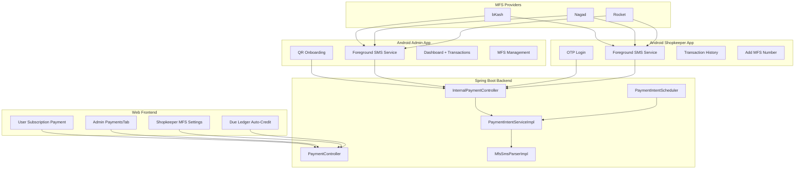

# HIGH-8: Payment Integration System — Complete Implementation Plan

## Scope

This plan covers the **entire** Payment Integration System across all platforms:
1. **Spring Boot Backend** — Minor enhancements + v1.1 shopkeeper payment logic
2. **Next.js Web Frontend** — Admin PaymentsTab + shopkeeper MFS registration + due payment display
3. **Android Admin App** — SMS capture for subscription payments (Kotlin)
4. **Android Shopkeeper App** — SMS capture for customer due payments (Kotlin)

---

## Current State

### Backend — Already Fully Implemented ✅
All v1.0 backend code exists: entities, repos, services, controllers, DTOs, migrations, tests.

### Frontend Web — Partially Implemented
- User-facing payment flow (upgrade, payment status, TrxID submission) ✅
- Admin payment management UI ❌
- Shopkeeper MFS registration UI ❌

### Android Apps — Not Started ❌
Both Admin and Shopkeeper companion apps need to be built from scratch.

---

## System Architecture Overview



---

## Phase 1: Backend Enhancements

### 1.1 Enhance ManualReviewPaymentItem with user info
- Add `userName`, `userPhone` to the DTO
- Update `toManualReviewItem()` in `PaymentIntentServiceImpl` to join user data
- **Files**: `ManualReviewPaymentItem.java`, `PaymentIntentServiceImpl.java`

### 1.2 Add admin device list endpoint
- `GET /payments/admin/devices` → list all registered devices
- Create `AdminDeviceResponse` DTO
- **Files**: `PaymentController.java`, `PaymentIntentService.java`, `PaymentIntentServiceImpl.java`, NEW `AdminDeviceResponse.java`

### 1.3 Add unmatched SMS pool endpoint
- `GET /payments/admin/sms-pool` → list unmatched SMS reports
- Create `SmsReportItem` DTO
- **Files**: `PaymentController.java`, `PaymentIntentService.java`, `PaymentIntentServiceImpl.java`, NEW `SmsReportItem.java`

### 1.4 Add payment summary endpoint
- `GET /payments/admin/summary` → KPIs for admin dashboard
- Create `PaymentSummaryResponse` DTO
- **Files**: `PaymentController.java`, `PaymentIntentService.java`, `PaymentIntentServiceImpl.java`, NEW `PaymentSummaryResponse.java`

### 1.5 Add scheduled payment intent expiry job
- Auto-expire PENDING intents past `expiresAt`
- Move submitted-but-unmatched intents to MANUAL_REVIEW after 10 min
- **File**: NEW `scheduler/PaymentIntentScheduler.java`

### 1.6 v1.1: MFS number registration endpoints
- `POST /payments/mfs-numbers/register` — shopkeeper registers MFS number
- `GET /payments/mfs-numbers` — shopkeeper views their numbers
- `GET /payments/admin/mfs-numbers/pending` — admin lists pending
- `POST /payments/admin/mfs-numbers/{id}/approve` — admin approves
- `POST /payments/admin/mfs-numbers/{id}/reject` — admin rejects
- **Files**: `PaymentController.java`, `PaymentIntentService.java`, NEW DTOs

### 1.7 v1.1: Due payment auto-matching
- Extend `ingestSmsReport()` to also match shopkeeper MFS numbers
- When SMS matches shopkeeper number, find due records by sender/amount
- Create JOMA transaction against customer due balance
- Handle partial payments
- **Files**: `PaymentIntentServiceImpl.java`

---

## Phase 2: Web Frontend — Admin Payment Types + API

### 2.1 Types (`types/paymentAdmin.ts`)
- `ManualReviewPaymentItem` — paymentIntentId, userId, userName, userPhone, amount, mfsMethod, submittedTrxId, failedAttempts, fraudFlag, submittedAt, expiresAt
- `AdminDevice` — id, userId, userName, deviceFingerprint, deviceName, appVariant, status, lastReportAt, registeredAt
- `SmsReportItem` — id, deviceId, mfsType, senderNumber, receiverNumber, amount, trxId, smsReceivedAt, matchStatus
- `PaymentSummary` — totalCompleted, totalManualReview, totalFailed, totalFraudFlags, autoVerifiedRate, todayCompleted, todayRevenue
- `MfsNumberRegistration` — id, userId, userName, mfsType, mfsNumber, simSlot, status, approvedBy, approvedAt, createdAt

### 2.2 API (`lib/paymentAdminApi.ts`)
- `getManualReviewQueue()`, `getFraudFlaggedPayments()`
- `verifyPaymentIntent()`, `rejectPaymentIntent()`
- `getAllDevices()`, `revokeDevice()`
- `getUnmatchedSmsPool()`, `getPaymentSummary()`
- v1.1: `registerMfsNumber()`, `getMyMfsNumbers()`, `getPendingMfsNumbers()`, `approveMfsNumber()`, `rejectMfsNumber()`

---

## Phase 3: Web Frontend — Admin PaymentsTab Component

### 3.1 PaymentsTab (`components/admin/PaymentsTab.tsx`)
Sub-sections using internal tab state:

**Summary KPIs**: Today revenue, total completed, manual review count, fraud flags, auto-verified rate

**Manual Review Queue**: Table with user info, amount, MFS method, TrxID, timestamps, fraud flags, verify/reject actions

**Fraud Flagged Payments**: Filtered view of fraud-flagged items

**Device Management**: Device list with status, revoke action, bootstrap QR generation

**SMS Pool**: Unmatched SMS reports, searchable for manual linking

**MFS Numbers (v1.1)**: Pending shopkeeper MFS registrations, approve/reject

**Verify Modal**: Payment details + searchable SMS pool for manual linking

**Reject Modal**: Payment details + required reason textarea

---

## Phase 4: Web Frontend — i18n

### 4.1 en.json + bn.json under `shop.admin.payments`
All labels, table headers, action buttons, status names, modal text, success/error messages in both English and Bengali.

---

## Phase 5: Web Frontend — Integration

### 5.1 Add Payments tab to AdminWorkspace
- New tab: `{ key: "payments", label: t("tabs.payments"), icon: <IconPayment /> }`
- Conditional render: `{activeTab === "payments" && <PaymentsTab />}`
- **File**: `AdminWorkspace.tsx`

### 5.2 v1.1: Shopkeeper MFS Registration in Settings
- Add MFS Number section to business settings page
- Form: MFS type, phone number, SIM slot
- Show registration status, allow up to 3 numbers
- **File**: `settings/page.tsx`

### 5.3 v1.1: Due Payment Auto-Credit Display
- Show auto-credited payments in due ledger
- Payment source indicator: MANUAL vs AUTO_MFS
- Linked TrxID in transaction details
- **File**: `DueLedgerWorkspace.tsx`

---

## Phase 6: Android Admin App

### 6.1 Project Setup
- **Package**: `com.dokaniai.payment.helper`
- **Language**: Kotlin
- **Min SDK**: 26 (Android 8.0+)
- **Architecture**: MVVM + Repository pattern
- **Build**: Gradle Kotlin DSL
- **Design System**: Indigo Ledger (Professional Indigo #24389C, Manrope + Inter fonts, tonal layering, frosted glass)

### 6.2 Screens (from HTML designs)

**Screen 1: Onboarding**
- Two-card layout: "I am an Admin" (QR scan) + "I am a Shopkeeper" (phone + OTP)
- Branding: DokaniAI Payment Verification Helper
- Feature pills: Real-time Sync, Secure Ledger
- Admin path → QR code scanner → extract API key + device fingerprint
- Shopkeeper path → phone number input → OTP verification

**Screen 2: Dashboard**
- TopAppBar: "Monitoring Active" with green pulse indicator
- Status grid: System Health card (network connected, live sync badge), Pending Sync count
- Last 3 Transactions list: MFS logo, amount, TrxID, timestamp, success badge
- Technical metadata: uptime, version
- Bottom nav: Dashboard, MFS Management, Settings

**Screen 3: MFS Management**
- Header: "MFS Management" with subtitle
- "Add New MFS Number" CTA button
- Stats grid: Approved count, Pending count
- MFS number cards: provider logo, name, phone number, status badge (Approved/Pending)
- Verification policy info card

**Screen 4: Settings**
- Device info, SIM slot selection, API key management
- App version, logout option

### 6.3 Core Components

**Foreground SMS Service**
- `SmsListenerService` — Foreground service with persistent notification
- `SmsReceiver` — BroadcastReceiver for SMS_RECEIVED intent
- Filters SMS by known MFS sender patterns
- Passes to parsing engine

**SMS Parsing Engine**
- `MfsSmsParser` — Regex patterns for bKash, Nagad, Rocket
- Extracts: amount, sender, TrxID, balance, timestamp
- Server-side re-validation (never trusts client-side parsing)

**Offline Queue**
- Room Database: `PendingSmsDao` with PENDING/SYNCED/FAILED status
- `SyncWorker` — WorkManager periodic sync
- Exponential backoff: 30s → 60s → 120s → 300s → 600s cap
- No max retry limit — SMS retained until synced
- Storage warning at 50+ pending items

**Network Layer**
- Retrofit2 + OkHttp3 for API calls
- Interceptors for X-API-Key and X-Device-Fingerprint headers
- `InternalPaymentApi` interface: `/sms/report`, `/device/register`, `/device/health`, `/config`

**Device Auth**
- QR scan → extract bootstrap token
- Call `/device/bootstrap` → get API key
- Store API key in Android Keystore (hardware-backed)
- Device fingerprint: Settings.Secure.ANDROID_ID + Build serial

**Permissions**
- READ_SMS, RECEIVE_SMS, FOREGROUND_SERVICE, INTERNET, ACCESS_NETWORK_STATE
- POST_NOTIFICATIONS (Android 13+)
- Camera (for QR scanning)

### 6.4 Project Structure
```
com.dokaniai.payment.helper/
├── DokaniAIApp.kt
├── di/
│   ├── NetworkModule.kt
│   ├── DatabaseModule.kt
│   └── RepositoryModule.kt
├── data/
│   ├── local/
│   │   ├── AppDatabase.kt
│   │   ├── PendingSmsEntity.kt
│   │   └── PendingSmsDao.kt
│   ├── remote/
│   │   ├── InternalPaymentApi.kt
│   │   └── dto/
│   │       ├── SmsReportRequest.kt
│   │       ├── SmsReportResponse.kt
│   │       ├── DeviceRegisterRequest.kt
│   │       ├── DeviceRegisterResponse.kt
│   │       └── DeviceHealthResponse.kt
│   └── repository/
│       └── SmsRepository.kt
├── service/
│   ├── SmsListenerService.kt
│   ├── SmsReceiver.kt
│   └── SyncWorker.kt
├── parser/
│   └── MfsSmsParser.kt
├── ui/
│   ├── onboarding/
│   │   ├── OnboardingActivity.kt
│   │   └── OnboardingViewModel.kt
│   ├── dashboard/
│   │   ├── DashboardActivity.kt
│   │   └── DashboardViewModel.kt
│   ├── mfs/
│   │   ├── MfsManagementFragment.kt
│   │   └── MfsViewModel.kt
│   ├── settings/
│   │   ├── SettingsFragment.kt
│   │   └── SettingsViewModel.kt
│   └── common/
│       ├── BottomNavBar.kt
│       └── TransactionCard.kt
├── auth/
│   ├── DeviceAuthManager.kt
│   └── QrScannerActivity.kt
└── util/
    ├── NetworkMonitor.kt
    └── PhoneNormalizer.kt
```

---

## Phase 7: Android Shopkeeper App

### 7.1 Project Setup
- **Package**: `com.dokaniai.payment.shopkeeper`
- **Language**: Kotlin
- **Min SDK**: 26
- **Same architecture** as Admin app but with JWT auth instead of API key
- **Design**: Same Indigo Ledger system but with lighter "Friendly Tool" variant (surface_bright for list items, icons always with labels)

### 7.2 Screens (from HTML designs)

**Screen 1: Shopkeeper Login**
- "Merchant Ledger" branding
- Phone number input with +880 prefix
- "Send OTP" button with gradient
- Trust & Safety info card
- SSL Encrypted + Auto Backup trust indicators

**Screen 2: Dashboard / Transaction History**
- Stats: Total Received Today with trend indicator
- System Status card (Ledger Syncing with green pulse)
- MFS Provider filter dropdown
- Date range selector (Today/Weekly/Monthly)
- Transaction list: provider logo, customer phone, TrxID, amount, status badge (Matched/Pending)

**Screen 3: Add MFS Number**
- MFS Provider selector: bKash/Nagad/Rocket radio cards
- Phone number input
- SIM Hardware Slot selector (SIM 1/SIM 2)
- Pending approval notice
- "Submit for Approval" gradient button
- Help cards: Secure Integration, Need Assistance

**Screen 4: Settings**
- Profile, device info, MFS number management
- Logout

### 7.3 Core Components

**Authentication**
- JWT-based (same as web platform)
- Phone + OTP login → JWT token stored in EncryptedSharedPreferences
- Auto-refresh token before expiry

**Foreground SMS Service**
- Same as Admin app but monitors shopkeeper's registered MFS numbers only
- Checks `registered_mfs_numbers` for approved numbers matching device SIM

**Network Layer**
- Retrofit2 with JWT Bearer token interceptor
- Same internal API endpoints + additional shopkeeper endpoints

**MFS Number Registration**
- Submit new MFS number via API
- Track approval status (PENDING → APPROVED/REJECTED)
- SMS monitoring activates only for APPROVED numbers

### 7.4 Project Structure
```
com.dokaniai.payment.shopkeeper/
├── DokaniAIShopkeeperApp.kt
├── di/
│   ├── NetworkModule.kt
│   ├── DatabaseModule.kt
│   └── RepositoryModule.kt
├── data/
│   ├── local/
│   │   ├── AppDatabase.kt
│   │   ├── PendingSmsEntity.kt
│   │   └── PendingSmsDao.kt
│   ├── remote/
│   │   ├── ShopkeeperPaymentApi.kt
│   │   ├── AuthApi.kt
│   │   └── dto/
│   ├── repository/
│   │   ├── SmsRepository.kt
│   │   ├── AuthRepository.kt
│   │   └── MfsNumberRepository.kt
│   └── auth/
│       └── TokenManager.kt
├── service/
│   ├── SmsListenerService.kt
│   ├── SmsReceiver.kt
│   └── SyncWorker.kt
├── parser/
│   └── MfsSmsParser.kt
├── ui/
│   ├── login/
│   │   ├── LoginActivity.kt
│   │   └── LoginViewModel.kt
│   ├── transactions/
│   │   ├── TransactionHistoryActivity.kt
│   │   └── TransactionViewModel.kt
│   ├── addmfs/
│   │   ├── AddMfsActivity.kt
│   │   └── AddMfsViewModel.kt
│   ├── settings/
│   │   ├── SettingsFragment.kt
│   │   └── SettingsViewModel.kt
│   └── common/
│       ├── BottomNavBar.kt
│       └── TransactionCard.kt
└── util/
    ├── NetworkMonitor.kt
    └── PhoneNormalizer.kt
```

---

## Implementation Order

| Step | Phase | Platform | What |
|------|-------|----------|------|
| 1 | Phase 1.1–1.5 | Backend | Enhance DTOs, add endpoints, scheduled job |
| 2 | Phase 2 | Web FE | Admin payment types + API functions |
| 3 | Phase 3 | Web FE | PaymentsTab component |
| 4 | Phase 4 | Web FE | i18n translations |
| 5 | Phase 5.1 | Web FE | AdminWorkspace integration |
| 6 | Phase 6 | Android | Admin companion app (Kotlin) |
| 7 | Phase 1.6–1.7 | Backend | v1.1 MFS registration + due auto-matching |
| 8 | Phase 5.2–5.3 | Web FE | v1.1 shopkeeper MFS settings + due display |
| 9 | Phase 7 | Android | Shopkeeper companion app (Kotlin) |

---

## File Summary

### New Backend Files (6)
- `dto/response/AdminDeviceResponse.java`
- `dto/response/SmsReportItem.java`
- `dto/response/PaymentSummaryResponse.java`
- `scheduler/PaymentIntentScheduler.java`
- `dto/response/MfsNumberResponse.java` (v1.1)
- `dto/request/MfsNumberRegistrationRequest.java` (v1.1)

### Modified Backend Files (4)
- `dto/response/ManualReviewPaymentItem.java`
- `service/PaymentIntentService.java`
- `service/impl/PaymentIntentServiceImpl.java`
- `controller/PaymentController.java`

### New Web Frontend Files (3)
- `types/paymentAdmin.ts`
- `lib/paymentAdminApi.ts`
- `components/admin/PaymentsTab.tsx`

### Modified Web Frontend Files (5)
- `components/admin/AdminWorkspace.tsx`
- `messages/en.json`
- `messages/bn.json`
- `app/dashboard/settings/page.tsx` (v1.1)
- `components/due/DueLedgerWorkspace.tsx` (v1.1)

### Android Admin App (NEW project, ~25 files)
- Full Kotlin project under `DokaniAI-PaymentHelper-Android/`

### Android Shopkeeper App (NEW project, ~25 files)
- Full Kotlin project under `DokaniAI-PaymentShopkeeper-Android/`
