# DokaniAI Payment System — User Manual

> **Version**: v1.0 + v1.1
> **Last Updated**: April 2026

---

## Table of Contents

1. [System Overview](#1-system-overview)
2. [For Admin — Android App Setup &amp; Usage (v1.0)](#2-for-admin--android-app-setup--usage-v10)
3. [For Admin — Managing Shopkeeper MFS Numbers (v1.1)](#3-for-admin--managing-shopkeeper-mfs-numbers-v11)
4. [For Shopkeeper — Android App Setup &amp; Usage (v1.1)](#4-for-shopkeeper--android-app-setup--usage-v11)
5. [For Shopkeeper — Paying Subscription (v1.0)](#5-for-shopkeeper--paying-subscription-v10)
6. [Troubleshooting](#6-troubleshooting)
7. [FAQ](#7-faq)

---

## 1. System Overview

DokaniAI uses **SMS-based payment verification** instead of traditional payment gateways. When someone sends money via bKash/Nagad/Rocket, the MFS provider sends an SMS confirmation. DokaniAI's Android apps capture these SMS messages and automatically verify payments.

### Two Phases

| Phase          | What                  | Who Pays               | Who Receives                    |
| -------------- | --------------------- | ---------------------- | ------------------------------- |
| **v1.0** | Subscription payments | Shopkeeper → Admin    | Admin's bKash/Nagad/Rocket      |
| **v1.1** | Customer due payments | Customer → Shopkeeper | Shopkeeper's bKash/Nagad/Rocket |

### Apps Involved

| App                                       | Who Uses           | Purpose                           | Auth Method            |
| ----------------------------------------- | ------------------ | --------------------------------- | ---------------------- |
| **DokaniAI Web**                    | Admin + Shopkeeper | Dashboard, settings, due ledger   | Email/Phone + Password |
| **DokaniAI Admin Helper** (Android) | Admin's phone      | Captures subscription payment SMS | QR Code → API Key     |
| **DokaniAI Shopkeeper** (Android)   | Shopkeeper's phone | Captures customer due payment SMS | Phone + OTP            |

### System Architecture

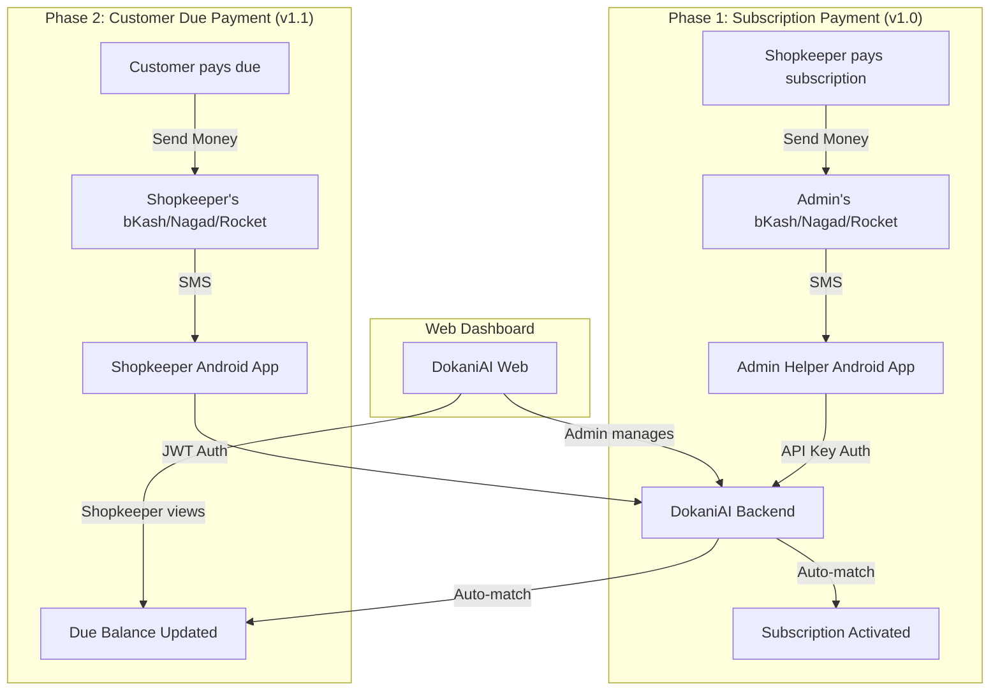

### How SMS-Based Verification Works

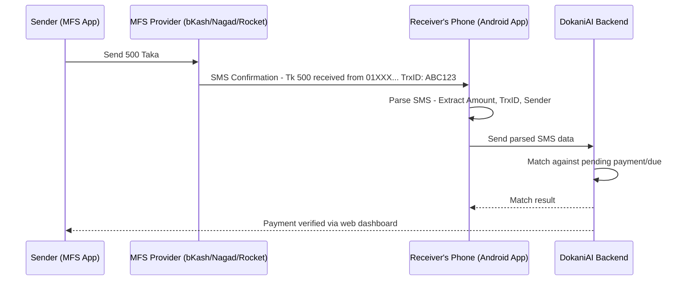

---

## 2. For Admin — Android App Setup & Usage (v1.0)

### 2.1 One-Time Setup

**Step 1: Configure Admin MFS Numbers**

Add your personal bKash, Nagad, and Rocket numbers in the backend `.env` file:

```properties
MFS_BKASH_NUMBER=01XXXXXXXXX
MFS_NAGAD_NUMBER=01YYYYYYYYY
MFS_ROCKET_NUMBER=01ZZZZZZZZZ
```

**Step 2: Install Admin Helper Android App**

1. Build the APK from `DokaniAI-PaymentHelper-Android/` project
2. Install on a dedicated Android phone that stays near you
3. This phone must have the SIM card for your bKash/Nagad/Rocket numbers
4. Minimum Android 8.0 (API 26+)

**Step 3: Bootstrap the Admin App via QR Code**

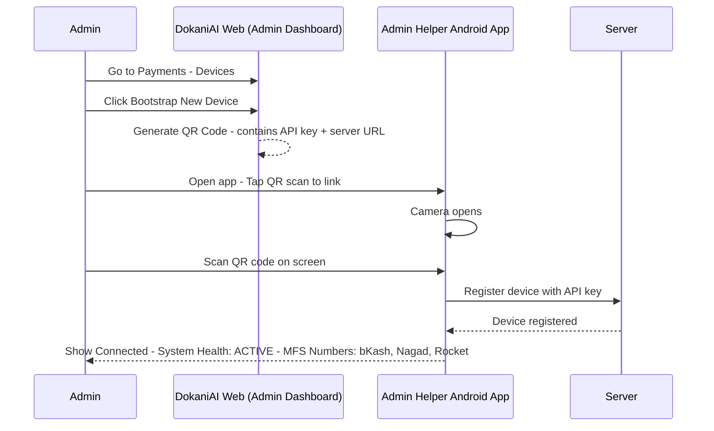

After successful scan, the app shows:

- ✅ **Connected** status
- 🔋 **System Health: ACTIVE**
- 📱 **Device Fingerprint**: e.g., `samsung_Galaxy-A52`
- 💳 **MFS Numbers**: Your configured bKash/Nagad/Rocket numbers

> 📱 **Tip**: Keep this phone charged and connected to internet. The app runs a foreground service that continuously monitors incoming SMS.

### 2.2 Admin App Screens

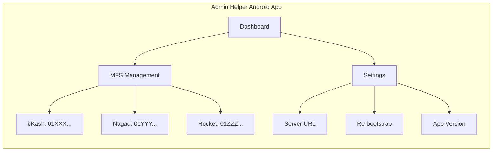

**Dashboard Screen:**

- System Health indicator (ACTIVE/INACTIVE)
- Device fingerprint
- Last sync timestamp
- Battery level
- Total SMS captured count

**MFS Management Screen:**

- Shows all 3 admin MFS numbers (bKash, Nagad, Rocket)
- Status of each number (Active/Inactive)
- SMS count per provider

**Settings Screen:**

- Server URL configuration
- Re-bootstrap (re-scan QR)
- App version info
- Logout / Disconnect device

### 2.3 How Subscription Payment Works (Automatic)

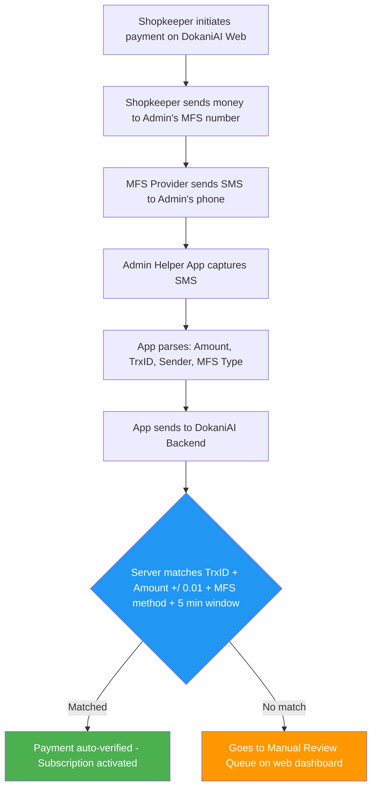

### 2.4 Managing Manual Reviews (Web Dashboard)

1. Go to **Admin Workspace → Payments → Review Queue**
2. You'll see payments with user info, amount, TrxID, and timestamps
3. Click **"Verify"** to approve, or **"Reject"** to deny
4. When verifying, you can select an SMS report from the SMS Pool to link

### 2.5 Monitoring Dashboard (Web)

The **Payments** tab shows:

- **Summary KPIs**: Today's revenue, total completed, manual review count, fraud flags, auto-verified rate
- **Review Queue**: Payments needing manual action
- **Fraud Flags**: Suspicious payments (multiple failed attempts)
- **Devices**: Registered Android devices with status
- **SMS Pool**: All unmatched SMS reports
- **MFS Numbers**: Shopkeeper MFS registrations (v1.1)

---

## 3. For Admin — Managing Shopkeeper MFS Numbers (v1.1)

### 3.1 What Are Shopkeeper MFS Numbers?

Shopkeepers can register their personal bKash/Nagad/Rocket numbers. Once approved by admin, when a customer sends money to that number, DokaniAI automatically credits it against the customer's due balance.

### 3.2 Complete MFS Number Lifecycle

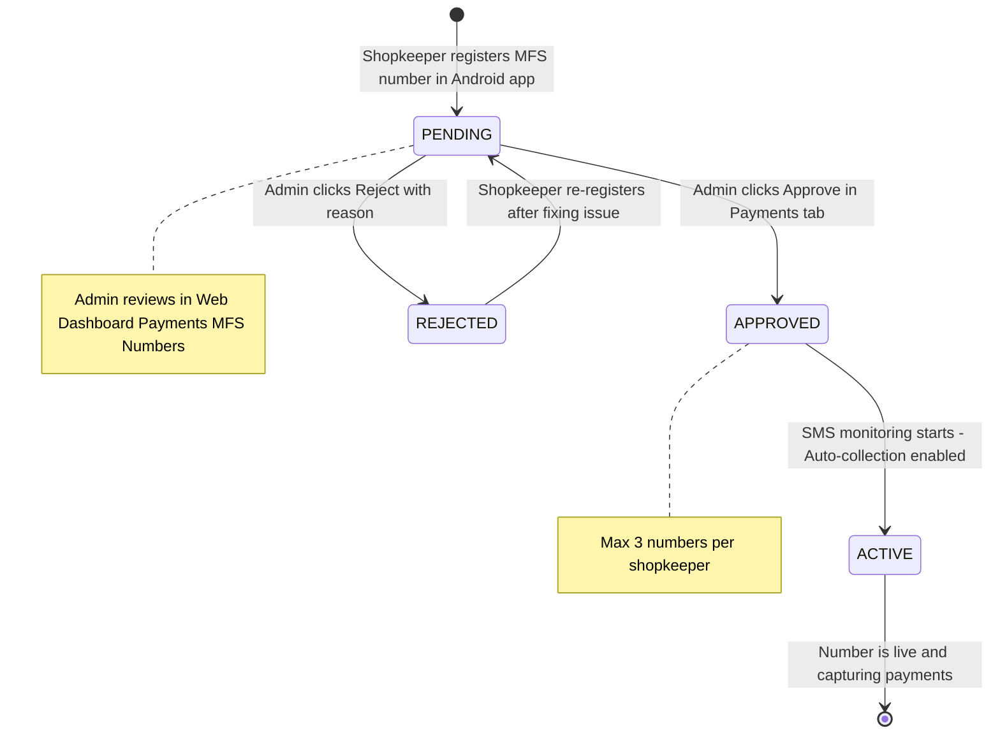

### 3.3 Step-by-Step for Admin

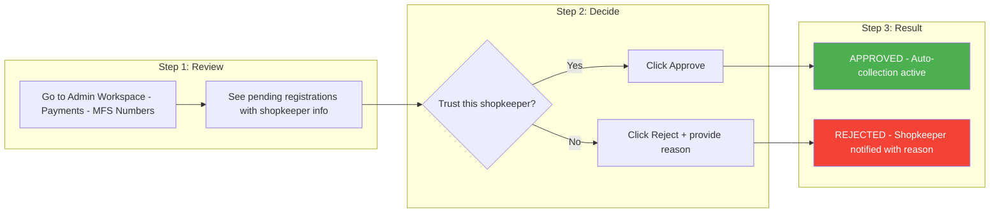

### 3.4 Example

```
Shopkeeper "Karim Store" registers:
- bKash: 01XXXXXXXXX (SIM 1)
- Nagad: 01YYYYYYYYY (SIM 2)
- Rocket: 01ZZZZZZZZZ (SIM 1)

Admin sees in MFS Numbers tab:
┌──────────────┬────────┬───────────────┬─────────┬──────────┐
│ User         │ Phone  │ MFS Number    │ Type    │ Actions  │
├──────────────┼────────┼───────────────┼─────────┼──────────┤
│ Karim Store  │ 01Z... │ 01XXXXXXXXX   │ bKash   │ ✓ ✗      │
│ Karim Store  │ 01Z... │ 01YYYYYYYYY   │ Nagad   │ ✓ ✗      │
│ Karim Store  │ 01Z... │ 01ZZZZZZZZZ   │ Rocket  │ ✓ ✗      │
└──────────────┴────────┴───────────────┴─────────┴──────────┘

Admin clicks ✓ (Approve) for all three → All numbers now active for SMS matching.
```

### 3.5 Rules

- Each shopkeeper can register **maximum 3 MFS numbers**
- Any combination: 3 bKash, or 1 bKash + 1 Nagad + 1 Rocket, etc.
- If a shopkeeper has only 1 or 2 MFS numbers, that's perfectly fine — they register what they have
- Only APPROVED numbers trigger due payment auto-matching
- Admin can reject with a reason (shopkeeper sees the reason)
- Shopkeeper can re-register after rejection
- Duplicate numbers (same number registered twice) are blocked

---

## 4. For Shopkeeper — Android App Setup & Usage (v1.1)

### 4.1 Overview

The Shopkeeper Android app captures incoming payment SMS on your phone and sends them to the DokaniAI server. The server then automatically matches payments to your customers' due balances.

### 4.2 One-Time Setup

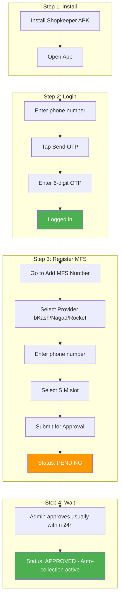

> 💡 **What if you have less than 3 MFS numbers?** That's completely fine! Register only the numbers you have. If you only use bKash, register just 1 number. If you use bKash and Nagad, register 2. The system works with any number from 1 to 3.

### 4.3 Shopkeeper App Screens

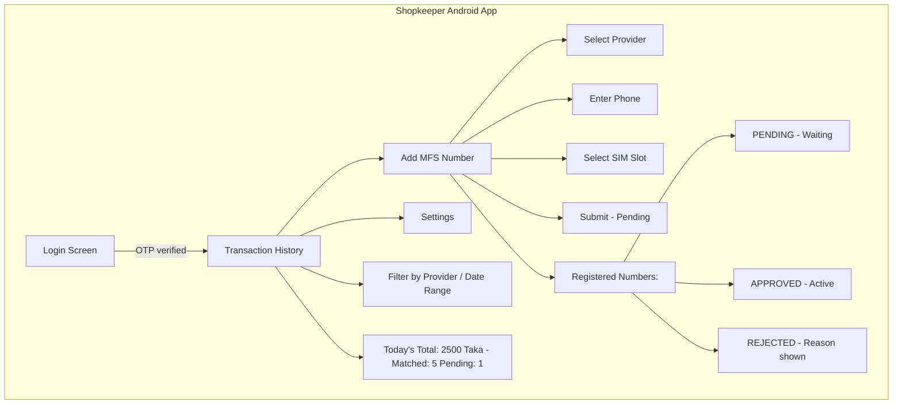

**Login Screen:**

- Phone number input
- Send OTP button
- OTP verification
- Bengali/English language support

**Transaction History Screen:**

- List of all auto-credited payments
- Filter by provider (bKash/Nagad/Rocket)
- Filter by date range (Today/This Week/This Month)
- Today's total received amount
- Pending and matched counts
- Unsynced SMS count (offline queue)
- Pull-to-refresh

**Add MFS Number Screen:**

- MFS provider selector (bKash/Nagad/Rocket)
- Phone number input with validation
- SIM slot selector (SIM 1/SIM 2)
- Submit for approval button
- List of already registered numbers with status badges:
  - 🟡 PENDING — Waiting for admin approval
  - 🟢 APPROVED — Active and monitoring
  - 🔴 REJECTED — Admin rejected (reason shown)

**Settings Screen:**

- Server URL configuration
- Sync pending SMS manually
- App version info
- Logout

### 4.4 How Auto-Collection Works

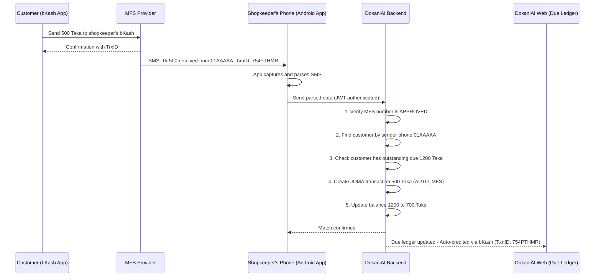

### 4.5 Example Walkthrough

```
Customer "Abul" owes ৳1,200 to "Karim Store":

1. Abul opens bKash → Send Money → Karim's bKash (01XXXXXXXXX) → ৳500
2. bKash sends SMS to Karim's phone
3. Shopkeeper app captures SMS, sends to DokaniAI server
4. Server parses SMS: Amount=৳500, Sender=01AAAAA, TxnID=754PTHMR
5. Server finds:
   - Karim's bKash 01XXXXXXXXX is APPROVED ✓
   - Customer with phone 01AAAAA exists in Karim's business ✓
   - Customer has ৳1,200 due balance ✓
6. Server creates:
   - DueTransaction: JOMA ৳500 (AUTO_MFS, TxnID: 754PTHMR)
   - Customer balance: ৳1,200 - ৳500 = ৳700
7. Karim sees in Due Ledger: "Auto-credited via bKash (TxnID: 754PTHMR)"
8. Karim sees in Android app: Transaction history updated
```

### 4.6 What You See in Due Ledger (Web)

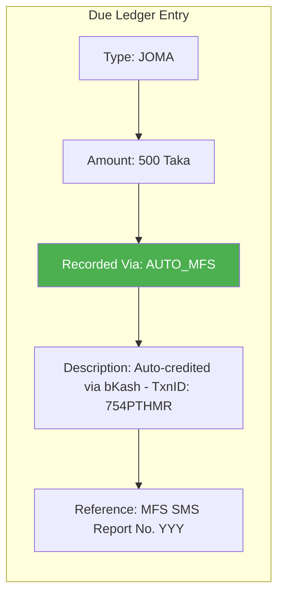

| Field        | Manual Entry             | Auto MFS Entry                              |
| ------------ | ------------------------ | ------------------------------------------- |
| Type         | JOMA                     | JOMA                                        |
| Amount       | ৳500                    | ৳500                                       |
| Recorded Via | MANUAL                   | AUTO_MFS                                    |
| Description  | "Cash payment from Abul" | "Auto-credited via bKash (TxnID: 754PTHMR)" |
| Reference    | Sale #XXX                | MFS SMS Report #YYY                         |

### 4.7 Important Notes

- **Phone matching**: Customer must be registered with the same phone number they use for bKash/Nagad/Rocket
- **Partial payments**: If customer sends ৳500 but owes ৳1,200, only ৳500 is credited (remaining ৳700 stays as due)
- **Over-payment**: If customer sends ৳1,500 but only owes ৳1,200, only ৳1,200 is credited (৳300 excess is NOT auto-handled)
- **Max 3 numbers**: You can register up to 3 MFS numbers total (any combination of bKash/Nagad/Rocket)
- **Less than 3 is fine**: If you only have 1 or 2 MFS numbers, just register those — the system works perfectly
- **Internet required**: The Android app needs internet to sync SMS data to the server
- **Offline support**: If no internet, SMS are stored locally and synced automatically when internet returns

### 4.8 Offline Handling

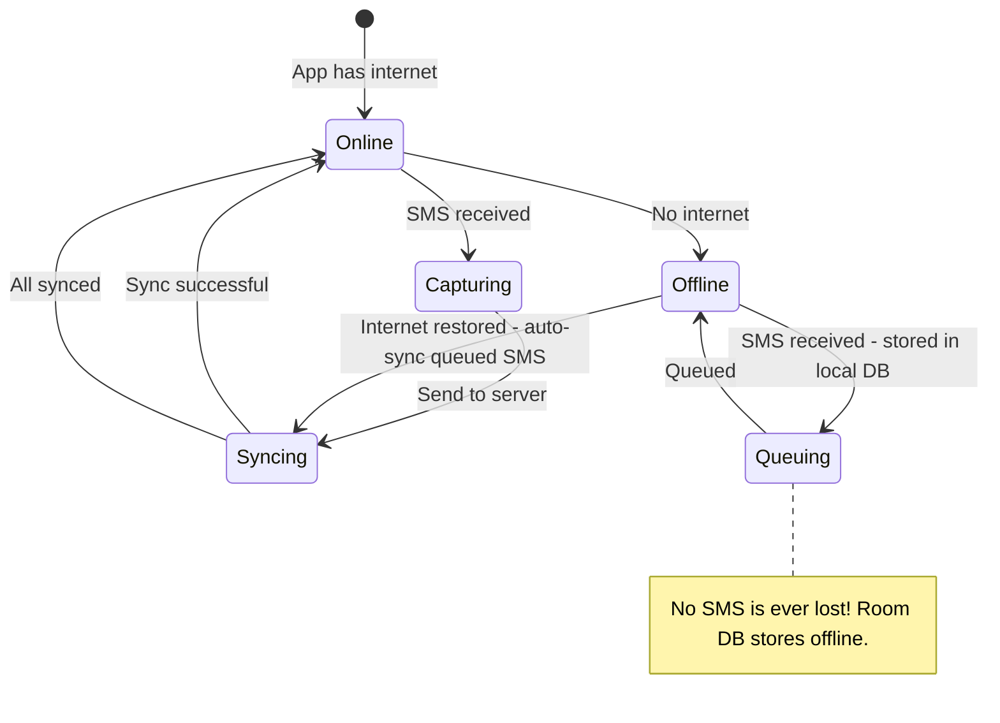

---

## 5. For Shopkeeper — Paying Subscription (v1.0)

### 5.1 How to Pay

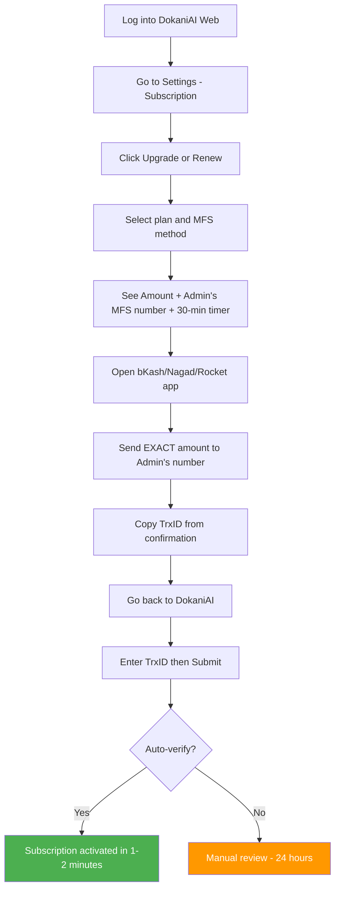

### 5.2 Example Walkthrough

```
Rahim wants to upgrade to Basic plan (৳149/month):

1. Rahim opens DokaniAI → Settings → Subscription → "Upgrade to Basic"
2. Selects "bKash" as payment method
3. Sees: "Send ৳149 to 01XXXXXXXXX (Admin bKash)"
4. Opens bKash app → Send Money → 01XXXXXXXXX → ৳149
5. Gets TrxID: "DDJ8BQBVCM"
6. Goes back to DokaniAI → Enters "DDJ8BQBVCM" → Submit
7. Within 1-2 minutes: "✅ Payment verified! Basic plan activated."
```

---

## 6. Troubleshooting

### Admin App Issues

| Issue                                    | Cause                      | Solution                                                        |
| ---------------------------------------- | -------------------------- | --------------------------------------------------------------- |
| QR code not scanning                     | Camera permission denied   | Grant camera permission in Android settings                     |
| "Device not registered"                  | API key expired or revoked | Re-bootstrap: scan a new QR code from web dashboard             |
| Device Fingerprint shows "unknown"       | Old app version            | Update to latest APK (v1.1+ fixes this)                         |
| MFS Numbers show "No numbers configured" | DTO mismatch (v1.0 bug)    | Update to latest APK (v1.1+ fixes this)                         |
| SMS not captured                         | SMS permission denied      | Grant SMS permission, ensure foreground notification is visible |
| App closes in background                 | Battery optimization       | Disable battery optimization for the app                        |
| Sync not working                         | No internet                | Check internet connection                                       |

### Shopkeeper App Issues

| Issue                       | Cause                                  | Solution                                                        |
| --------------------------- | -------------------------------------- | --------------------------------------------------------------- |
| OTP not received            | Wrong phone number or SMS delay        | Check phone number, wait 60 seconds, try again                  |
| "Not authenticated"         | JWT token expired                      | Re-login with OTP                                               |
| MFS number rejected         | Admin rejected                         | Check reason in app, fix if needed, re-register                 |
| Can't register more numbers | Max 3 limit reached                    | Delete an existing number or contact admin                      |
| SMS not captured            | SMS permission denied                  | Grant SMS permission, ensure foreground notification is visible |
| App closes in background    | Battery optimization                   | Disable battery optimization for the app                        |
| Transactions not showing    | No internet or no approved MFS numbers | Check internet, verify MFS numbers are approved                 |

### Payment Not Auto-Verified (Subscription)

| Possible Cause             | Solution                                                      |
| -------------------------- | ------------------------------------------------------------- |
| Wrong amount sent          | Must match exactly (±৳0.01 tolerance)                       |
| Wrong MFS number           | Must send to admin's configured number                        |
| TrxID not submitted        | Shopkeeper must enter TrxID in web app                        |
| SMS not captured           | Check Android app is running, foreground notification visible |
| No internet on admin phone | App queues SMS offline, syncs when internet returns           |
| More than 5 minutes delay  | SMS must arrive within 5 minutes of TrxID submission          |

### Due Payment Not Auto-Credited (Shopkeeper)

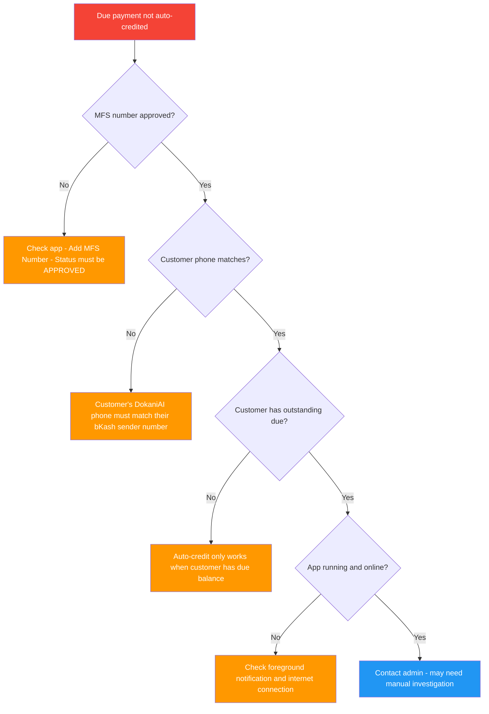

---

## 7. FAQ

**Q: Do I need a separate phone for the Android app?**
A: For the admin, a dedicated phone is recommended since it needs to stay powered on with the MFS SIM card. For shopkeepers, their regular phone works fine — the app runs in the background.

**Q: What if I have multiple SIM cards?**
A: Both apps support SIM slot selection. When registering an MFS number, specify SIM 1 or SIM 2. This helps the app know which SIM receives which SMS.

**Q: Can a shopkeeper have bKash, Nagad, AND Rocket?**
A: Yes! Shopkeepers can register up to 3 MFS numbers in any combination: 3 bKash, or 1 bKash + 1 Nagad + 1 Rocket, or any other mix.

**Q: What if a shopkeeper only has 1 MFS number?**
A: That's perfectly fine. They register just that 1 number. The system works with 1, 2, or 3 MFS numbers.

**Q: Is my payment data secure?**
A: Yes. SMS data is transmitted over HTTPS. API keys are stored in Android's encrypted keystore. JWT tokens are used for shopkeeper authentication. The admin app's API key is bound to the device fingerprint.

**Q: What happens if the same SMS is processed twice?**
A: The server deduplicates by SMS hash and TrxID. Duplicate submissions are safely ignored.

**Q: How long does auto-verification take?**
A: Typically 10-30 seconds from SMS arrival to payment verification, assuming internet is available on the phone.

**Q: What if there's no internet?**
A: Both Android apps store SMS in a local Room database and sync when internet returns. No SMS is ever lost.

**Q: Can admin see all shopkeeper MFS numbers?**
A: Admin sees pending registrations in the Payments tab. Approved/rejected numbers are managed through the same interface.

**Q: What's the difference between the two Android apps?**
A: The **Admin Helper** app uses QR code authentication and monitors the admin's MFS numbers for subscription payments. The **Shopkeeper** app uses phone+OTP login and monitors the shopkeeper's own MFS numbers for customer due payments.

**Q: How does admin approve shopkeeper MFS numbers?**
A: Go to Admin Workspace → Payments → MFS Numbers tab. You'll see all pending registrations with shopkeeper info. Click Approve or Reject with a reason.

---

## Quick Reference Card

### For Admin

| Action                       | Where                                               |
| ---------------------------- | --------------------------------------------------- |
| Configure MFS numbers        | Backend `.env` file                               |
| Bootstrap Android app        | Admin Workspace → Payments → Devices → Bootstrap |
| Review subscription payments | Admin Workspace → Payments → Review Queue         |
| Approve shopkeeper MFS       | Admin Workspace → Payments → MFS Numbers          |
| Monitor dashboard            | Admin Workspace → Payments → Summary              |
| Revoke device                | Admin Workspace → Payments → Devices → Revoke    |

### For Shopkeeper

| Action                      | Where                                                                 |
| --------------------------- | --------------------------------------------------------------------- |
| Pay subscription            | Web App → Settings → Subscription → Upgrade                        |
| Register MFS number         | Android App → Add MFS Number (or Web App → Settings → MFS Numbers) |
| Check registration status   | Android App → Add MFS Number screen                                  |
| View auto-credited payments | Android App → Transaction History                                    |
| Check due ledger            | Web App → Due Ledger                                                 |
| View auto-credits in ledger | Due Ledger → Look for "AUTO_MFS" entries                             |
| Install Android app         | Build from `DokaniAI-PaymentShopkeeper-Android/`                    |
